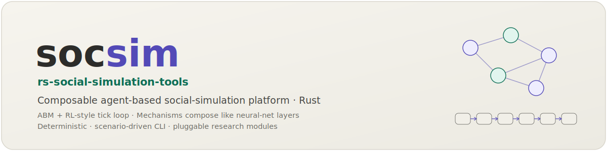

<p align="center"></p>

[English](README.md) | **日本語**

# rs-social-simulation-tools


`socsim` はRustで書かれた，コンポーザブルなエージェントベース社会シミュレーションプラットフォームです．トレイトベースのメカニズムシステム，シードされたChaCha20 RNGによる決定論的再現性，ソーシャルネットワーク層，空間グリッドのプリミティブ，保存・再開のためのWorld状態スナップショット，オプションの学習ポリシー（MARL），オプションのLLMエージェント層（Ollama/OpenAI，プロンプトキャッシュ付き），結果出力ヘルパ，再利用可能な観測メトリクスライブラリ，そしてシナリオの実行・パラメータスイープ・集計のためのCLIを，15クレートのワークスペースとして提供します．CLIは **World 多態**です：シナリオは名前で *モジュールパック* を選択し，現在3つのパックを同梱しています — 文献に基づくキャリブレーションパラメータを持つ10メカニズムの参考実装 **HRライフサイクル** モジュール，ソーシャルネットワーク上で有界信頼コンセンサスモデルを実行する **opinion-dynamics** パック，そして階層的なネットワーク上で沈黙の風土の創発をモデル化し，LLM／ルールベースの voice 決定を切り替えられる **`organizational-silence`** パックです．再利用可能でドメイン非依存なメカニズムは汎用の **`socsim-mechanisms`** カタログに収録され，意見ダイナミクス，ネットワーク伝播，文化伝播，グループダイナミクスの4つのフィーチャファミリにわたる8メカニズムを提供します．

## インストール

ソースからビルド（Rustツールチェーンが必要）：

```sh
git clone https://github.com/akitenkrad/rs-social-simulation-tools.git
cd rs-social-simulation-tools
cargo build --release
```

バイナリは `target/release/socsim` に生成されます．

テストスイートの実行：

```sh
cargo test --workspace
```

## クイックスタート

```sh
socsim run scenarios/hr_lifecycle_baseline.toml
```

出力例：

```
Running 'hr_lifecycle_baseline' (pack=hr-lifecycle, t_max=60, seeds=[42], parallel=false)

Seed 42 — 82 events recorded

t             avg_tenure   knowledge_stock   org_performance     turnover_rate
10                9.1000           53.9517           32.1462            0.0000
20               14.6000           62.4468           35.7133            0.0000
30               21.5500           72.5042           40.4270            0.0250
40               25.9000           78.4727           40.2186            0.0000
50               30.0750           85.3493           40.8007            0.0000
60               35.6250           92.3841           41.8100            0.0000
```

`socsim` バイナリは World 多態です：シナリオは **モジュールパック**を名前で選択します（`socsim list packs`）．現在3つのパックを同梱しています — 較正済みの `hr-lifecycle` リファレンスモジュール，`socsim-mechanisms` の有界信頼メカニズムをソーシャルネットワーク上で実行する汎用 `opinion-dynamics` パック，そして階層的な組織で沈黙の風土の創発をモデル化する `organizational-silence` パックです：

```sh
socsim run scenarios/opinion_dynamics_baseline.toml
```

```
Running 'opinion_dynamics_baseline' (pack=opinion-dynamics, t_max=60, seeds=[42], parallel=false)

t               clusters         max_delta              mean            spread          variance
10               22.0000            0.1238            0.5092            0.9769            0.0360
30               15.0000            0.0127            0.5094            0.9769            0.0243
60               12.0000            0.0010            0.5098            0.9769            0.0232
```

有界信頼の意見は時間とともにより少ないクラスタへ収束します（コンセンサス）．`epsilon` を大きくすると完全な合意に至ります．

```sh
socsim run scenarios/org_silence_baseline.toml
```

```
Running 'org_silence_baseline' (pack=organizational-silence, t_max=60, seeds=[42], parallel=false)

t              silence_rate   climate_of_silence       voice_volume      org_performance
10                 0.5500               0.2750             0.2750              28.5630
30                 0.7250               0.4250             0.1500              22.4173
60                 0.6500               0.3500             0.2250              25.9982
```

沈黙の風土 C(t) は t=24 の salience ショックまで上昇し，その後，高い σ のもとでの voice が Argyris ダブルループ学習メカニズム経由でチームの `knowledge_stock` に流入することで，部分的に回復します．

## ドキュメント

| ドキュメント | 内容 |
|---|---|
| [チュートリアル](docs/tutorials/index.ja.md) | **ここから始めてください．** 学習指向の，手を動かして進めるレッスン：CLI，最初のモデル，ネットワーク，グリッド，LLMエージェント，シナリオパック |
| [設計概要](docs/design.ja.md) | コンセプトと設計思想，主要トレイト/構造体，6フェーズ実行モデル |
| [CLIリファレンス](docs/cli.ja.md) | 全サブコマンド，フラグ，JSONL出力形式 |
| [ユースケース＆レシピ](docs/usecases.ja.md) | 代表的な研究ワークフローのランブック |
| [ライブラリAPI](docs/library.ja.md) | カスタムメカニズムの実装とライブラリとしての利用 |
| [Mechanismカタログ](docs/mechanisms.ja.md) | 全19メカニズム：理論，出典，図解，フェーズ上の位置付け，各メカニズムの適用方法 |
| [モジュールパック](docs/packs.ja.md) | 同梱の3つのパック（`hr-lifecycle`，`opinion-dynamics`，`organizational-silence`）：World のデータモデル，メカニズムの構成，スターターシナリオ，記録されるメトリクス |
| [アーキテクチャ](docs/architecture.ja.md) | クレート依存グラフ，6フェーズティックループ，キャリブレーション哲学 |

## ライセンス

MIT — [LICENSE](LICENSE) を参照してください．
