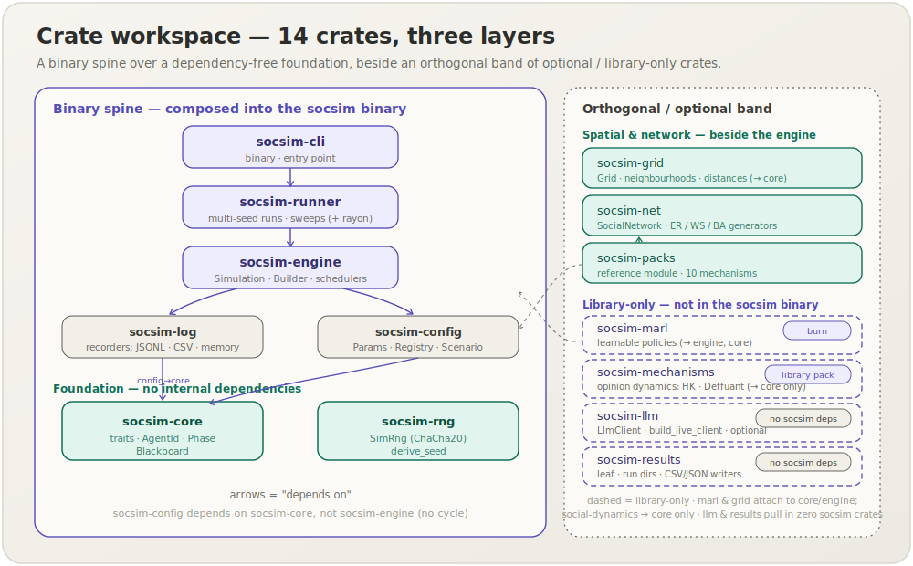
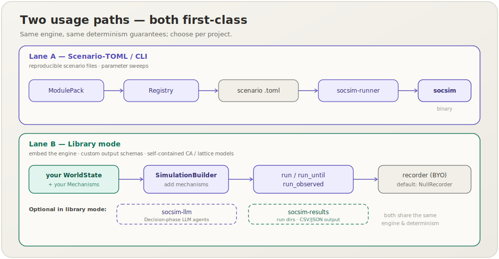
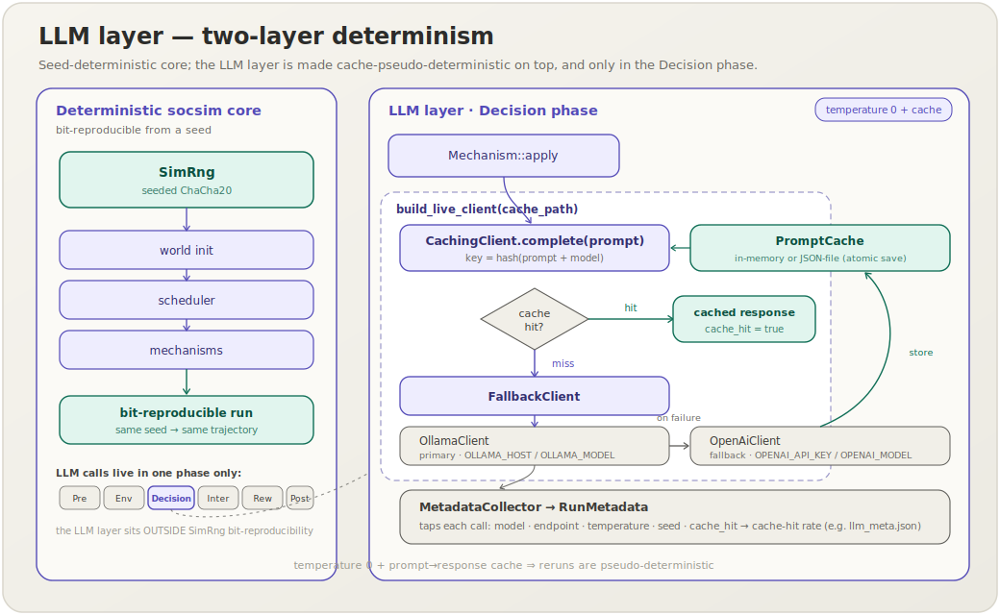
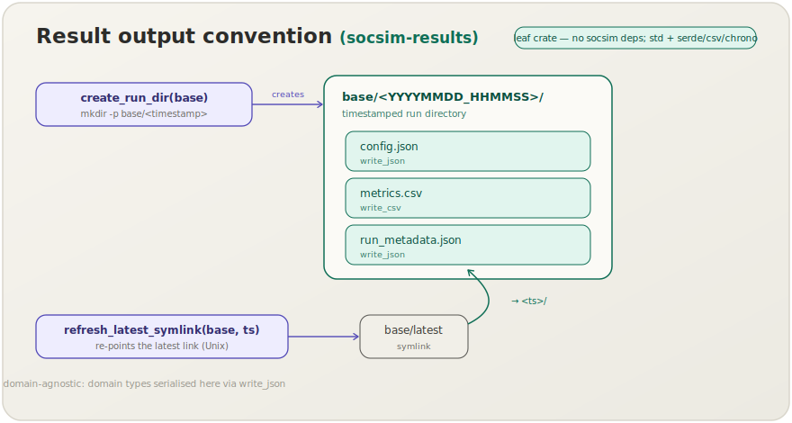

[English](architecture.md) | **日本語**

# アーキテクチャ

---

## クレートワークスペース

ワークスペースは3層に整理された14個のクレートで構成されています：



```
socsim-cli          ← バイナリ（エントリーポイント）
    └── socsim-runner      ← マルチシード実行，スイープ，サマリー
            ├── socsim-engine      ← Simulation, SimulationBuilder, スケジューラー
            │       └── socsim-log         ← InMemoryRecorder, JsonlRecorder, CsvRecorder
            ├── socsim-config      ← Params, Registry, ModulePack, Scenarioローダー
            │       └── socsim-core        ← トレイト (Mechanism, WorldState, …), AgentId, Phase, Blackboard
            ├── socsim-hr-lifecycle ← リファレンスモジュール（10メカニズム）
            │       └── socsim-net         ← SocialNetwork（ER, WS, BAジェネレーター）
            ├── socsim-grid        ← Grid, GridIndex, 近傍, 距離（空間モデル）
            ├── socsim-marl        ← 学習ポリシー(MARL): Policy, PolicyMechanism, MarlTrainer（burn; ライブラリ専用）
            └── socsim-rng         ← SimRng (ChaCha20), derive_seed

socsim-social-dynamics ← 汎用の意見ダイナミクスパック: HegselmannKrauseMechanism, DeffuantMechanism, MeanOperator（→ socsim-core のみ; ライブラリ専用）
socsim-llm      ← オプションのLLMエージェント層: LlmClient, CachingClient, build_live_client（socsim 依存なし; feature ゲート; ライブラリ専用）
socsim-results  ← リーフの出力ヘルパ: timestamp, create_run_dir, write_csv/json, refresh_latest_symlink（socsim 依存なし; ライブラリ専用）
```

依存ルール：

- `socsim-core` と `socsim-rng` は**内部依存なし** — これらが基盤です．
- `socsim-config` は `socsim-core` に依存しますが，循環を避けるため `socsim-engine` には**依存しません**．
- `socsim-engine` は `socsim-core`，`socsim-log`，`socsim-config` に依存します．
- `socsim-runner` は上記すべてに依存し，並列処理のために `rayon` を追加します．
- `socsim-cli` はすべてを `socsim` バイナリとして結合します．
- `socsim-hr-lifecycle`，`socsim-net`，`socsim-grid` はエンジン層の隣に位置し，直交しています；`socsim-grid` は `socsim-core` にのみ依存します．
- `socsim-marl`（Phase 6）は `socsim-engine` と `socsim-core` に依存します．**ライブラリ専用**（`socsim` バイナリには含まれません）で，ニューラルネットフレームワーク `burn` を取り込むため，hr-lifecycle 連携は `marl` feature でゲートしています．
- `socsim-llm` はエンジン層の隣に位置する**直交した，オプションの**層です．**`socsim-*` 依存はなく**（`serde`/`serde_json`/`thiserror` のみ，加えて feature 越しの `ureq`），**ライブラリ専用**です．ライブのプロバイダバックエンドは feature ゲート（`ollama`，`openai`，および両者をまとめた `live`）されており，デフォルトビルドはネットワーク依存を一切取り込みません．LLM 駆動モデルの `Decision` フェーズで使用します．
- `socsim-results` は**リーフクレート**で，**`socsim-*` 依存はなく**（`std` に加えて `serde`/`serde_json`/`csv`/`chrono` のみ），軽量ライブラリモード向けの出力ボイラープレートを提供します．`socsim-log`/`-config`/`-runner` を一切取り込みません．
- `socsim-social-dynamics` はエンジン層の隣に位置する**直交した，オプションの**パックです．**`socsim-core` のみ**に依存し（`ScalarOpinions` / `OpinionNeighbors` 能力トレイトのため），**ライブラリ専用**です — `ModulePack` を持たず，`socsim` バイナリには組み込まれません．これは**最初の汎用（非 HR）メカニズムパック**です：再利用可能でドメイン非依存な意見ダイナミクスの構成要素（有界信頼の `HegselmannKrauseMechanism` と `DeffuantMechanism`，および A/G/H/P/R の `MeanOperator` ファミリー）を提供し，シナリオ固有の `socsim-hr-lifecycle` パックとは区別されます．

---

## 6フェーズティックループ

各離散時間ステップは，`Phase::ORDER` で定義された固定順序で6つのフェーズを実行します：

```
PreStep → Environment → Decision → Interaction → Reward → PostStep
```

エンジンの `Simulation::step` メソッドは：

1. クロックをティック（`t += 1`）します．
2. `Scheduler` にエージェントの活性化順序を問い合わせます．
3. `Phase::ORDER` の各フェーズで，そのフェーズを登録したすべてのメカニズムを挿入順に呼び出します．

ステップ2で計算された活性化順序は `StepContext::agent_order` としてすべてのフェーズに渡され，同じステップ内のメカニズムが同じ順序を見ることを保証します．

メカニズムは `Mechanism::phases` から `'static` スライスを返すことでフェーズを登録します．登録された各フェーズで1ステップに1回呼び出されます．HRライフサイクルメカニズムの典型的なフェーズ割り当ては以下の通りです：

| メカニズム | フェーズ |
|---|---|
| `learning_curve` | Environment |
| `peer_effect` | Interaction |
| `ocb` | Interaction |
| `fit` | Decision |
| `turnover` | Decision |
| `hiring` | Decision |
| `knowledge_loss` | PostStep |
| `socialization` | PostStep |
| `toxic_spread` | Interaction |
| `org_performance` | Reward |

### イベント駆動 / サブティックモデル

固定のティックループは，socsim を1ティックあたりエージェント1アクションのモデルに制限**しません**．イベント駆動・サブティックのダイナミクス（Gillespie型反応，投票者モデル，接触過程の感染）は，単純な慣用句でサポートされます：**多数の微小イベントを1つの `Mechanism::apply` 内でバッチ処理し，それらのイベントを1ティックにマッピングする**ことです．1回の `apply()` 呼び出しが `events_per_step` 個のランダムな単一セル／エージェント更新（すべて `ctx.rng` から引く）を実行するので，エンジンのティックが観測／チェックポイントの間隔となり，イベントごとの更新セマンティクスは保たれます．モデルが吸収状態に達したとき，メカニズムは `ctx.request_stop()` を呼べます．動作する格子投票者モデルは `crates/socsim-engine/examples/cellular_automata.rs` を参照してください．

---

## 2つの利用経路：シナリオCLI vs. ライブラリモード

socsim は2通りの使い方ができ，**どちらもファーストクラス**です：



- **シナリオTOML / CLI経路** — `ModulePack` → `Registry` → シナリオ `.toml` → `socsim-runner` → `socsim` バイナリ．新規プロジェクト，再現可能なシナリオファイル，パラメータスイープに最適です．
- **ライブラリモード** — `socsim-core` / `socsim-engine`（および任意で `socsim-grid`）だけに依存し，ワールドを自分で構築し，メカニズムを `SimulationBuilder` に直接追加し，`run` / `run_until` / `run_observed` で駆動し，独自のレコーダーを持ち込みます（あるいは持ち込まない — デフォルトは `NullRecorder` なので，エンジンは `socsim-log` 依存を強制しません）．既存ツールへのエンジン埋め込み，カスタム出力スキーマ，自己完結型の格子／CAモデルに最適です．

2つの経路は同じエンジンと決定論性の保証を共有します；プラットフォームごとではなくプロジェクトごとに選択してください．トレードオフ表は[ライブラリガイド](library.ja.md#軽量エンジンのみの利用toml--runner-なし)を参照してください．

---

## 決定論的RNG

`socsim-rng` は `rand_chacha::ChaCha20Rng` をラップして再現可能なストリームを提供します．主なAPIは：

- `SimRng::from_seed(seed: u64)` — ルートRNGを作成します．
- `SimRng::derive(&[u64])` — ラベル（エージェントID，フェーズインデックスなど）から子RNGを派生させます（親を変更しません）．FNV-1a風のハッシュミックスを使用します．

エンジンはシナリオの `seed` フィールドからルートRNGをシードします．同じシードは，マシンアーキテクチャやRustのバージョンに関わらず，常に同じエージェント軌跡を生成します．

エージェントとチームの集計は常にソートされた `AgentId` 順で反復し，ハッシュマップの反復非決定性を排除します．

---

## スナップショット：保存と再開

シミュレーションの**可変状態**を捕捉・復元できます — PyTorch の `state_dict`（状態）と model architecture（コード）の分離に相当します．`Snapshot<W>` は World（`SimClock` を含む），`SimRng` の厳密なストリーム位置（`rand_chacha` の `serde1` でシリアライズ），early-stop フラグを保持します．mechanisms・scheduler・recorder は*コード*であり再構築側が用意するため，意図的に含めません．

- `Simulation::snapshot()` / `restore(snapshot)` — メモリ上での捕捉/復元（`snapshot()` は `W: Clone` が必要）．
- `Snapshot::save(path)` / `Snapshot::load(path)` — JSON 永続化，`SNAPSHOT_VERSION` で版チェック．

**同じ** mechanisms で構築した `Simulation` にスナップショットを復元すると，保存時点以降の実行がビット単位で再現されます — *別シード*で構築した sim に復元しても無中断実行と一致することをテストで検証しています．境界はオプトイン（`W: Serialize` / `DeserializeOwned` でゲートした `impl`）なので `WorldState` トレイトは不変で，serde 非対応の World は単にこれらのメソッドを持ちません．`SocialNetwork` は `{nodes, edges}` のペアとしてシリアライズし（petgraph の `NodeIndex` は永続化せず再構築），petgraph のバージョン差にも安定です．

---

## 学習ポリシー（MARL, Phase 6）

`socsim-marl` は `Decision` フェーズを学習可能にします：`PolicyMechanism` が `Policy`（`burn` の小さな MLP を REINFORCE で学習する `DiscretePolicyNet` が実装）をラップし，他のメカニズムと同じ6フェーズループに差し込めます — エンジンの変更は不要です．`ObsEncoder`/`ActionApplier`/`RewardFn` が具体的な World とフラットな特徴・行動空間を橋渡しし，`TrajectoryBuffer` がエピソードを収集，`MarlTrainer` が外側の学習ループを回します．重みは `SimRng` からシードされ全テンソル演算は CPU 上なので，凍結ポリシーはビット単位で再現可能です．使い方は[ライブラリガイド](library.ja.md#学習ポリシーmarl)を参照してください．

---

## LLM層（socsim-llm）

`socsim-llm` は LLM 駆動エージェント向けのオプション層です．socsim コアは**決定論的で LLM フリー**なので，このクレートはモデルの非決定性を1箇所に閉じ込め，*疑似決定論化*します — これは意図的な**2層決定論**の設計です：socsim コアがシード決定論的であり，その上に LLM 層を*キャッシュ疑似決定論的*に重ねます．規約として LLM 呼び出しはメカニズムの `Decision` フェーズに閉じ込めます（LLM 呼び出しは `Mechanism::apply` 内でインラインに行う同期的な `complete` にすぎません）．



すべてはプロバイダ非依存の単一トレイトの上に構築されています：

```rust,ignore
pub trait LlmClient {
    fn model(&self) -> &str;
    fn endpoint(&self) -> &str;
    fn complete(&self, prompt: &str, config: &LlmConfig) -> Result<LlmResponse, LlmError>;
}
```

本番スタックは `live` feature 越しに1回の呼び出しで組み立てます：

```rust,ignore
let client: CachingClient<Box<dyn LlmClient>> =
    socsim_llm::build_live_client(cache_path /* Option<&Path> */)?;
```

`build_live_client` は環境変数から **Ollama-first → OpenAI-fallback → 型消去 → キャッシュ**を構成します：

- **Ollama**（プライマリ）— `OLLAMA_HOST`（既定 `http://localhost:11434`）と `OLLAMA_MODEL`（既定 `llama3.1`）．
- **OpenAI**（ベストエフォートのフォールバック）— `OPENAI_API_KEY` と `OPENAI_MODEL`（既定 `gpt-4o-mini`）．`OPENAI_API_KEY` が未設定ならプレースホルダを構築し，Ollama 自体が失敗したときにのみエラーになります（Ollama 単体の構成でも動作します）．
- バックエンドは `Box<dyn LlmClient>` に型消去され，本番スタックでもテスト用モックの注入でも同じ具体的な戻り値型で扱えます．

構築は**遅延**です — キャッシュミス時に `CachingClient::complete` が呼ばれるまでネットワーク呼び出しは発生しません．

疑似決定論は2つの要素から生まれます：

- **`PromptCache`** — `hash(prompt + model)`（`cache_key`）をキーとするプロンプト → レスポンスのキャッシュで，インメモリ（`PromptCache::in_memory`）または JSON ファイルバック（`PromptCache::open`，アトミック保存）です．`LlmConfig::deterministic()` は `temperature = 0` と固定 `seed` を設定し，ウォームキャッシュと組み合わせると再実行で同一のレスポンスを再生し，ノイズの多いモデルを再現可能なオラクルに変えます．
- **`MetadataCollector`** / **`RunMetadata`** — `CallMetadata` が呼び出しごとに model / endpoint / temperature / seed / `cache_hit` を記録し，`MetadataCollector::summary()` がこれらをシリアライズ可能な `RunMetadata`（model，endpoint，生成設定，総呼び出し数，キャッシュヒット数，キャッシュヒット率）に集約します．replication はこれを（例：`llm_meta.json` として）永続化します．

決定論的なテストには `mock::ScriptedClient` があります — クロージャで応答するネットワークフリーの `LlmClient` で，ライブバックエンドとまったく同じように `CachingClient` に差し込めます．

このクレートは**ライブラリ専用**で `socsim` バイナリには組み込まれていません；軽量 replication は git 依存で直接取り込みます．

---

## 結果出力ヘルパ（socsim-results）

`socsim-results` は，軽量ライブラリモードの replication がそろってコピーしていた出力ボイラープレートを切り出したものです．これらの replication は独自の `main.rs` + clap CLI を備え出力を直接書き込む（`Recorder`/`Scenario` 機構を使わない）ため，このクレートは依存の少ない**リーフクレート**です — `std` に加えて `serde`/`serde_json`/`csv`/`chrono` のみで，**`socsim-*` 依存はない**ので，取り込んでも `socsim-log`/`-config`/`-runner` を一切引き込みません．



共有の `results/` 出力規約を提供します：

- `timestamp()` — 現在のローカル時刻を `YYYYMMDD_HHMMSS` のスタンプで返します．
- `create_run_dir(base)` — タイムスタンプ付き実行ディレクトリ `base/<timestamp>` を作成します；`ensure_dir(path)` は冪等な `mkdir -p` です．
- `refresh_latest_symlink(base, target)` — `base/latest` を最新の実行に（再）指定します（Unix のシンボリックリンク；それ以外ではベストエフォートの no-op）．
- `write_csv(rows, path)` / `write_json(value, path)` — serde ベースの CSV/JSON ライタ（`socsim-llm` の `RunMetadata` はこの JSON ライタで永続化されます）．I/O / CSV / JSON の失敗源をまとめた `WriteError` を返します．

設計上ドメイン非依存です：汎用のシリアライズプリミティブのみを提供するので，ドメイン型（`socsim-llm` の `RunMetadata` など）はそれぞれの所有クレートに置き，ここでは `write_json` 経由で書き込みます．

---

## ソーシャルネットワーク層

`socsim-net` は `SocialNetwork` を提供します — `petgraph::UnGraph<AgentId, ()>` の薄いラッパーで，O(1) ルックアップのための `AgentId → NodeIndex` マップを持つ無向グラフです．3つのランダムグラフジェネレーターが含まれており，すべて `&mut SimRng` を受け取ります：

| ジェネレーター | モデル |
|---|---|
| `SocialNetwork::erdos_renyi(ids, p, rng)` | Erdős–Rényi G(n,p) |
| `SocialNetwork::watts_strogatz(ids, k, beta, rng)` | Watts–Strogatz スモールワールド |
| `SocialNetwork::barabasi_albert(ids, m, rng)` | Barabási–Albert 優先的結合 |

HRライフサイクルベースラインは `watts_strogatz(k=4, beta=0.1)` を使用して従業員間のスモールワールドネットワークをモデル化します．`toxic_spread` と `turnover` メカニズムは各ステップで隣接リストを問い合わせます．

---

## キャリブレーション哲学

HRライフサイクルモジュールはパラメータを2つのカテゴリに分けています：

### 経験的相関（ρ）

これらは発表されたメタ分析から直接引用した**固定された影響強度**です．文献で記録された効果の方向と相対的な大きさを表します．基礎となる引用を置き換える場合を除き，変更すべきではありません．

| 定数 | 値 | 出典 |
|---|---|---|
| `RHO_SI` | 0.51 | Schmidt & Hunter (1998) — 構造化面接の妥当性 |
| `ALPHA_PEER` | 0.17 | Mas & Moretti (2009) — ピア生産性乗数 |
| `P_TOXIC` | 0.04 | Housman & Minor (2015) — 有害労働者の基準有病率 |
| `P_SPREAD` | 0.46 | Housman & Minor (2015) — 有害行動の感染確率 |
| `PHI_TACIT` | 0.85 | Nonaka (1994) — 暗黙知対総知識の比率 |
| `RHO_PJ` | 0.20 | Kristof-Brown et al. (2005) — PJ適合の相関 |
| `RHO_PO` | 0.07 | Kristof-Brown et al. (2005) — PO適合の相関 |
| `RHO_PO_TURN` | −0.35 | Kristof-Brown et al. (2005) — PO適合対離職意図 |
| `LAMBDA_LEARN` | 0.15 | Bahk & Gort (1993) — 学習曲線成長率 |

### 月次ダイナミクススケールパラメータ（チューナブル）

これらは，シミュレーションの月次ダイナミクスのペースと大きさを制御する**キャリブレーション制御パラメータ**です．直接的な経験的対応物はありませんが，モデルが妥当な軌跡（例：年間~15〜22%の自発的離職率，徐々に成長するが発散しない知識ストック）を生成するように調整されています．

| 定数 | 値 | 制御対象 |
|---|---|---|
| `BASE_MONTHLY_QUIT_HAZARD` | 0.008 | 基準~0.8%/月の離職確率 |
| `BASE_QUIT_LOGIT` | −4.82 | ロジット切片（`logit(0.008)`） |
| `QUIT_EMBED_SENS` | 1.0 | (1 − 埋め込み度)に対する離職ロジットの感度 |
| `QUIT_SAT_SENS` | 0.8 | (1 − 満足度)に対する離職ロジットの感度 |
| `QUIT_CASCADE_BUMP` | 0.30 | 離職した隣接者ごとの加算的ロジットバンプ（Krackhardtカスケード） |
| `ALPHA_K` | 0.30 | チーム知識ストックへのOCB流入係数 |
| `BETA_LOSS` | 1.0 | 在職期間（年単位）に対する知識損失指数 |
| `KAPPA_LOSS` | 0.40 | 知識損失の大きさ係数 |
| `THETA_MEAN` | 1.0 | 採用時の真の能力θの平均 |
| `THETA_SD` | 0.2 | θの標準偏差 |

すべてのキャリブレーション定数は，引用元を記載したdocコメントとともに `crates/socsim-hr-lifecycle/src/calibration.rs` にあります．

---

## シナリオTOMLスキーマ

シナリオTOMLには4つのセクションがあります：

```toml
[simulation]   # name, module_pack, t_max, seed, scheduler
[world]        # ワールドファクトリーに転送される自由形式のパラメータ
[[mechanism]]  # 順序付き配列；構成するメカニズムごとに1エントリー
[output]       # log_pathテンプレートとメトリクスキー
```

`[[mechanism]]` 配列は**順序保存**されます：構成順序は宣言順序と等しくなります．各 `Phase` 内では，メカニズムはシナリオファイルに現れる順に発火します．

`output.log_path` テンプレートは `{name}` と `{seed}` の置換をサポートします．

2つのスケジューラーが利用可能です：`sequential`（ソートされた `AgentId` 順，完全に決定論的）と `random_activation`（シミュレーションRNGを使って各ステップでシャッフル）．
