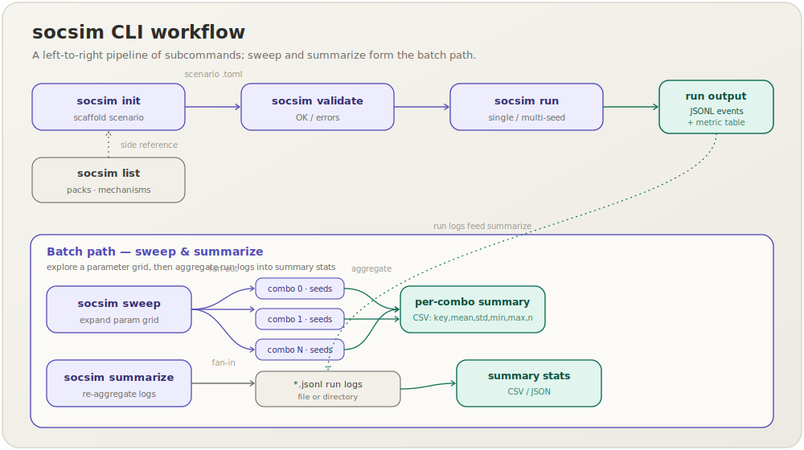

**English** | [日本語](cli.ja.md)

# CLI Reference

The `socsim` binary exposes six subcommands. Run `socsim --help` or `socsim <COMMAND> --help` for flags.

The binary is **world-polymorphic**: every scenario names a *module pack* and is dispatched to that pack's world type. Two packs ship today (`hr-lifecycle`, `opinion-dynamics`); new packs register behind a `pack-*` Cargo feature.

```
socsim <COMMAND>

Commands:
  init       Generate a starter scenario TOML for a module pack
  run        Run a scenario (single seed or multi-seed)
  validate   Validate a scenario TOML against the pack's registry
  list       List available module packs or mechanisms
  sweep      Run a grid parameter sweep
  summarize  Re-aggregate existing JSONL run logs into a summary
  help       Print this message or the help of the given subcommand(s)
```



---

## init

Generate a starter scenario TOML for a module pack.

```
socsim init --module-pack <MODULE_PACK> --out <OUT>
```

| Flag | Description |
|---|---|
| `--module-pack` | Pack name, e.g. `hr-lifecycle` |
| `-o, --out` | Output file path |

**Example**

```sh
socsim init --module-pack hr-lifecycle --out scenarios/my_scenario.toml
```

Output:

```
Wrote starter scenario to 'scenarios/my_scenario.toml'
```

The `opinion-dynamics` pack is also available, e.g. `socsim init --module-pack opinion-dynamics --out scenarios/op.toml`.

---

## run

Run a scenario TOML for one seed or a range of seeds.

```
socsim run [OPTIONS] <SCENARIO>
```

| Flag | Default | Description |
|---|---|---|
| `--seeds <A..B>` | scenario seed | Seed range (exclusive upper bound) |
| `--parallel` | false | Run seeds in parallel using Rayon |

**Single-seed run** (uses the seed from the TOML):

```sh
socsim run scenarios/hr_lifecycle_baseline.toml
```

Output:

```
Running 'hr_lifecycle_baseline' (pack=hr-lifecycle, t_max=60, seeds=[42], parallel=false)

Seed 42 — 82 events recorded

t             avg_tenure   knowledge_stock   org_performance     turnover_rate
10                9.1000           53.9517           32.1462            0.0000
20               14.6000           62.4468           35.7133            0.0000
30               21.5500           72.5042           40.4270            0.0250
40               25.9000           78.4727           40.2186            0.0000
50               30.0750           85.3493           40.8007            0.0000
60               35.6250           92.3841           41.8100            0.0000
```

**Multi-seed run** prints a cross-seed summary table instead of per-step series:

```sh
socsim run scenarios/hr_lifecycle_baseline.toml --seeds 0..3
```

Output:

```
Running 'hr_lifecycle_baseline' (pack=hr-lifecycle, t_max=60, seeds=[0, 1, 2], parallel=false)

Cross-seed summary (3 seeds):

metric                      mean         std         min         max      n
------------------------------------------------------------------------
avg_tenure               35.8000      0.5319     35.3750     36.5500      3
knowledge_stock          92.6772      1.2340     91.1426     94.1641      3
org_performance          42.8467      1.4574     40.7856     43.8800      3
turnover_rate             0.0083      0.0118      0.0000      0.0250      3
```

After each run, JSONL log files are written as specified by `output.log_path` in the scenario TOML (see [JSONL output format](#jsonl-output-format) below).

---

## validate

Check that all mechanism names in a scenario TOML are registered in the named pack and that the scheduler and `t_max` are valid.

```
socsim validate <SCENARIO>
```

**Example**

```sh
socsim validate scenarios/hr_lifecycle_baseline.toml
# OK — scenario 'scenarios/hr_lifecycle_baseline.toml' is valid.
```

---

## list

List available module packs or the mechanisms inside each pack. For what each pack contains, see the [module pack catalog](packs.md).

```
socsim list <WHAT>
```

`<WHAT>` is one of `packs` or `mechanisms`.

**Examples**

```sh
socsim list packs
```

```
Available module packs:
  hr-lifecycle
  opinion-dynamics
```

```sh
socsim list mechanisms
```

```
Mechanisms by pack:
  [hr-lifecycle]
    fit
    hiring
    knowledge_loss
    learning_curve
    ocb
    org_performance
    peer_effect
    socialization
    toxic_spread
    turnover
  [opinion-dynamics]
    convergence
    deffuant
    hegselmann_krause
    lorenz
    opinion_metrics
    social_judgement
```

---

## sweep

Run a grid parameter sweep over the Cartesian product of one or more parameter axes.

```
socsim sweep [OPTIONS] <SCENARIO>
```

| Flag | Default | Description |
|---|---|---|
| `--param <MECH.PARAM=V1,V2,...>` | — | Sweep axis (repeatable for multi-dimensional sweep) |
| `--seeds <A..B>` | `0..5` | Seed range for each combo |
| `-o, --out <DIR>` | `runs/sweep` | Output directory for per-combo CSV files |
| `--parallel` | false | Parallel seeds within each combo |

**Example** — probe how `toxic_spread.p_spread` affects outcomes:

```sh
socsim sweep scenarios/hr_lifecycle_baseline.toml \
    --param "toxic_spread.p_spread=0.2,0.46,0.7" \
    --seeds 0..3
```

Output (abridged):

```
Sweeping 'hr_lifecycle_baseline' over 1 axes × 3 seeds
  toxic_spread.p_spread = [0.2, 0.46, 0.7]
  combo 0: toxic_spread.p_spread=0.2000
metric                      mean         std         min         max      n
------------------------------------------------------------------------
avg_tenure               35.3250      5.0624     29.1000     41.5000      3
...
  combo 2: toxic_spread.p_spread=0.7000
...
Wrote 3 CSV files to 'runs/sweep'
```

Each CSV file is named `combo_<N>_<param>=<value>.csv` and contains columns `key,mean,std,min,max,n`.

**Multi-dimensional sweep** — add `--param` once per axis:

```sh
socsim sweep scenarios/hr_lifecycle_baseline.toml \
    --param "peer_effect.alpha_peer=0.1,0.17,0.3" \
    --param "turnover.quit_cascade_bump=0.1,0.3,0.5" \
    --seeds 0..10 --parallel
```

---

## summarize

Re-aggregate one or more existing JSONL run logs into summary statistics without re-running the simulation.

```
socsim summarize [OPTIONS] <PATH>
```

| Flag | Default | Description |
|---|---|---|
| `--format <csv\|json>` | `csv` | Output format |

`<PATH>` may be a single `.jsonl` file or a directory; directories are scanned non-recursively for `*.jsonl` files.

**Examples**

```sh
socsim summarize runs/hr_lifecycle_baseline_42.jsonl
```

```
key,mean,std,min,max,n
avg_tenure,35.625000,0.000000,35.625000,35.625000,1
knowledge_stock,92.384145,0.000000,92.384145,92.384145,1
org_performance,41.810021,0.000000,41.810021,41.810021,1
turnover_rate,0.000000,0.000000,0.000000,0.000000,1
```

```sh
socsim summarize runs/ --format json
```

---

## JSONL output format

Each `socsim run` writes one JSONL file per seed. The path is controlled by `output.log_path` in the scenario TOML, which supports two substitution tokens:

| Token | Replaced with |
|---|---|
| `{name}` | `simulation.name` |
| `{seed}` | The integer seed for that trial |

Example template: `"runs/{name}_{seed}.jsonl"` → `runs/hr_lifecycle_baseline_42.jsonl`

Each line of the JSONL file is a self-contained JSON object. Two record types are emitted:

**Metric record**

```json
{"type":"metric","t":1,"key":"turnover_rate","value":0.0}
```

**Event record**

```json
{"type":"event","t":3,"kind":"turnover","payload":{"agent":7,"team":2}}
```

Fields are consistent across all records of each type; `payload` is mechanism-specific.
