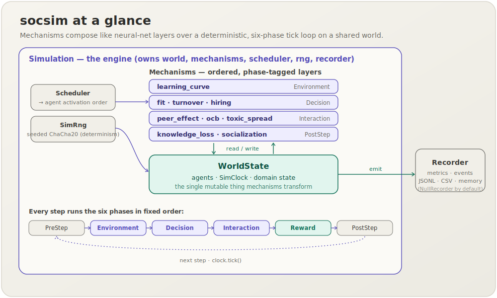
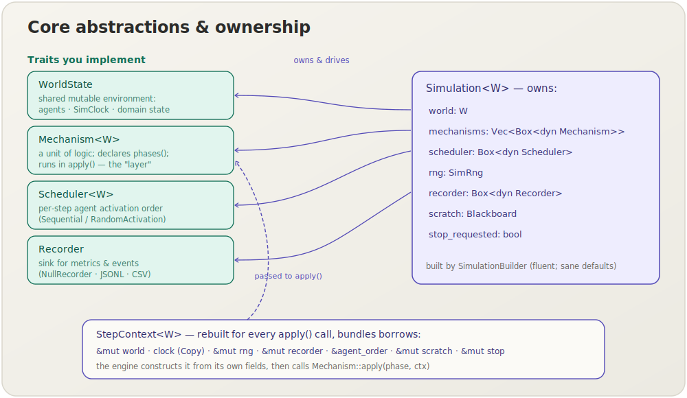
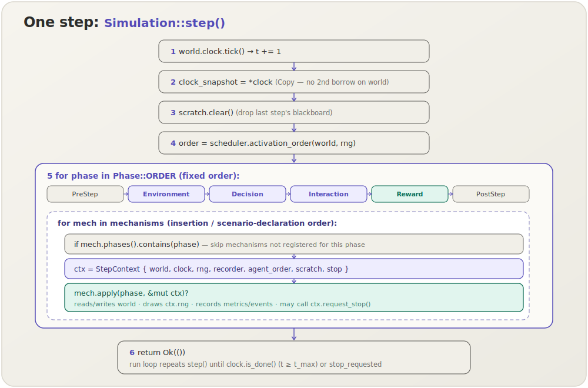
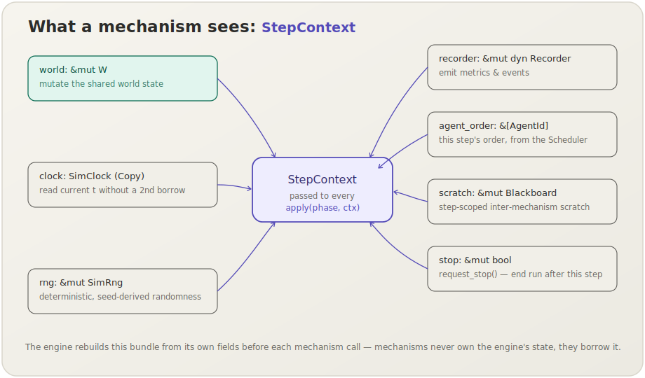
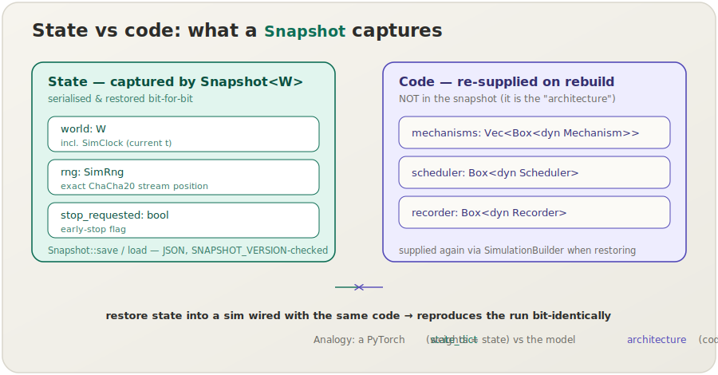

[English](design.md) | **日本語**

# 設計概要

このページは socsim の概念的な入口にあたります．socsim とは何か，どのような思想に基づいて設計されているか，主要な型がそれぞれどのような役割を担うか，そして6フェーズループの1ステップで各パーツがどのように振る舞うかを，順を追って詳しく説明します．クレート依存グラフ・キャリブレーション哲学・シナリオスキーマといったリファレンスレベルの内容は[アーキテクチャ](architecture.ja.md)ページを，同梱のメカニズムについては[メカニズムカタログ](mechanisms.ja.md)を参照してください．

## 1. socsim とは

`socsim` は，合成可能なエージェントベースの社会シミュレーションエンジンです．シミュレーションの中心には**共有ワールド**があり，これを**メカニズム**のスタックが固定された6フェーズの順序でステップごとに変換していきます．乱数はすべて単一のシード付きRNGから生成されます．

設計の指針となる比喩はニューラルネットワークです．メカニズムはレイヤーのように積み重ねて合成でき，ワールドはそれらが読み書きするテンソルにあたり，エンジンはそれらを順番に実行するランタイムにあたります．モデルを組み立てる際は，エンジンに手を入れるのではなく，*メカニズムを積み重ねる*ことで構成します．



こうして得られるのが**ABM + RL スタイルのティックループ**です．離散時間が1ステップずつ進み，すべてのエージェントとグローバルな効果はフェーズに割り当てられたメカニズムとして表現され，実行全体は指定したシードに対して決定論的に再現されます．

## 2. 設計思想

**合成を優先し，エンジンには手を入れない．** ドメインロジックはすべてメカニズムに集約されます．新しい挙動を追加するとは，もう1つの `Mechanism` を書いてフェーズに割り当てることに他なりません．エンジン・ワールドトレイト・他のすべてのメカニズムには一切手を加えずに済みます．「ニューラルネットのレイヤーのように合成する」とは，実際にはこのことを指します．

**状態とコードを分離する．** 実行時の*状態*にあたるのは，ワールド（クロックを所有する），RNGストリームの位置，停止フラグです．一方の*コード*にあたるのは，メカニズムの集合，スケジューラー，レコーダーです．[`Snapshot`](#7-状態とコードスナップショットと決定論性)はこのうち状態のみを保存します．これは PyTorch における `state_dict`（状態）とモデルアーキテクチャ（コード）の分離とまったく同じ発想であり，これにより実行を保存してビット単位で正確に再開できます．

**決定論性は構造として組み込む．** 再現性は後から有効化する機能ではなく，構造そのものに由来します．乱数はすべて単一のシード付き ChaCha20 ストリームから派生します．エージェントと集計は常にソート済みの `AgentId` 順で反復されるため，浮動小数点の和とRNGの引きが安定します．クロックは値渡しされるため，`t` を読み取る際にワールドを再び借用する必要がありません．そして活性化順序は，ハッシュマップの順序に左右される偶発的なものではなく，`Scheduler` による明示的な決定として与えられます．

**実装すべきトレイトはわずか．** 実装が必要なトレイトは `WorldState`，`Mechanism`，`Scheduler`，`Recorder` の4つだけで，ほとんどのプロジェクトでは最初の2つを書くだけで済みます．残りはすべて，具体的なエンジン側の機構です．

**2つの利用経路はどちらも主たる手段．** 同一のエンジンと決定論性の保証が，シナリオTOML / CLI経路（`.toml` にメカニズムを宣言して `socsim` バイナリで実行する）と，ライブラリモード（Rustでワールドを構築して `Simulation` を直接駆動する）の両方を支えています．一方が他方より劣るということはありません．

**6フェーズループは協調のための取り決め．** メカニズムどうしが直接呼び出し合うことはありません．その代わり，参加するフェーズを宣言することで，自分の効果が*いつ*発生するかを取り決めます．`PreStep → Environment → Decision → Interaction → Reward → PostStep` というこの固定順序こそが，メカニズムを予測可能に合成するために必要な唯一のプロトコルです．

## 3. 主要な構成要素

socsim は，実装側が用意する4つのトレイトと，エンジンが提供するいくつかの具体的な型から構成されています．



| 型 | 種別 | 役割 | 比喩 |
|---|---|---|---|
| `WorldState` | トレイト（実装側で用意） | 共有される可変な環境．エージェントの一覧，`SimClock`，すべてのドメインデータを保持する． | テンソル / モデル状態 |
| `Mechanism<W>` | トレイト（実装側で用意） | 研究ロジックの1単位．実行するフェーズを宣言し，`apply` で処理を行う． | ネットワークレイヤー |
| `Scheduler<W>` | トレイト（自前で実装するか組み込みを利用） | 各ステップのエージェント活性化順序を決定する． | データローダーの順序 |
| `Recorder` | トレイト（自前で実装するか組み込みを利用） | メトリクスとイベントの出力先．`NullRecorder` が何もしないデフォルト実装． | ロガー / メトリクスライター |
| `AgentId` | struct | 中身を隠した `Copy` 可能なエージェントID．反復順序が決定論的になるよう `Ord` を実装． | 行インデックス |
| `SimClock` | struct | `Copy` 可能な離散時間カウンター．`t`，`t_max`，`is_done`，`tick` を持つ． | エポックカウンター |
| `Phase` | enum | 6つのフェーズ．`Phase::ORDER` がその固定実行順序を表す． | フォワードパスのスケジュール |
| `StepContext<'a, W>` | struct | すべての `apply` 呼び出しに渡される借用一式． | レイヤーのフォワード `ctx` |
| `Blackboard` | struct | ステップ単位の型消去された一時領域．メカニズム間で一時的な値を受け渡す． | ステップごとの活性化キャッシュ |
| `SimRng` | struct | シード付き ChaCha20 ストリーム．`derive` でラベル付きの子ストリームを作成する． | シード付きジェネレーター |
| `Simulation<W>` | struct | 駆動役．ワールド，メカニズム，スケジューラー，RNG，レコーダー，一時領域，停止フラグを所有する． | 学習ループ / ランタイム |
| `SimulationBuilder` | struct | 妥当なデフォルト（シーケンシャルスケジューラー，シード0，`NullRecorder`）を備えた流れるように書けるコンストラクター． | モデルビルダー |
| `Snapshot<W>` | struct | 保存・再開のために可変状態をシリアライズ可能な形で取り込んだもの． | `state_dict` |

所有関係は単純です．`Simulation` が各構成要素を1つずつ**所有**し，メカニズムを呼び出すたびに `StepContext` を通じて，一時的かつ安全にそれらを貸し出します．メカニズムは借用するだけで，エンジンの状態を所有することはありません．

## 4. 6フェーズ実行モデル

すべてのステップは，同じ6つのフェーズを同じ順序で実行します．フェーズは*意味の上での*スケジュールであり，効果が何であるかではなく，どの種類の効果が*いつ*位置づけられるかを示します．

- **PreStep** — メインフェーズ前のセットアップ / ブックキーピング．
- **Environment** — グローバルな外因性の更新（リソースの補充，ショック）．
- **Decision** — エージェントが行動を選択する（このモジュールでは採用/退職も含む）．
- **Interaction** — エージェント間の効果（ピア効果，ネットワーク拡散）．
- **Reward** — ペイオフの計算と集計；メトリクスの記録．
- **PostStep** — 全員が行動した後のクリーンアップ / ロギング．

`Simulation::step()` が行う処理は，具体的には次のとおりです．



1. **クロックを進める**（`t += 1`）．メカニズムが新しい時刻を観測できるよう，これを*最初に*行います．
2. **クロックを値としてコピー**する．`StepContext` は `&mut world` を渡すため，クロックを値渡しにしておくことで，`t` を読み取る際にワールドを再び借用せずに済みます．
3. **一時領域の blackboard をクリア**する．前のステップの値が現在のステップに漏れ込まないようにします．
4. **スケジューラーに活性化順序を一度だけ問い合わせる**．同じ `agent_order` をこのステップのすべてのフェーズで共有することで，すべてのメカニズムが一貫した順序を参照します．
5. **入れ子のループを実行**する．外側のループは `Phase::ORDER` をたどり，内側のループはメカニズムを**挿入順**（シナリオの宣言順と一致する）にたどります．メカニズムは `phases()` で登録したフェーズでのみ実行され，複数のフェーズを登録したメカニズムは，それぞれのフェーズで1回ずつ呼び出されます．エンジンは呼び出しごとに新しい `StepContext` を構築し，`apply(phase, ctx)` を呼びます．
6. **戻る．** ここで実行ループが，さらに1ステップ進めるかどうかを判断します．

リファレンス実装であるHRライフサイクルのメカニズムに当てはめると，1ステップは次のように進みます．

| フェーズ | 動作するメカニズム | 何が起きるか |
|---|---|---|
| PreStep | — | （ブックキーピング用；MARLバリアントで使用） |
| Environment | `learning_curve` | 在職期間が加算され，個人生産性が更新される |
| Decision | `fit`, `turnover`, `hiring` | 満足度の更新；退職の解決；空席の補充 |
| Interaction | `peer_effect`, `ocb`, `toxic_spread` | チーム効果，知識流入，伝染 |
| Reward | `org_performance` | 生産性の合計；ステップメトリクスの記録；チーム平均の再計算 |
| PostStep | `knowledge_loss`, `socialization` | 退職者の暗黙知の消失；新入社員のオンボーディング |

順序が固定されているおかげで，メカニズムは互いを参照することなく，値の受け渡しに依存できます．たとえば `turnover` は Decision フェーズで `departed_this_step` に書き込み，`knowledge_loss` は PostStep フェーズでそれを読み取ります．また `org_performance` は Reward フェーズで各チームの平均能力を再計算し，`peer_effect` は次のステップでその最新の値を読み取ります．各メカニズムが守る取り決めについては[メカニズムカタログ](mechanisms.ja.md)を参照してください．

## 5. メカニズム呼び出しの内側：`StepContext`

メカニズムの `apply` が小さくまとまり，関心が絞られているのは，触れられるものがすべて1つの束として届けられるからです．



- `world: &mut W` — 共有状態を読み取り，変更する．
- `clock: SimClock` — 値のコピー．現在の `t` を自由に読み取れる．
- `rng: &mut SimRng` — 乱数の*唯一の*正規の供給源．これにより実行が再現可能なまま保たれる．
- `recorder: &mut dyn Recorder` — メトリクスとイベントを出力する．
- `agent_order: &[AgentId]` — スケジューラーが定めた，このステップの活性化順序．
- `scratch: &mut Blackboard` — ステップ単位の型消去された領域．同じステップ内の後続メカニズムへ（あるいは外側の駆動側へ）一時的な値を渡すためのもので，`WorldState` を汚染しない．
- `stop: &mut bool` — `request_stop()` を呼ぶと，現在のステップが完了した後に実行を終了する．

これこそが，メカニズムを合成可能に保つ仕組みです．メカニズムは「ワールドとこのコンテキスト」を入力とする純粋な関数であり，隠れたグローバル状態も，互いに対する直接の知識も持ちません．

## 6. シミュレーションの駆動

`Simulation` は `step()` に加えて，小さな駆動用APIを提供します．

- `run()` — クロックが `is_done()`（`t ≥ t_max`）になる**か**，メカニズムが停止を要求するまでステップを進める．
- `run_until(predicate)` — 上記に加えて，`predicate(&world)` が真になった時点でも停止する．
- `run_observed(observe)` — 各ステップの後に `observe(StepReport)` を呼び，収束曲線やリアルタイムのメトリクスを収集する．`step()` と読み取りループを自前で組む必要がない．
- `step()` / `step_reported()` — ループを自分で回したいときに，ちょうど1ステップだけ進める．

ステップの途中で要求された停止は，そのステップが完了した*後に*反映されます．現在のステップに残るメカニズムは引き続き実行され，その後にループが終了します．`StepReport` は，ステップ後のクロック時刻，停止フラグ，そしてワールドと一時領域への共有参照をまとめたものです．

```rust
use socsim_config::{Registry, Params, ModulePack};
use socsim_hr_lifecycle::{HrLifecyclePack, HrWorld};
use socsim_engine::{RandomActivationScheduler, SimulationBuilder};

let mut reg: Registry<HrWorld> = Registry::new();
HrLifecyclePack.register(&mut reg);

let mut builder = SimulationBuilder::new(world)
    .scheduler(Box::new(RandomActivationScheduler))
    .seed(42);
for name in ["learning_curve", "fit", "turnover", "hiring",
             "peer_effect", "ocb", "toxic_spread",
             "org_performance", "knowledge_loss", "socialization"] {
    builder = builder.add_mechanism(reg.build(name, &Params::empty())?);
}
let mut sim = builder.build();
sim.run()?;
```

カスタムワールドとメカニズムの構築については[ライブラリAPI](library.ja.md)を，同じエンジンをシナリオファイルから駆動する方法については[CLIリファレンス](cli.ja.md)を参照してください．

## 7. 状態とコード：スナップショットと決定論性

`Snapshot<W>` は socsim における保存・再開の基本機構であり，状態とコードの分離をそのまま体現しています．



取り込むのは**状態のみ**で，その内訳はワールド（`SimClock` を所有する），正確な `SimRng` ストリーム位置，そして停止フラグです．メカニズム・スケジューラー・レコーダーといった**コード**は意図的に含めません．これらは `Simulation` を再構築する際に改めて与えられるからです．*同じ*メカニズムで構築した simulation にスナップショットを復元すれば，保存したステップ以降の実行がビット単位で正確に継続します．`Snapshot::save` / `load` は，バージョンチェック付きのJSONとして永続化します．

これが成り立つのは，エンジン全体が決定論的だからです．具体的には，（ラベル付きの `derive` 子ストリームを持つ）単一のシード付き ChaCha20 ストリーム，浮動小数点の順序を安定させるためのソート済み `AgentId` での反復，値としてコピーされるクロック，そして明示的なスケジューラーによります．同じシード・同じコードなら，どのマシンでも同じ軌跡が得られます．

## 8. 次のステップ

| ページ | 追加される内容 |
|---|---|
| [アーキテクチャ](architecture.ja.md) | クレート依存グラフ，キャリブレーション哲学，シナリオTOMLスキーマ，スナップショット，MARL |
| [メカニズムカタログ](mechanisms.ja.md) | 各メカニズムの理論，出典，図，フェーズ配置 |
| [ライブラリAPI](library.ja.md) | 独自の `WorldState` と `Mechanism` の実装；エンジンをライブラリとして駆動する |
| [CLIリファレンス](cli.ja.md) | コマンドラインからシナリオを実行，スイープ，サマリー |
