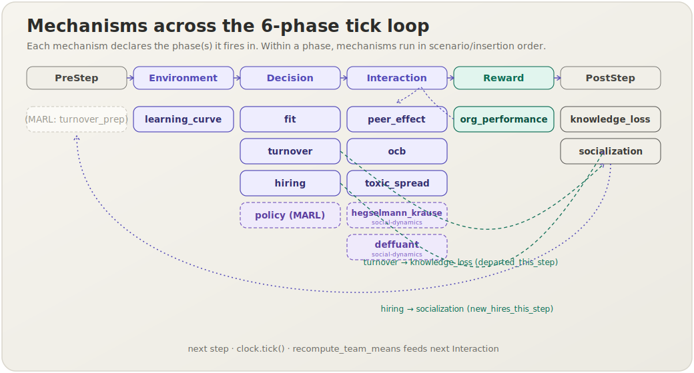

[English](mechanisms.md) | **日本語**

# Mechanism カタログ

**メカニズム**は socsim における研究ロジックの単位です．
[`Mechanism`](library.ja.md) トレイトを実装し（参加するフェーズと単一の `apply` メソッドを宣言し），
共有の[6フェーズティックループ](architecture.ja.md#6フェーズティックループ)を介して他のメカニズムと組み合わせます．
メカニズムはニューラルネットワーク層のように合成され，各メカニズムが `WorldState` を読み書きし，
エンジンがそれらを毎ステップ固定順序で実行します．

このカタログでは，socsim に同梱されている**18個**のメカニズムを解説します．内訳は，
公表された経験的知見に対してキャリブレーション済みの参照用[HR ライフサイクル](usecases.ja.md)メカニズム10個，
学習可能な MARL `policy` メカニズム1個，および7個の社会ダイナミクスメカニズム
（`hegselmann_krause`，`deffuant`，`social_judgement`，`lorenz`，`si_contagion`，`threshold_contagion`，`axelrod`）
— 汎用の非 HR `socsim-social-dynamics` クレート — です．

## 概要



6フェーズの順序は `PreStep → Environment → Decision → Interaction →
Reward → PostStep` に固定されています．メカニズムは `Mechanism::phases` で参加するフェーズを宣言し，
同一フェーズ内ではシナリオでの宣言順（＝挿入順）に発火します．破線の緑矢印は，1ステップ内での**共有状態の受け渡し**を示します．
たとえば `turnover` が `departed_this_step` を設定し，PostStep で `knowledge_loss` がそれを読み取ります．

## 18個のメカニズム

| メカニズム | フェーズ | 出典 | 種別 | 概要 |
|---|---|---|---|---|
| [`learning_curve`](mechanisms/learning-curve.ja.md) | Environment | Bahk & Gort (1993) | empirical | 在職期間に基づく学習効果が個人生産性を向上させる． |
| [`peer_effect`](mechanisms/peer-effect.ja.md) | Interaction | Mas & Moretti (2009) | empirical | チームの能力が各メンバーの実効生産性を引き上げる． |
| [`ocb`](mechanisms/ocb.ja.md) | Interaction | calibration | tunable | 市民的行動がチームの知識ストックに蓄積される． |
| [`fit`](mechanisms/fit.ja.md) | Decision | Kristof-Brown et al. (2005) | empirical | P-J / P-O 適合が職務満足度を駆動する． |
| [`turnover`](mechanisms/turnover.ja.md) | Decision | Kristof-Brown (2005) + Krackhardt | mixed | ネットワークカスケードを伴うロジスティック月次離職ハザード． |
| [`hiring`](mechanisms/hiring.ja.md) | Decision | Schmidt & Hunter (1998) | empirical | チームを補充し，妥当性シグナルで能力を観測して選考する． |
| [`socialization`](mechanisms/socialization.ja.md) | PostStep | onboarding model | calibration | 新入社員をオンボードし，組織定着度を高める． |
| [`knowledge_loss`](mechanisms/knowledge-loss.ja.md) | PostStep | Nonaka (1994) | mixed | ベテランの離職がチームの暗黙知を流出させる． |
| [`toxic_spread`](mechanisms/toxic-spread.ja.md) | Interaction | Housman & Minor (2015) | empirical | 有害行動がネットワークエッジに沿って伝播する． |
| [`org_performance`](mechanisms/org-performance.ja.md) | Reward | aggregation | — | 生産性を集計し，ステップメトリクスを記録する． |
| [`policy`](mechanisms/policy-mechanism.ja.md) | Decision | MARL (§14.1) | learnable | 学習済み RL ポリシーをドロップイン型 Decision メカニズムとして利用する（ライブラリ専用）． |
| [`hegselmann_krause`](mechanisms/hegselmann-krause.ja.md) | Interaction | Hegselmann & Krause (2002, 2005) | bounded-confidence | ε 以内の意見の選択された平均へ向かう同期的な有界信頼更新（ライブラリ専用）． |
| [`deffuant`](mechanisms/deffuant.ja.md) | Interaction | Deffuant et al. (2000) | bounded-confidence | ペアの有界信頼更新：ε 以内の2エージェントが率 μ で収束する（ライブラリ専用）． |
| [`social_judgement`](mechanisms/social-judgement.ja.md) | Interaction | Social Judgement Theory | assimilation–contrast | ε 以内のメッセージを同化し，拒否領域のものに反発する — 分極を駆動する（ライブラリ専用）． |
| [`lorenz`](mechanisms/lorenz.ja.md) | Interaction | Lorenz et al. (2021) | assimilation + reinforcement | 同化に加え，極端な意見を増幅する自己強化項を持つ（ライブラリ専用）． |
| [`si_contagion`](mechanisms/si-contagion.ja.md) | Interaction | SI 感染症モデル | network contagion | 各アクティブな近傍が独立に確率 β で非アクティブなエージェントを感染させる（ライブラリ専用）． |
| [`threshold_contagion`](mechanisms/threshold-contagion.ja.md) | Interaction | Granovetter (1978) | network contagion | 非アクティブなエージェントはアクティブ近傍の割合が θ に達すると活性化する（ライブラリ専用）． |
| [`axelrod`](mechanisms/axelrod.ja.md) | Interaction | Axelrod (1997) | cultural dissemination | 出会いのたびに類似度に等しい確率で異なる特徴を1つコピーする（ライブラリ専用）． |

最後の7行は，汎用の（非 HR）[`socsim-social-dynamics`](architecture.ja.md#クレートワークスペース)クレートの
メンバーであり，HR ライフサイクルクレートとは区別される再利用可能でドメイン非依存な社会ダイナミクスの構成要素
（意見ダイナミクス，ネットワーク伝播，文化伝播）です．
すべて**ライブラリ専用**（`ModulePack` ／シナリオ TOML 登録なし）です．

**Kind** は2種類を区別します．*empirical* はメタ分析から得られた固定相関 ρ で，チューニングできません．
一方の *tunable* は月次ダイナミクスのペースを制御するキャリブレーションスケールです．
詳しくは[キャリブレーション哲学](architecture.ja.md#キャリブレーション哲学)を参照してください．

## メカニズムの適用方法

どちらの利用経路も，同一のエンジンと決定論性の保証を共有します．

### シナリオ TOML（CLI 経路）

各 `[[mechanism]]` ブロックでは，登録済みメカニズムの名前，`phase`，および任意の `params` を指定します．
配列は順序が保存されるため，合成順序は宣言順序と一致し，同一フェーズ内ではその順序でメカニズムが発火します．

```toml
[[mechanism]]
name  = "learning_curve"
phase = "environment"
[mechanism.params]
lambda_learn = 0.15
```

指定できる `phase` 文字列は `pre_step`，`environment`，`decision`，`interaction`，
`reward`，`post_step` です．`socsim run scenarios/<file>.toml` で実行します．

### ライブラリモード

`ModulePack` を `Registry` に登録し，名前を指定してメカニズムをビルドし，`SimulationBuilder` に追加します．

```rust
use socsim_config::{Registry, Params, ModulePack};
use socsim_hr_lifecycle::{HrLifecyclePack, HrWorld};
use socsim_engine::{RandomActivationScheduler, SimulationBuilder};

let mut reg: Registry<HrWorld> = Registry::new();
HrLifecyclePack.register(&mut reg);

let m = reg.build("learning_curve", &Params::empty())?;
let mut sim = SimulationBuilder::new(world)
    .scheduler(Box::new(RandomActivationScheduler))
    .seed(42)
    .add_mechanism(m)
    .build();
sim.run()?;
```

独自のメカニズムの作成については [ライブラリ API](library.ja.md) を，
完全なシナリオスキーマについては [CLI リファレンス](cli.ja.md) を参照してください．

## 新しいメカニズムの作成

ワールド型に対して `Mechanism<W>` を実装し，`phases()` を宣言して，ロジックを `apply()` に記述します．
CLI 経路で使うなら `ModulePack` に登録し，ライブラリモードで使うなら `SimulationBuilder` に直接追加します．
各メカニズムページは，理論と出典，データフロー図，フェーズ配置，状態の読み書きの取り決め，
依存関係，パラメータ，適用方法という同じ構成に従っているので，そのままテンプレートとして活用できます．

## 新しいメカニズムのドキュメント化

**コードベースに新しいメカニズムを追加する際は，必ず対応するドキュメントも併せて追加します**．
これにより，本カタログが実装内容と常に同期した状態に保たれます．
[`learning_curve`](mechanisms/learning-curve.ja.md) ページと
[`mech-learning-curve.svg`](assets/mech-learning-curve.svg) を基準テンプレートとし，
以下のチェックリストを満たしてください．

1. **英語ページ** — `docs/mechanisms/<slug>.md`（正典）．上記の11節構成に従います
   （概要；理論と出典（数式は LaTeX で記述し，`$$...$$` ブロックおよびインライン `$...$` を用いる）；データフロー；
   6フェーズループにおける位置；状態の読み書きコントラクト；依存関係と順序制約；
   パラメータ（経験的 ρ と調整可能スケールを区別）；適用方法（TOML ＋ ライブラリモード）；
   決定論性と RNG；期待される動作；参考文献）．1行目は言語スイッチャー，
   本カタログへの戻りリンクを含めます．
2. **日本語ミラー** — `docs/mechanisms/<slug>.ja.md`，スイッチャーは
   `[English](<slug>.md) | **日本語**`．散文のみ翻訳し，コード・数式・識別子・SVG 参照はそのまま維持します．
3. **図** — `docs/assets/mech-<slug>.svg` を共通スタイルで手書き作成します．
   6フェーズのストリップで該当フェーズをハイライトし，*reads* ボックス → 数式ボックス → *writes* ボックスの順に配置します．
   乱数を引く場合にのみ `ctx.rng` タグを付けます．
4. **カタログ** — `mechanisms.md` と `mechanisms.ja.md` の **両方** の表に行を追加し，
   [`mechanisms-overview.svg`](assets/mechanisms-overview.svg) の該当フェーズ列にメカニズムを配置します．

既存ページの規約（バイリンガル，generated-by フッターなし）に厳密に合わせてください．
