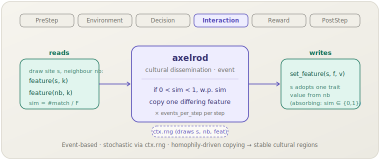

[English](axelrod.md) | **日本語**

# Axelrod 文化伝播（`axelrod`）

> ランダムな出会いのたびに，サイトは近傍と異なる文化特徴を1つ，特徴の重なり（類似度）に等しい確率でコピーします．これにより似た近傍は収束し，似ていない近傍は離れたままになります．
> **フェーズ：** Interaction．**出典：** Axelrod (1997)．**種別：** cultural dissemination（culture vectors, event-driven）．

[← Mechanism カタログに戻る](../mechanisms.ja.md)

## 1. 概要

`axelrod` は，汎用の `socsim-social-dynamics` クレートにおける**文化伝播**メンバーです．
各エージェントは `F` 個の特徴からなる固定長のカテゴリカルな*文化ベクトル*を持ちます．
メカニズムは**イベント駆動**です．各ステップで `events_per_step` 回のマイクロイベントを実行します．
各イベントではサイト `s` を一様に，ランダムな近傍 `nb` を引き，その類似度
`sim = (一致する特徴数) / F` を計算し，`0 < sim < 1` のとき確率 `sim` で
`nb` と異なる特徴を1つランダムに選んで `s` にコピーします．

2つの境界ケースでは何も起こりません．`sim = 0` ではエージェントは特徴値を1つも共有しないため決して相互作用せず，
`sim = 1` では同一なのでコピーするものがありません．この同類性と影響のダイナミクスは
**安定した文化領域** — 近傍が何も共有しない境界で隔てられた，同一エージェントの連続したブロック — を生み出します．
フリー関数 `is_absorbing` は吸収状態（すべての隣接ペアが `sim ∈ {0, 1}`）を判定します．
すなわち，それ以上のイベントがどのエージェントも変化させられない状態です．

このメカニズムは**ライブラリ専用**です．`socsim-core` の `CultureVectors` および `Neighbors`
能力トレイトを実装する任意のワールド上で動作します．これには**`ModulePack` がありません**
（シナリオ TOML 登録なし）．直接構築して `SimulationBuilder` に追加してください．

## 2. 理論と出典

Axelrod (1997) は，なぜ全員が単一の文化に収束せず文化的差異が持続するのかを問いました．
彼のモデルは2つの直観的な力を組み合わせます．**同類性**（エージェントは似た相手とより容易に相互作用する）と
**社会的影響**（相互作用はエージェントをより似させる）です．直観に反して，これらの相互作用は
集団を単一の大域文化ではなく，いくつかの異なる安定した文化に固定しうるのです．

各エージェントは `F` 個の特徴を持つ文化ベクトルを持ち，各特徴は `q` 個のカテゴリカルな特性値の1つを取ります．
サイト `s` と近傍 `nb` について，文化的類似度は

$$\mathrm{sim}(s, nb) = \frac{1}{F}\bigl|\{\, k : \text{feature}(s, k) = \text{feature}(nb, k) \,\}\bigr| \in [0, 1]$$

です．1回の相互作用イベントは次のように進みます．確率 `sim`（同類性／影響）で，`s` と `nb` が異なる特徴 `k` を
一様ランダムに1つ選び，`feature(s, k) ← feature(nb, k)` とします．`sim ∈ {0, 1}` のケースは不活性です．
実装は `wang2025` 再現実装の `classical_event` から逐語的に移植されています．

## 3. データフロー



`events_per_step` 回のイベントごとに，メカニズムはサイト `s` と `neighbors_of(s)` から
ランダムな近傍 `nb` を引き，`sim` を計算するために両者の `feature` 値を読み取り，
`0 < sim < 1` のとき確率 `sim` で，コピーした特徴を1つ `set_feature` で書き込みます．
他の状態には触れません．

## 4. 6フェーズループにおける位置

エージェントが互いに影響を及ぼし合う **Interaction** フェーズで実行されます．文化のコピーそのものが相互作用です．

- 更新は**ステップ内で非同期かつ逐次的**です．`events_per_step` 回のイベントはそれぞれ
  ライブの文化ベクトルを読み書きするため，同一ステップ内の後のイベントは前のイベントの効果を見ます．
- これはイベントベースのイディオムです — 多数のマイクロイベント（出会い）を単一の `apply` 呼び出しにまとめ，
  1つのエンジンティックに対応させます（[イベント駆動／サブティック](../architecture.ja.md#イベント駆動--サブティックモデル)パターンを参照）．
  エンジンティックは観測の刻みであり，`events_per_step` は1観測あたりのコピーイベント回数を決めます．
- 組み込みの停止ロジックはありません．停止が必要なら，ドライバ側またはワールド側の吸収状態チェック
  （`is_absorbing` ヘルパ）と組み合わせてください．

## 5. 状態の読み書きコントラクト

| フィールド | 読み取り | 書き込み | 備考 |
|---|:--:|:--:|---|
| `feature(i, k)`（`CultureVectors`） | ✓ | ✓ | `sim` を計算するためイベントごとにライブで読み取り；コピー成功時に `s` の異なる特徴を1つ上書き． |
| `n_features()`（`CultureVectors`） | ✓ | | ベクトル長 `F`，類似度の分母として使用． |
| `neighbors_of(s)`（`Neighbors`） | ✓ | | 引かれたサイト `s` の候補相手． |

## 6. 依存関係と順序制約

- **上流：** なし．`CultureVectors + Neighbors` を実装するワールドのみを必要とします．
  トポロジー（格子・ネットワーク・完全グラフ）は `neighbors_of` を介したワールド側の関心事であり，
  初期文化ベクトルもワールドの責任です．
- **下流：** 不要．メカニズム自身は収束／停止ロジックを持ちません．
  フリー関数 `is_absorbing(world)` により，ドライバや PostStep チェックが吸収状態を検出して実行を停止できます．

## 7. パラメータ

| パラメータ | 型 | デフォルト | 意味 |
|---|---|---|---|
| `events_per_step` | `usize` | `1` | エンジンティックあたりのマイクロイベント（出会い）回数．大きいほど1観測あたりのダイナミクスが速い． |

特徴数 `F` と特性アルファベット `q` は，メカニズムではなくワールドの性質（`n_features` とそれが保持する特性値を介する）です．
ModulePack がないため，シナリオ TOML のパラメータブロックもありません．単一フィールドはコンストラクタ引数です．

## 8. 適用方法

このメカニズムは**ライブラリモード専用**です — シナリオ TOML 登録はありません．
`CultureVectors + Neighbors` を実装するワールドを用意し，メカニズムを構築して
`SimulationBuilder` に追加します．

```rust
use socsim_core::{AgentId, CultureVectors, Neighbors, WorldState, SimClock};
use socsim_social_dynamics::{AxelrodMechanism, is_absorbing};
use socsim_engine::{SequentialScheduler, SimulationBuilder};

// エージェントごとに F 特徴の文化ベクトルを持つワールド（例：格子上）．
struct CultureWorld { clock: SimClock, f: usize, traits: Vec<Vec<u32>> }

impl WorldState for CultureWorld {
    fn agent_ids(&self) -> Vec<AgentId> {
        (0..self.traits.len() as u64).map(AgentId).collect()
    }
    fn clock(&self) -> &SimClock { &self.clock }
    fn clock_mut(&mut self) -> &mut SimClock { &mut self.clock }
}
impl CultureVectors for CultureWorld {
    fn n_features(&self) -> usize { self.f }
    fn feature(&self, id: AgentId, k: usize) -> u32 { self.traits[id.0 as usize][k] }
    fn set_feature(&mut self, id: AgentId, k: usize, v: u32) {
        self.traits[id.0 as usize][k] = v;
    }
}
impl Neighbors for CultureWorld {
    fn neighbors_of(&self, id: AgentId) -> Vec<AgentId> {
        self.agent_ids().into_iter().filter(|&j| j != id).collect()
    }
}

// 1ステップあたり `n_sites` 回のマイクロイベント（集団を1掃き）．
let n_sites = world.agent_ids().len();
let axelrod = AxelrodMechanism::new(n_sites);

let mut sim = SimulationBuilder::new(world) // world: CultureVectors + Neighbors
    .scheduler(Box::new(SequentialScheduler))
    .seed(42)
    .add_mechanism(axelrod)
    .build();
sim.run()?;
```

吸収状態で停止させるには，ドライバループ（または PostStep メカニズム）から
`is_absorbing(sim.world())` をチェックし，`true` を返したら break します．

## 9. 決定論性と RNG

**確率的**です．各イベントはサイト `s`，近傍 `nb`，相互作用試行（確率 `sim`），およびコピーする特徴を
`ctx.rng` から引くため，軌道は RNG ストリームに依存します．すべての乱数が `ctx.rng` を通るため，
固定シードでは実行が完全に再現可能です．プロセスは吸収的です — `is_absorbing` が成立すれば，
それ以上のイベントは何も変化させません．

## 10. 期待される動作

生き残る文化の数は，トポロジーに対する `F` と `q`（ワールドの性質）によって決まります．

- **少ない特徴／多い特性**（初期多様性が高く重なりが低い）：近傍が相互作用するのに十分共有することがまれなため，
  集団は**多数の小さな文化領域**に凍結します — Axelrod の多様性の持続です．
- **多い特徴／少ない特性**：重なりが高く影響が伝播するため，集団は**単一の支配的文化**（モノカルチャー）へ駆動されます．

ダイナミクスは常に，類似度ゼロの境界で隔てられた連続した同一領域の吸収配置で終わります．
その後，文化マップは二度と変化しません．

## 11. 参考文献

- Axelrod, R. (1997). The dissemination of culture: A model with local convergence
  and global polarization. *Journal of Conflict Resolution*, 41(2), 203–226.
- Castellano, C., Marsili, M., & Vespignani, A. (2000). Nonequilibrium phase
  transition in a model for social influence. *Physical Review Letters*, 85(16),
  3536–3539.
