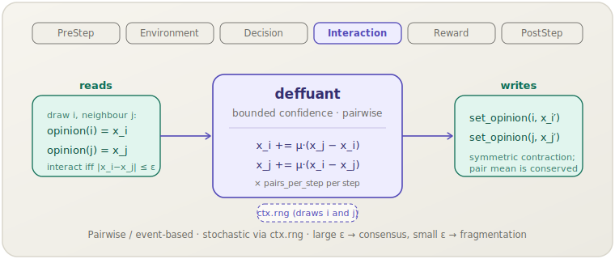

[English](deffuant.md) | **日本語**

# Deffuant（`deffuant`）

> ランダムなペア出会いのたびに，信頼区間 ε 以内の2エージェントが互いの差の割合 μ だけ近づきます．
> **フェーズ：** Interaction．**出典：** Deffuant, Neau, Amblard & Weisbuch (2000)．**種別：** bounded-confidence（ε, μ）．

[← Mechanism カタログに戻る](../mechanisms.ja.md)

## 1. 概要

`deffuant` は，汎用の `socsim-mechanisms` クレートにおける有界信頼（BC）ファミリーの
**ペア／イベントベース**のメンバーです．Hegselmann–Krause が*すべての*エージェントを
信頼集合全体に対して同時に更新するのに対し，Deffuant は一度に*2*エージェントを更新します．
各ステップで `pairs_per_step` 回のランダムな出会いを行い，エージェント `i` とランダムな近傍 `j` を引きます．
両者の意見が互いに対称な許容幅 ε 以内にあれば，両者は相手の方向へ差の割合 μ だけ進みます．
ε より離れていれば何も起こりません．

多数の出会いを繰り返すと，HK と同じ定性的レジームを再現します — ε が広いと集団はコンセンサスへ駆動され，
ε が狭いと複数のクラスタに凍結します — が，歩調を揃えるのではなく確率的・非同期的に進行します．

このメカニズムは**ライブラリ専用**です．`socsim-core` の `ScalarOpinions` および
`Neighbors` 能力トレイトを実装する任意のワールド上で動作します．これには
**`ModulePack` がありません**（シナリオ TOML 登録なし）．直接構築して `SimulationBuilder` に追加してください．

## 2. 理論と出典

Deffuant, Neau, Amblard & Weisbuch (2000) は，有界信頼下での連続意見混合の*ペア*モデルを提案しました．
各相互作用でランダムなペア $(i, j)$ が選ばれ，意見が十分近ければ部分的に収束し，そうでなければ相互作用しません．
信頼区間 ε と収束率 μ を用いると，相互作用するペアに対する更新は次のようになります．

$$
\begin{aligned}
x_i' &= x_i + \mu\,(x_j - x_i),\\
x_j' &= x_j + \mu\,(x_i - x_j),
\end{aligned}
\qquad |x_i - x_j| \le \varepsilon \text{ のときのみ適用．}
$$

両方の差分は**更新前**の値 $x_i, x_j$ を用いるため，ペアは対称的に収縮します．
すなわちペアの平均 $\tfrac{1}{2}(x_i + x_j)$ は保存され，両者の差は係数 $(1 - 2\mu)$ で縮みます．
したがって率 μ は $(0, 0.5]$ に属します．$\mu = 0.5$ ではペアは直ちにその平均へ飛び，μ が小さいほど緩やかに混ざります．
socsim の更新は `mou2024` 再現実装の `bc` ルールをペアに適用したもの（数式的に同一の移植）です．

## 3. データフロー



`pairs_per_step` 回の出会いごとに，メカニズムは `i`（スケジューラの活性化順序，
あるいはフォールバックとしてワールドのロスター）と `neighbors_of(i)`（`i` を除く）から
ランダムな近傍 `j` を引き，`opinion(i)` と `opinion(j)` を読み取り，両者が ε 以内なら
`set_opinion` で両方の新しい意見を書き込みます．他の状態には触れません．

## 4. 6フェーズループにおける位置

エージェントが互いに影響を及ぼし合う **Interaction** フェーズで実行されます．意見交換そのものが相互作用です．

- HK と異なり，更新は**ステップ内で非同期かつ逐次的**です．`pairs_per_step` 回の出会いはそれぞれ
  ライブの意見を読み書きするため，同一ステップ内の後の出会いは前の出会いの効果を見ます．
- これは BC 文献の標準的なイベントベースのイディオムです — 多数のマイクロイベント（出会い）を
  単一の `apply` 呼び出しにまとめ，1つのエンジンティックに対応させます
  （[イベント駆動／サブティック](../architecture.ja.md#イベント駆動--サブティックモデル)パターンを参照）．
  エンジンティックは観測の刻みであり，`pairs_per_step` は1観測あたりのペア更新回数を決めます．

## 5. 状態の読み書きコントラクト

| フィールド | 読み取り | 書き込み | 備考 |
|---|:--:|:--:|---|
| `opinion(i)`, `opinion(j)`（`ScalarOpinions`） | ✓ | ✓ | 出会いごとにライブで読み取り；`|x_i − x_j| ≤ ε` のときのみ両方を上書き． |
| `neighbors_of(i)`（`Neighbors`） | ✓ | | `i` の候補相手（自分自身は除外）． |

## 6. 依存関係と順序制約

- **上流：** なし．`ScalarOpinions + Neighbors` を実装するワールドのみを必要とします．
  トポロジー（完全グラフ・リング・ネットワーク・格子）は `neighbors_of` を介したワールド側の関心事です．
- **下流：** オプションの [`ConvergenceMechanism`]（PostStep）と `max_abs_delta` ヘルパは利用できますが，
  確率的な更新は厳密な固定点に到達するとは限らないため，収束判定は早期に停止したり一切停止しなかったりします —
  Deffuant ではステップ予算を優先してください．

## 7. パラメータ

| パラメータ | 型 | デフォルト | 意味 |
|---|---|---|---|
| `epsilon`（ε） | `f64` | `0.2` | 対称な信頼区間．ε が大きいほどクラスタは少なく大きくなる（→ コンセンサス）． |
| `mu`（μ） | `f64` | `0.5` | `(0, 0.5]` の収束率；各エージェントは差の割合 μ だけ移動する． |
| `pairs_per_step` | `usize` | `1` | 1ステップあたりのランダムなペア出会いの回数． |

ModulePack がないため，シナリオ TOML のパラメータブロックもありません．3つのフィールドはすべてコンストラクタ引数です．

## 8. 適用方法

このメカニズムは**ライブラリモード専用**です — シナリオ TOML 登録はありません．
`ScalarOpinions + Neighbors` を実装するワールドを用意し，メカニズムを構築して
`SimulationBuilder` に追加します．（ワールドのボイラープレートは
[Hegselmann–Krause の例](hegselmann-krause.ja.md#8-適用方法)と同一です．）

```rust
use socsim_mechanisms::DeffuantMechanism;
use socsim_engine::{RandomActivationScheduler, SimulationBuilder};

// ε = 0.2, μ = 0.5, 1ステップあたり50回のペア出会い．
let deffuant = DeffuantMechanism::new(0.2, 0.5, 50);

let mut sim = SimulationBuilder::new(world) // world: ScalarOpinions + Neighbors
    .scheduler(Box::new(RandomActivationScheduler))
    .seed(42)
    .add_mechanism(deffuant)
    .build();
sim.run()?;
```

`pairs_per_step` を増やすとティックあたりのダイナミクスが速く進み，`mu` を下げるとより緩やかに混ざります．

## 9. 決定論性と RNG

**確率的**です．出会いごとにエージェント `i` と相手 `j` を `ctx.rng` から引くため，
軌道は RNG ストリームに依存します．すべての乱数が `ctx.rng` を通るため，固定シードでは実行が完全に再現可能です
（決定論性テストで検証済み）．決定論的な HK 平均と異なり，確率的な出会いの繰り返しは厳密な固定点に落ち着くとは限らないため，
`ConvergenceMechanism` との併用は推奨されません．

## 10. 期待される動作

HK と同様に，初期意見の広がりに対する ε の相対値がレジームを決めます．

- **大きな ε**（≳ 意見の範囲）：引かれたほぼすべてのペアが相互作用し，μ 収縮が集団を単一の**コンセンサス**へ駆動します．
  全体平均は保存され（対称交換），広がりは非増加です．
- **小さな ε**：離れた意見は決して相互作用しないため，集団は**複数のクラスタ**に落ち着きます（分裂／分極）．
  ε が小さくなるほどクラスタは増えます．

同じ ε の HK と比べると，Deffuant の非同期なペア混合は同じクラスタ構造に到達する傾向がありますが，
よりノイズが多く緩やかな軌道をたどります．

## 11. 参考文献

- Deffuant, G., Neau, D., Amblard, F., & Weisbuch, G. (2000). Mixing beliefs among
  interacting agents. *Advances in Complex Systems*, 3(01n04), 87–98.
