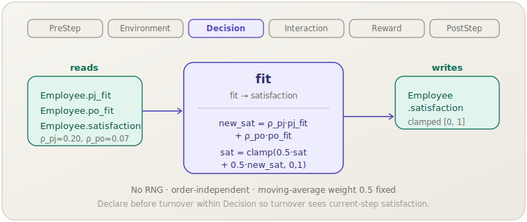

**English** | [日本語](fit.ja.md)

# Fit-to-satisfaction (`fit`)

> An employee's job satisfaction is updated each step as a weighted blend of
> person–job and person–organisation fit, capturing the empirical link between
> perceived fit and attitudinal outcomes.
> **Phase:** Decision. **Source:** Kristof-Brown et al. (2005). **Kind:** empirical (ρ_pj, ρ_po).

[← Back to the mechanism catalog](../mechanisms.md)

## 1. Overview

`fit` translates static fit dimensions (person–job fit and person–organisation
fit) into the dynamic attitudinal outcome of job satisfaction. Each step it
computes a target satisfaction from the two fit scores, then blends that target
with the employee's prior satisfaction using a moving average with equal weights
(0.5/0.5). This smoothing prevents satisfaction from jumping discontinuously
and models the empirical observation that attitudes respond gradually to
perceived fit.

Because downstream mechanisms — notably `ocb` (knowledge sharing) and
`turnover` (quit probability) — depend heavily on `satisfaction`, `fit` acts
as the central attitudinal gateway in the HR lifecycle module.

## 2. Theory & source

Kristof-Brown et al. (2005) meta-analysed the consequences of fit across four
dimensions; they report correlations of ρ ≈ 0.20 (person–job) and ρ ≈ 0.07
(person–organisation) with job satisfaction. socsim implements this as a linear
composite target that is blended into the running satisfaction value:

```text
new_sat      = ρ_pj · pj_fit + ρ_po · po_fit
satisfaction = clamp(0.5 · satisfaction + 0.5 · new_sat, 0, 1)
```

- `pj_fit` — person–job fit ∈ [0, 1]; captures how well the employee's skills
  and interests match their role.
- `po_fit` — person–organisation fit ∈ [0, 1]; captures cultural and values
  alignment.
- `ρ_pj` (`rho_pj` = 0.20) — empirical correlation of PJ fit with satisfaction.
- `ρ_po` (`rho_po` = 0.07) — empirical correlation of PO fit with satisfaction.
- The moving-average weight 0.5 is fixed; it produces a half-life of one step
  when `new_sat` deviates from the current value.
- The result is clamped to [0, 1].

## 3. Data flow



The mechanism reads `pj_fit`, `po_fit`, and the prior `satisfaction` for each
employee, computes `new_sat`, applies the moving-average blend, and writes back
the updated `satisfaction`. No team or world-level state is touched.

## 4. Position in the 6-phase loop

Runs in **Decision**, the third phase. Placing `fit` here ensures that the
freshly updated `satisfaction` is available to the other Decision-phase
mechanisms (`turnover`, `hiring`) and to the subsequent Interaction-phase
mechanism `ocb` within the same step.

`fit` has no ordering constraint relative to `turnover` or `hiring` within the
Decision phase, though in a typical scenario `fit` is declared first so that
`turnover` uses the current step's satisfaction rather than last step's.

## 5. State read/write contract

| Field | Read | Write | Notes |
|---|:--:|:--:|---|
| `Employee.pj_fit` | ✓ | | Person–job fit; set at hire / scenario init. |
| `Employee.po_fit` | ✓ | | Person–organisation fit; set at hire / scenario init. |
| `Employee.satisfaction` | ✓ | ✓ | Moving-average blend; clamped to [0, 1]. |

## 6. Dependencies & ordering constraints

- **Upstream:** none within the same step. `pj_fit` and `po_fit` are treated as
  exogenous inputs set at hire; they are not updated by any other mechanism in
  the default configuration.
- **Downstream (same step):**
  - `ocb` (Interaction) reads `satisfaction` to compute knowledge contributions;
    runs after `fit` because Interaction follows Decision.
  - `turnover` (Decision) uses `satisfaction` as a driver of quit probability;
    declare `fit` before `turnover` within the Decision phase for correct
    same-step ordering.

## 7. Parameters

| Param key | Default | Kind | Source |
|---|---|---|---|
| `rho_pj` | `0.20` | empirical (PJ fit–satisfaction correlation) | Kristof-Brown et al. (2005) |
| `rho_po` | `0.07` | empirical (PO fit–satisfaction correlation) | Kristof-Brown et al. (2005) |

## 8. How to apply

### Scenario TOML

```toml
[[mechanism]]
name  = "fit"
phase = "decision"
[mechanism.params]
rho_pj = 0.20
rho_po = 0.07
```

### Library mode

```rust
use socsim_config::{Registry, Params, ModulePack};
use socsim_hr_lifecycle::{HrLifecyclePack, HrWorld};
use socsim_engine::{RandomActivationScheduler, SimulationBuilder};

let mut reg: Registry<HrWorld> = Registry::new();
HrLifecyclePack.register(&mut reg);

let fit = reg.build("fit", &Params::empty())?;
let mut sim = SimulationBuilder::new(world)
    .scheduler(Box::new(RandomActivationScheduler))
    .seed(42)
    .add_mechanism(fit)
    .build();
sim.run()?;
```

## 9. Determinism & RNG

Draws **no** randomness. The moving-average formula is applied independently to
each employee. Iteration order does not affect the result; the mechanism is
fully deterministic for a given world state.

## 10. Expected behaviour

In a workforce where `pj_fit` and `po_fit` are drawn from reasonably high
distributions (e.g., uniform [0.5, 1.0]), `satisfaction` should converge
towards a stable level within a handful of steps. Because `ρ_pj` and `ρ_po`
are relatively small, the target `new_sat` is modest (typically 0.07–0.27 for
high-fit employees), and satisfaction is primarily driven by its own inertia.
This means that employees hired with high initial satisfaction retain it even
when fit is mediocre, and vice versa — matching the empirical finding that
satisfaction is partially a stable individual disposition (Staw et al., 1986).
Turnover rates should fall as average satisfaction rises with tenure and
positive selection.

## 11. References

- Kristof-Brown, A. L., Zimmerman, R. D., & Johnson, E. C. (2005). Consequences
  of individuals' fit at work: A meta-analysis of person–job, person–
  organization, person–group, and person–supervisor fit. *Personnel Psychology*,
  58(2), 281–342.
