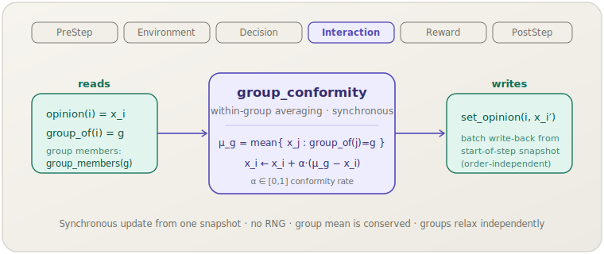

[English](group-conformity.md) | **日本語**

# グループ同調（`group_conformity`）

> 各エージェントは，自分が属するグループの平均意見へ向かって割合 α だけ同期的に移動します．
> **フェーズ：** Interaction．**出典：** DeGroot (1974)．**種別：** theory（グループ内平均化）．

[← Mechanism カタログに戻る](../mechanisms.ja.md)

## 1. 概要

`group_conformity` は，汎用の `socsim-mechanisms` クレートが提供する
**グループダイナミクス**意見メカニズムです．1ステップに1回，**同期的**な更新を行います．
まず全エージェントのスカラー意見をスナップショットし，*各グループの平均意見*を計算して，
各エージェント `i` について，その意見を `i` 自身のグループの平均へ向けて割合 α だけ移動させます．
したがってエージェントは，*同じグループに属する*相手の方向にのみ引き寄せられます — グループ分割が影響集合であり，
グループ平均への同調がダイナミクスです．

すべての新しい意見が*同じ*ステップ開始時のスナップショットから計算される（まず全グループ平均を取得し，
その後に全意見を書き込む）ため，結果はエージェントの活性化順序に依存しません — これは
グループ内影響に限定した，同時（並列）の DeGroot コンセンサス更新です．`α = 1` では各エージェントは
1ステップで自グループの平均へ直接ジャンプし，α が小さいとグループは平均へ徐々に緩和します．
重要なのは，平均化のステップが**各グループの平均を厳密に保存する**ことで，互いに素なグループは
それぞれの（保存された）平均へ*独立に*収束し，決して混ざりません．

このメカニズムは**ライブラリ専用**です．`socsim-core` の `GroupMembership` および
`ScalarOpinions` 能力トレイトを実装する任意のワールド上で動作します．これには
**`ModulePack` がありません**（シナリオ TOML 登録を一切提供しません）．直接構築して
`SimulationBuilder` に追加してください．

## 2. 理論と出典

DeGroot (1974, "Reaching a Consensus") は，個人の集団が自らの意見を，影響集合内の意見の
**加重平均**へ繰り返し改訂するモデルを提示しました．緩やかな連結条件の下で，この過程はコンセンサスに収束します．
`group_conformity` は，影響集合を*エージェント自身のグループ*に固定したこの平均化コンセンサス則であり，
すなわち**グループ内同調**のモデルです．メンバーはグループの支配的な意見へ同化します．

エージェント `i` のグループを $g = g(i)$，そのメンバー集合を
$M_g = \{\, j : g(j) = g \,\}$ と書くと，意見プロファイル $x$ におけるグループの平均意見は

$$\mu_g(x) = \frac{1}{|M_g|} \sum_{j \in M_g} x_j$$

であり，各エージェントの同期的な同調更新は次のようになります．

$$x_i' = x_i + \alpha\,\bigl(\mu_{g(i)}(x) - x_i\bigr), \qquad \alpha \in [0, 1].$$

これはグループ平均への割合 α の緩和です．2つの構造的性質が直接導かれます．

$$
\begin{aligned}
\text{（保存）}\quad & \frac{1}{|M_g|}\sum_{i \in M_g} x_i' = \mu_g(x) && \text{（グループ平均は毎ステップ不変），}\\
\text{（縮約）}\quad & \max_{i,j \in M_g} |x_i' - x_j'| = (1-\alpha)\,\max_{i,j \in M_g} |x_i - x_j| && \text{（グループ内の広がりは } 1-\alpha \text{ 倍に縮む）．}
\end{aligned}
$$

$0 < \alpha \le 1$ に対して各グループは自グループの平均へ幾何的に収束し，$\mu_g$ が $g$ の
メンバーのみに依存するため，異なるグループは**独立に**進展します — グループ間の結合はありません．
単一グループに設定すると集団平均上の大域的 DeGroot コンセンサスが復元され，特別な場合 $\alpha = 1$ は
各メンバーを1ステップでグループ平均へスナップさせます．

## 3. データフロー



このメカニズムはステップ開始時のスナップショットから `opinion(i)`，`group_of(i)`，
および各グループのメンバー（`groups()` 上の `group_members(g)`）を読み取り，全グループ平均を計算し，
各エージェントを自グループの平均へ α だけ移動させて，新しい意見を `set_opinion` で一括書き戻します．
他の状態には触れません．

## 4. 6フェーズループにおける位置

エージェントが互いに影響を及ぼし合う **Interaction** フェーズで実行されます．
ここではグループへの同調そのものが相互作用であり，これが自然な配置です．

- `apply` 呼び出しの開始時に取得した全意見のスナップショットを読み取り，そのスナップショットから
  全グループの平均を計算し，各エージェントの新しい意見を単一バッチで書き込みます — これにより更新は
  同期的（同時）になり，スケジューラの活性化順序に依存しません．
- 各エージェント自身の意見も自グループの平均の一部です（メンバーの1人です）．これは DeGroot 平均化の定義に一致します．

スカラー意見のみを読み書きするため，同一の Interaction フェーズに意見を変更するメカニズムが2つあれば
逐次的に合成されます．純粋なグループ同調の実行では，通常これが唯一の意見更新メカニズムです．

## 5. 状態の読み書きコントラクト

| フィールド | 読み取り | 書き込み | 備考 |
|---|:--:|:--:|---|
| `opinion(i)`（`ScalarOpinions`） | ✓ | ✓ | ステップ開始時にスナップショット；`x_i + α·(μ_g − x_i)` で上書き． |
| `group_of(i)`（`GroupMembership`） | ✓ | | エージェント `i` がどのグループの平均に同調するかを選択する． |
| `group_members(g)`（`GroupMembership`） | ✓ | | グループ平均 `μ_g` に集計されるメンバー． |
| `groups()`（`GroupMembership`） | ✓ | | 平均を計算するグループを列挙する． |

## 6. 依存関係と順序制約

- **上流：** なし．`GroupMembership + ScalarOpinions` を実装するワールドのみを必要とします．
  分割（チームインデックス・コミュニティラベル・空間ブロックなど）は
  `group_of` ／ `group_members` ／ `groups` を介したワールド側の関心事です．
- **下流：** オプションの [`ConvergenceMechanism`]（PostStep）は，`max|Δx| < tol` になった時点で実行を停止できます．
  フリー関数 `max_abs_delta(prev, curr)` はドライバ側ループ向けに同じ判定を公開します．更新は
  `0 < α ≤ 1` で決定論的かつ縮約的なので，収束検出はここで意味を持ちます．

3つの `GroupMembership` アクセサは相互に一貫している必要があります — `group_members(g)` が返す任意のメンバーの
`group_of` は `g` であり，エージェントが対応付けられるすべてのグループは `groups()` に現れます．

## 7. パラメータ

| パラメータ | 型 | デフォルト | 意味 |
|---|---|---|---|
| `alpha`（α） | `f64` | `0.3` | 同調率．`[0, 1]` にクランプされる．毎ステップに閉じるグループ平均との差の割合：`0` は意見を凍結し，`1` は各エージェントを毎ステップ自グループの平均へスナップさせる． |

ModulePack がないため，シナリオ TOML のパラメータブロックもありません．`alpha` はコンストラクタ引数であり，
構築時に `[0, 1]` にクランプされます．

## 8. 適用方法

このメカニズムは**ライブラリモード専用**です — シナリオ TOML 登録はありません．
`GroupMembership + ScalarOpinions` を実装するワールドを用意し，メカニズムを構築して
`SimulationBuilder` に追加します．

```rust
use socsim_core::{AgentId, GroupId, GroupMembership, ScalarOpinions, WorldState, SimClock};
use socsim_mechanisms::GroupConformityMechanism;
use socsim_engine::{SequentialScheduler, SimulationBuilder};

// エージェントごとに1つのスカラー意見と固定のグループ分割を持つワールド．
struct GroupWorld { clock: SimClock, opinions: Vec<f64>, group: Vec<GroupId> }

impl WorldState for GroupWorld {
    fn agent_ids(&self) -> Vec<AgentId> {
        (0..self.opinions.len() as u64).map(AgentId).collect()
    }
    fn clock(&self) -> &SimClock { &self.clock }
    fn clock_mut(&mut self) -> &mut SimClock { &mut self.clock }
}
impl ScalarOpinions for GroupWorld {
    fn opinion(&self, id: AgentId) -> f64 { self.opinions[id.0 as usize] }
    fn set_opinion(&mut self, id: AgentId, v: f64) { self.opinions[id.0 as usize] = v; }
}
impl GroupMembership for GroupWorld {
    fn group_of(&self, id: AgentId) -> GroupId { self.group[id.0 as usize] }
    fn group_members(&self, g: GroupId) -> Vec<AgentId> {
        self.group.iter().enumerate()
            .filter(|&(_, &gg)| gg == g)
            .map(|(i, _)| AgentId(i as u64)).collect()
    }
    fn groups(&self) -> Vec<GroupId> {
        let mut gs = self.group.clone(); gs.sort_unstable(); gs.dedup(); gs
    }
}

// α = 0.3 — グループ平均への中程度のステップごとの引き寄せ．
let gc = GroupConformityMechanism::new(0.3);

let mut sim = SimulationBuilder::new(world)
    .scheduler(Box::new(SequentialScheduler))
    .seed(42)
    .add_mechanism(gc)
    .build();
sim.run()?;
```

グループ内コンセンサスを速めるには α を `1.0` へ近づけます．収束で停止させるには，
`ConvergenceMechanism::new(1e-9)` も追加します．

## 9. 決定論性と RNG

**決定論的**です．更新は固定のステップ開始時スナップショットを読み取り，メンバーを
ソート済み `AgentId` 順に総和してグループ平均を計算し，固定バッチを書き込むため，結果は順序非依存で，
同じワールド状態に対して再現可能です — `ctx.rng` には**触れません**．したがって同じ初期状態は
毎回同じ軌跡を生成します．

## 10. 期待される動作

ダイナミクスは α とグループ分割によって決まります．

- **グループ内**では，意見は幾何的に（広がりが毎ステップ `(1−α)` 倍に）グループの平均へ収束し，
  その平均は平均化のステップで**保存**されます．`α = 1` ではグループは1ステップでコンセンサスに到達します．
- **グループ間**では，進展は**独立**です．各グループは自グループの平均へ収束し，意見がグループ境界を越えることは
  決してありません．すべてを包含する単一グループは集団平均上の大域的コンセンサスを復元します．

## 11. 参考文献

- DeGroot, M. H. (1974). Reaching a consensus. *Journal of the American
  Statistical Association*, 69(345), 118–121.
