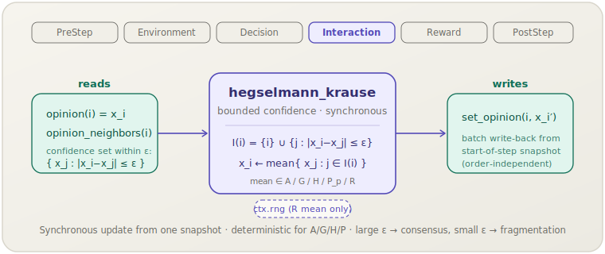

[English](hegselmann-krause.md) | **日本語**

# Hegselmann–Krause（`hegselmann_krause`）

> 各エージェントは，自分の意見から信頼区間 ε 以内にあるすべての意見の（選択された）平均へ同期的に移動します．
> **フェーズ：** Interaction．**出典：** Hegselmann & Krause (2002, 2005)．**種別：** bounded-confidence（ε, mean）．

[← Mechanism カタログに戻る](../mechanisms.ja.md)

## 1. 概要

`hegselmann_krause`（HK）は，汎用の `socsim-mechanisms` クレートが提供する2つの
**有界信頼（bounded confidence, BC）** 意見ダイナミクスメカニズムの1つです．
1ステップに1回，**同期的**な更新を行います．まず全エージェントのスカラー意見をスナップショットし，
各エージェント `i` について，その意見を `x_i` から対称な許容幅 ε 以内にある意見 — その*信頼集合* —
の（選択された）*平均*として再計算します．ε より離れた意見は無視されるため，
エージェントはおおむね既に賛同している相手の方向にのみ引き寄せられます．

すべての新しい意見が*同じ*ステップ開始時のスナップショットから計算されるため，
結果はエージェントの活性化順序に依存しません — これは正典的な HK モデルの同時（並列）更新です．
ε が広いと集団は単一のコンセンサスに収束し，ε が狭いと複数の安定した意見クラスタに分裂します．

このメカニズムは**ライブラリ専用**です．`socsim-core` の `ScalarOpinions` および
`Neighbors` 能力トレイトを実装する任意のワールド上で動作します．これには
**`ModulePack` がありません**（シナリオ TOML 登録を一切提供しません）．直接構築して
`SimulationBuilder` に追加してください．

## 2. 理論と出典

Hegselmann & Krause (2002) は，*連続*意見ダイナミクスのモデルとして有界信頼を導入しました．
エージェント `i` は意見が信頼半径 ε 以内に収まる相手からのみ影響を受け，その集合の**算術平均**へ更新します．
意見プロファイル $x$ における `i` の信頼（影響）集合を

$$I(i, x) = \{\, j \in N(i) \cup \{i\} \;:\; |x_i - x_j| \le \varepsilon \,\}$$

と書くと，基本（算術）モデルの同期更新は次のようになります．

$$x_i' = \frac{1}{|I(i, x)|} \sum_{j \in I(i, x)} x_j .$$

2005 年の論文は，信頼集合を集計する*平均の種類*という軸に沿って HK を一般化し，
算術平均を平均演算子のファミリーで置き換えます．socsim はこれを5つのメンバーを持つ
[`MeanOperator`] enum として公開しています．

$$
\begin{aligned}
A &= P_1 = \tfrac{1}{m}\textstyle\sum_j x_j && \text{（算術）}\\
G &= P_0 = \Bigl(\textstyle\prod_j x_j\Bigr)^{1/m} && \text{（幾何）}\\
H &= P_{-1} = m \big/ \textstyle\sum_j \tfrac{1}{x_j} && \text{（調和）}\\
P_p &= \Bigl(\tfrac{1}{m}\textstyle\sum_j x_j^{\,p}\Bigr)^{1/p},\; p \neq 0 && \text{（べき／Hölder）}\\
R &= \mathrm{Uniform}\bigl(\min S,\; \max S\bigr) && \text{（ランダム）}
\end{aligned}
$$

ここで $m = |I(i,x)|$，$S$ は信頼集合の多重集合です．厳密に正の入力に対して，
これらの平均は論文の**系統的不等式**を満たします．

$$P_{-\infty} = \min \;\le\; H = P_{-1} \;\le\; G = P_0 \;\le\; A = P_1 \;\le\; P_p \;\le\; P_{+\infty} = \max \quad (p \ge 1).$$

幾何平均と調和平均はゼロで未定義になるため，意見が開いた正区間にあることを要求します．
この平均計算は `hegselmann2005` 再現実装の `means.rs` から逐語的に（数式的に同一に）移植されています．

## 3. データフロー



このメカニズムはステップ開始時のスナップショットから `opinion(i)` と `neighbors_of(i)` を読み取り，
近傍を信頼集合にフィルタし，設定された平均で集計して，新しい意見を `set_opinion` で一括書き戻します．
他の状態には触れません．

## 4. 6フェーズループにおける位置

エージェントが互いに影響を及ぼし合う **Interaction** フェーズで実行されます．
ここでは意見の変化そのものが相互作用であり，これが自然な配置です．

- `apply` 呼び出しの開始時に取得した全意見のスナップショットを読み取り，
  各エージェントの新しい意見を単一バッチで書き込みます — これにより更新は同期的（同時）になり，
  スケジューラの活性化順序に依存しません．
- 自分自身は常に自分の信頼集合に含まれます（`{i}` は無条件に追加されます）．これは正典的な HK の定義に一致します．

スカラー意見のみを読み書きするため，同一の Interaction フェーズに意見を変更するメカニズムが2つあれば
逐次的に合成されます．BC 文献では，HK は通常，実行中で意見を更新する*唯一*のメカニズムです．

## 5. 状態の読み書きコントラクト

| フィールド | 読み取り | 書き込み | 備考 |
|---|:--:|:--:|---|
| `opinion(i)`（`ScalarOpinions`） | ✓ | ✓ | ステップ開始時にスナップショット；信頼集合の平均で上書き． |
| `neighbors_of(i)`（`Neighbors`） | ✓ | | ε フィルタ前の影響プール；自分自身はメカニズムが追加する． |

## 6. 依存関係と順序制約

- **上流：** なし．`ScalarOpinions + Neighbors` を実装するワールドのみを必要とします．
  トポロジー（完全グラフ・リング・ネットワーク・格子）は `neighbors_of` を介したワールド側の関心事です．
- **下流：** オプションの [`ConvergenceMechanism`]（PostStep）は，`max|Δx| < tol` になった時点で実行を停止できます．
  フリー関数 `max_abs_delta(prev, curr)` はドライバ側ループ向けに同じ判定を公開します．収束検出は
  決定論的な平均（A/G/H/P）に対してのみ意味を持ちます — `Random` 平均は固定点に到達するとは限りません．

## 7. パラメータ

| パラメータ | 型 | デフォルト | 意味 |
|---|---|---|---|
| `epsilon`（ε） | `f64` | `0.2` | 対称な信頼区間．ε が大きいほどクラスタは少なく大きくなる（→ コンセンサス）．左右のオーバーライドが共に未設定のときのフォールバック値． |
| `epsilon_left`（ε_l） | `Option<f64>` | `None` | 左側（符号付きギャップ `x_j − x_i < 0`）の許容幅のオーバーライド．`None` のときは `epsilon` が使用される．[`with_asymmetric`](#非対称版) で HK 2002 §4.2 / Fig. 10–13 の非対称版を有効化する． |
| `epsilon_right`（ε_r） | `Option<f64>` | `None` | 右側（符号付きギャップ `x_j − x_i > 0`）の許容幅のオーバーライド． |
| `mean` | `MeanOperator` | `Arithmetic` | 信頼集合に適用する平均演算子：`Arithmetic`（A），`Geometric`（G），`Harmonic`（H），`Power(p)`（P_p），`Random`（R）． |

ModulePack がないため，シナリオ TOML のパラメータブロックもありません．全フィールドはコンストラクタ引数です．

### 非対称版

HK 2002 §4.2 は有界信頼区間を `|x_i − x_j| ≤ ε` から符号付きギャップに対する片側ウィンドウへ一般化します：

$$I(i, x) = \{\, j \in N(i) \cup \{i\} \;:\; -\varepsilon_l \le x_j - x_i \le \varepsilon_r \,\}.$$

`ε_l ≠ ε_r` のとき，ダイナミクスは方向性のあるバイアスを持ちます：最終的な平均意見は広い側へドリフトし，
**片側スプリット**（あるエージェントは他者を信頼集合に含めるが，逆は成り立たない）が現れます．
これは論文 §4.2 / Fig. 10–13 の再現です．

```rust
// HK 2002 §4.2: エージェントは左より右へ広く目を向けるため，
// 集団平均は上方向にドリフトする．
let hk = HegselmannKrauseMechanism::with_asymmetric(
    /* eps_l */ 0.05,
    /* eps_r */ 0.25,
    MeanOperator::Arithmetic,
);
```

`eps_l == eps_r` のとき，非対称コードパスは [`HegselmannKrauseMechanism::new`] とビット同一で，
既存呼び出し箇所を片側 knob 版に置き換えても非破壊です．

## 8. 適用方法

このメカニズムは**ライブラリモード専用**です — シナリオ TOML 登録はありません．
`ScalarOpinions + Neighbors` を実装するワールドを用意し，メカニズムを構築して
`SimulationBuilder` に追加します．

```rust
use socsim_core::{AgentId, ScalarOpinions, Neighbors, WorldState, SimClock};
use socsim_mechanisms::{HegselmannKrauseMechanism, MeanOperator};
use socsim_engine::{SequentialScheduler, SimulationBuilder};

// エージェントごとに1つのスカラー意見を持つワールド（例：完全グラフ上）．
struct OpinionWorld { clock: SimClock, opinions: Vec<f64> }

impl WorldState for OpinionWorld {
    fn agent_ids(&self) -> Vec<AgentId> {
        (0..self.opinions.len() as u64).map(AgentId).collect()
    }
    fn clock(&self) -> &SimClock { &self.clock }
    fn clock_mut(&mut self) -> &mut SimClock { &mut self.clock }
}
impl ScalarOpinions for OpinionWorld {
    fn opinion(&self, id: AgentId) -> f64 { self.opinions[id.0 as usize] }
    fn set_opinion(&mut self, id: AgentId, v: f64) { self.opinions[id.0 as usize] = v; }
}
impl Neighbors for OpinionWorld {
    fn neighbors_of(&self, id: AgentId) -> Vec<AgentId> {
        self.agent_ids().into_iter().filter(|&j| j != id).collect()
    }
}

// ε = 0.2 と算術平均 — 正典的な HK 設定．
let hk = HegselmannKrauseMechanism::new(0.2, MeanOperator::Arithmetic);

let mut sim = SimulationBuilder::new(world)
    .scheduler(Box::new(SequentialScheduler))
    .seed(42)
    .add_mechanism(hk)
    .build();
sim.run()?;
```

演算子を差し替えると 2005 年の一般化を探索できます．例：
`HegselmannKrauseMechanism::new(0.2, MeanOperator::Power(2.0))`．収束で停止させるには，
`ConvergenceMechanism::new(1e-9)` も追加します．

論文 §3 Property IV / Fig. 4–8（および非対称版 Fig. 10–13）の "ε-プロファイル" 走査で
用いられる等間隔初期分布 `x_i = i/(n − 1)` は，BC 文献では正典的な初期化です．本クレートは
フリーヘルパ `regular_profile(n) -> Vec<f64>` として公開しており，各再現実装で同じ五行を
書き直す必要はありません：

```rust
use socsim_mechanisms::regular_profile;

let opinions = regular_profile(625);    // [0.0, 1/624, …, 1.0]; n=1 では [0.5]; n=0 では []
let world = OpinionWorld { clock: SimClock::default(), opinions };
```

乱数初期分布はシナリオ依存（H/G 平均のための開区間クランプ，分極化混合など）であり，
ドライバ側に委ねます．

## 9. 決定論性と RNG

算術・幾何・調和・べき平均（A/G/H/P）に対しては**決定論的**です．更新は固定スナップショットを読み取り，
固定バッチを書き込むため，結果は順序非依存で，同じワールド状態に対して再現可能です — `ctx.rng` には触れません．
唯一の例外は `MeanOperator::Random`（R）で，これは `ctx.rng` を介して信頼集合の範囲から一様サンプルを引きます．
固定シードであればその実行も再現可能ですが，固定点に収束するとは限りません．

## 10. 期待される動作

ダイナミクスは初期意見の広がりに対する ε の相対値によって決まります．

- **大きな ε**（≳ 意見の範囲）：全エージェントが全員の信頼集合に留まるため，算術平均が集団全体を単一の**コンセンサス**へ駆動します．
- **小さな ε**：離れた意見は互いの信頼集合に入らないため，集団は**複数の安定クラスタ**に凍結します（分裂／分極）．
  クラスタ数は ε が小さくなるほど増加します．

非算術平均を選ぶと，固定点は系統的不等式に沿ってシフトします（例：調和平均はクラスタを算術平均より下方に偏らせる）が，
このコンセンサス対分裂という定性的な様相は変わりません．

## 11. 参考文献

- Hegselmann, R., & Krause, U. (2002). Opinion dynamics and bounded confidence:
  models, analysis and simulation. *Journal of Artificial Societies and Social
  Simulation*, 5(3).
- Hegselmann, R., & Krause, U. (2005). Opinion dynamics driven by various ways of
  averaging. *Computational Economics*, 25(4), 381–405.
