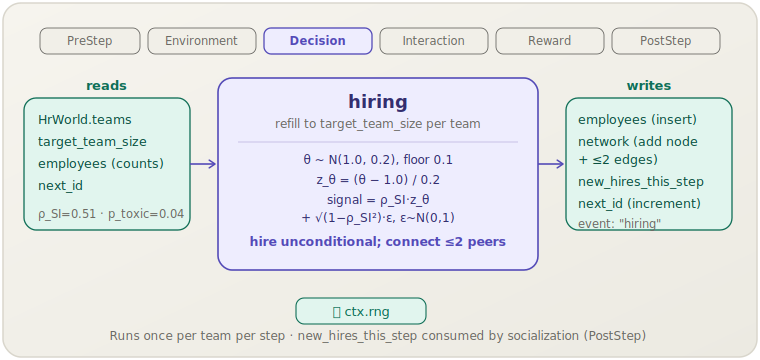

[English](hiring.md) | **日本語**

# 採用 (`hiring`)

> 各チームは，正規分布から能力を抽出し選考シグナルでフィルタリングした新規従業員によってターゲット人数まで補充されます．
> **フェーズ:** Decision．**出典:** Schmidt & Hunter (1998)．**種別:** 経験的（ρ_SI）．

[← Mechanism カタログに戻る](../mechanisms.ja.md)

## 1. 概要

`hiring` はステップごとに1回，`turnover` が退職者を削除した後に実行され，`target_team_size` を下回るすべてのチームを補充します．各空席について，キャリブレーションされた正規分布から候補者の真の能力 `θ` を抽出し，標準化された能力スコアと測定ノイズをブレンドした選考シグナルを構築して（不完全な評価ツールをモデル化），無条件で採用します．新規従業員はソーシャルネットワーク内の既存チームメンバー最大2人と接続され，`new_hires_this_step` に追加されます．`socialization` メカニズム（PostStep）は同ステップの後半でこのリストを処理し，社会的統合を初期化します．

`hiring` はしたがって2つの構造的役割を果たします：人員数の維持と，オンボーディングを駆動する `new_hires_this_step` バッファへの書き込みです．

## 2. 理論と出典

選考モデルは Schmidt & Hunter (1998) の人材選考妥当性に関するメタ分析フレームワークに従います．中心となる考え方は，選考ツールが真の能力のノイズ混じりシグナルしか捉えられないというものです：

```text
θ ~ N(THETA_MEAN=1.0, THETA_SD=0.2), floored at THETA_FLOOR=0.1

z_θ = (θ − THETA_MEAN) / THETA_SD          (標準化)

ε ~ N(0, 1)                                (測定ノイズ)

signal = ρ_SI · z_θ + √(1 − ρ_SI²) · ε
```

- `ρ_SI`（0.51）は Schmidt & Hunter (1998) による経験的選考妥当性——選考シグナルと真の職務パフォーマンスの相関です．完璧なツールなら `ρ_SI = 1`，ランダムなツールなら `ρ_SI = 0` になります．
- この構築により `ρ_SI` の値に関わらず `Var(signal) = 1` が保証され，シグナルが適切に標準化されます．
- 現在の実装では，採用は**無条件**です：シグナルは計算されイベントログに記録されますが，採用決定のゲートとしてはまだ機能していません．これは意図的なモデリング上の選択であり，将来的な閾値またはtop-k選考ポリシーのための余地を残しています．

各新規採用者にはまた `is_toxic` フラグが割り当てられます．これは確率 `p_toxic`（0.04）のBernoulliとして抽出され，Housman & Minor (2015) が報告した基準有病率を再現します．

挿入後，採用者はWatts–Strogazソーシャルネットワーク内のランダムに選ばれた既存チームメンバー最大2人と接続されます．

## 3. データフロー



各チームの不足について，`hiring` は `ctx.rng` から `θ` と `ε` を抽出し，新しい `Employee` レコードを挿入し，最大2本のエッジを持つネットワークノードを追加し，新規エージェントのIDを `new_hires_this_step` に追加します．その後，`socialization` メカニズムが同ステップの後半でそのリストを消費します．

## 4. 6フェーズループにおける位置

3番目のフェーズである **Decision** で，`Environment` の後に実行されます．Decision 内では，`hiring` は `turnover` の**後に**実行する必要があります：

1. `turnover` が取得した `headcount_at_step_start` が，`org_performance` で使用される離職前の人数を反映するため．
2. `hiring` が離職後のチームサイズを確認し，適切な数の空席を埋めるため．

`hiring` は `socialization`（PostStep）の**前に**実行する必要があります．`socialization` が読み取る `new_hires_this_step` を `hiring` が生成するためです．

## 5. 状態読み書きコントラクト

| フィールド | 読み取り | 書き込み | 備考 |
|---|:--:|:--:|---|
| `HrWorld.teams` | ✓ | | 人数不足のチームを探すために走査されます． |
| `HrWorld.target_team_size` | ✓ | | チームあたりのターゲット人数． |
| `HrWorld.employees` | ✓ | ✓ | チーム人数の取得に使用；新規 Employee が挿入されます． |
| `HrWorld.network` | | ✓ | 新規ノードが追加；既存チームメンバーへの最大2本のエッジ． |
| `HrWorld.new_hires_this_step` | | ✓ | 追加；`socialization` が消費します． |
| `HrWorld.next_id` | ✓ | ✓ | 新しい `AgentId` を生成するためにインクリメントされます． |
| `Employee.theta` | | ✓ | N(1.0, 0.2) から抽出，下限0.1でフロア処理． |
| `Employee.is_toxic` | | ✓ | Bernoulli(p_toxic)． |

その他のすべての `Employee` フィールド（tenure，socialization，embeddedness，po_fit，pj_fit，satisfaction，productivity，cum_reward，recent_quit_neighbors）は構築時にデフォルト値で初期化されます．

## 6. 依存関係と順序制約

**必ず後に実行すべきもの：**
- `turnover`（Decision）——このステップの離職による空席が可視化され，`headcount_at_step_start` が取得されるようにするため．

**必ず前に実行すべきもの：**
- `socialization`（PostStep）——`hiring` が `new_hires_this_step` を生成し，`socialization` がそれを消費します．同ステップに `hiring` なしで `socialization` を実行すると空のリストを処理することになります．

**共有状態の引き継ぎ：**

| 生産者 | フィールド | 消費者 |
|---|---|---|
| `turnover` | `employees` / `teams` の空席 | `hiring` |
| `hiring` | `new_hires_this_step` | `socialization` |

## 7. パラメータ

| パラメータキー | デフォルト | 種別 | 出典 |
|---|---|---|---|
| `rho_si` | `0.51` | 経験的（選考妥当性） | Schmidt & Hunter (1998) |
| `p_toxic` | `0.04` | 経験的（有害有病率） | Housman & Minor (2015) |

`THETA_MEAN`（1.0），`THETA_SD`（0.2），`THETA_FLOOR`（0.1）はコンパイル定数であり，現在はシナリオパラメータとして公開されていません．

## 8. 使い方

### シナリオTOML

```toml
[[mechanism]]
name  = "turnover"
phase = "decision"
[mechanism.params]
rho_po_turn       = -0.35
base_quit_logit   = -4.82
quit_embed_sens   =  1.0
quit_sat_sens     =  0.8
quit_cascade_bump =  0.30

[[mechanism]]
name  = "hiring"
phase = "decision"
[mechanism.params]
rho_si  = 0.51
p_toxic = 0.04
```

`hiring` は正しいフェーズ内順序を確保するため，TOML内で `turnover` の後に記述する必要があります．

### ライブラリモード

```rust
use socsim_config::{Registry, Params, ModulePack};
use socsim_hr_lifecycle::{HrLifecyclePack, HrWorld};
use socsim_engine::{RandomActivationScheduler, SimulationBuilder};

let mut reg: Registry<HrWorld> = Registry::new();
HrLifecyclePack.register(&mut reg);

let mut params = Params::empty();
params.set("rho_si",  0.51_f64);
params.set("p_toxic", 0.04_f64);

let hiring = reg.build("hiring", &params)?;
let mut sim = SimulationBuilder::new(world)
    .scheduler(Box::new(RandomActivationScheduler))
    .seed(42)
    .add_mechanism(hiring)
    .build();
sim.run()?;
```

## 9. 決定論性とRNG

`hiring` はすべての新規採用者について `ctx.rng` から引数を取得します：`θ` 用に1回の `Normal` サンプル，選考シグナルのノイズ項 `ε` 用に1回の `Normal` サンプル，`is_toxic` 用に1回の `Bernoulli` 抽出，そしてネットワークエッジのターゲット（最大2人のチームメンバー）のサンプリングです．ステップあたりの採用数はチームの不足人数で決まり——それ自体が与えられたシードと履歴に対して決定論的なので——同じシードによる実行では全抽出シーケンスが再現されます．

## 10. 期待される動作

ベースラインシナリオでは：

- `turnover` がアクティブな場合，`hiring` はほとんどのステップでメンバーを失ったチームを補充するために発火し，人員数を `target_team_size × num_teams` に近づけます．
- 新規採用者は `tenure = 0` かつ生産性ほぼゼロで入社します（`learning_curve` 参照）．離職と補充の波の後，チームの平均生産性は一時的に低下し，その後の数ヶ月で新規採用者が学習曲線を上昇するにつれて回復します．
- `rho_si` を1.0に近づけると，受信する `θ` 値が高い能力の候補者に集中し（シグナルが能力をより正確に追跡），長期実行で徐々に `org_performance` を押し上げます．
- `p_toxic = 0.04` は，25人に約1人の新規採用者が入社時に有害であることを意味し，`toxic_spread`（Interaction）のシードプールを提供します．

## 11. 参考文献

- Schmidt, F. L., & Hunter, J. E. (1998). The validity and utility of selection
  methods in personnel psychology: Practical and theoretical implications of
  85 years of research findings. *Psychological Bulletin*, 124(2), 262–274.
- Housman, M., & Minor, D. (2015). Toxic workers. *Harvard Business School
  Working Paper* 16-057.
