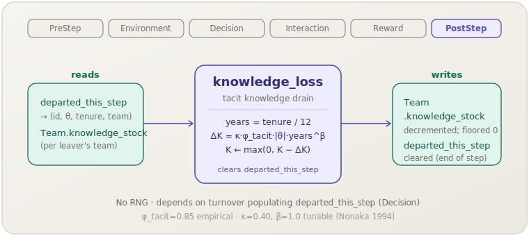

[English](knowledge-loss.md) | **日本語**

# 知識損失 (`knowledge_loss`)

> 退職する従業員は暗黙知を持ち去り，チームの知識ストックを永続的に減少させます．
> **フェーズ:** PostStep．**出典:** Nonaka (1994)．**種別:** 混合（φ_tacit 経験的；κ，β チューナブル）．

[← Mechanism カタログに戻る](../mechanisms.ja.md)

## 1. 概要

`knowledge_loss` は，在職期間が再構築されるまで生産性指標に現れない自発的離職の組織コストをモデル化します：従業員が退職すると，チームに蓄積されたノウハウの一部が失われます．このうち暗黙知の成分——コード化に抵抗するルーティン，判断，関係性——は特に代替困難です．

このメカニズムは，`turnover` が従業員を削除して `departed_this_step` に追加した後，PostStepフェーズで発火します．各退職について，離職者の能力と在職期間に比例した暗黙知損失を計算し，チームの `knowledge_stock` からそれを差し引きます．また，そのバッファの正規のステップ末クリーンアップとして `departed_this_step` をクリアします．

## 2. 理論と出典

Nonaka (1994) は，組織知識に2つの不可分な成分があると主張します：明示知（コード化・転送可能）と暗黙知（体化・粘着性）．知識労働者が離職すると，暗黙知の部分は大部分が回収不能です．socsim はこれを在職期間でスケーリングされた損失式で操作化しています：

```text
years = tenure_months / 12
ΔK    = −κ · φ_tacit · |θ| · years^β
team.knowledge_stock = max(0,  team.knowledge_stock − |ΔK|)
```

- `θ`（`Employee.theta`）——退職従業員の能力（正のスケール抽出を扱うため絶対値を使用）．
- `tenure_months`——退職時の在籍月数；損失のスケールが知識単位/ステップで測定されるOCB流入と一致するように年数に変換されます．
- `φ_tacit`（`phi_tacit = 0.85`）——経験的な暗黙知割合（Nonaka 1994）；労働者の知識の85%は暗黙知であり，退職時に失われます．
- `κ`（`kappa_loss = 0.40`）——典型的な離職者の流出量をチームOCB流入の数ヶ月分にサイジングするチューナブルなスケールで，`knowledge_stock` の崩壊を防ぎます．
- `β`（`beta_loss = 1.0`）——チューナブルな指数；デフォルト1.0では損失は在職年数に線形です．1.0超の値は長期在職者の離職コストを不均衡に大きくし，1.0未満の値は在職期間の効果を圧縮します．

## 3. データフロー



このメカニズムは `departed_this_step`（同ステップで `turnover` が生成）を走査し，各離職者について `Team.knowledge_stock` をデクリメントします．その後 `departed_this_step` をクリアします．

## 4. 6フェーズループにおける位置

第6フェーズかつ最終フェーズである **PostStep** で実行されます．この配置は必須です：`departed_this_step` は `turnover`（Decision，フェーズ3）によって生成され，ここで読み取られます；`knowledge_loss` が早いフェーズで実行されるとバッファが空になってしまいます．最後に実行することで，まだリストを必要とする他のメカニズム（`departed_this_step.len()` を読み取るRewardの `org_performance` など）への干渉リスクなしに，`departed_this_step` の正規クリアを行うことができます．

PostStepメカニズムの中では，`knowledge_loss` は `new_hires_this_step` をクリアする `socialization` の**後に**宣言するべきです；両方のPostStepメカニズムは状態を共有しませんが，`knowledge_loss` を最後に宣言することは「クリーンアップは最後に」という慣例を尊重します．

## 5. 状態読み書きコントラクト

| フィールド | 読み取り | 書き込み | 備考 |
|---|:--:|:--:|---|
| `HrWorld.departed_this_step` | ✓ | ✓ | `(id, θ, tenure, team)` タプルを読み取り；終了時にクリアされます． |
| `Team.knowledge_stock` | ✓ | ✓ | 離職者ごとにデクリメント；下限0でフロア処理． |

## 6. 依存関係と順序制約

- **上流（同ステップ）：** `turnover`（Decision）が実行済みで `(id, θ, tenure_months, team_idx)` タプルで `departed_this_step` が生成されている必要があります．
- **上流（同ステップ）：** `org_performance`（Reward）は `turnover_rate` を計算するために `departed_this_step.len()` を読み取るため，`knowledge_loss` がバッファをクリアする**前に**実行する必要があります．フェーズ順序（RewardはPostStepより前）がこれを自動的に保証します．
- **下流：** PostStep後に `departed_this_step` のクリア済み状態を読み取るものはありません．`ocb`（Interaction）が `knowledge_stock` に加算する対応メカニズムです；OCB流入と退職流出のバランスが長期的なストックレベルを支配します．

## 7. パラメータ

| パラメータキー | デフォルト | 種別 | 出典 |
|---|---|---|---|
| `phi_tacit` | `0.85` | 経験的（暗黙知割合） | Nonaka (1994) |
| `kappa_loss` | `0.40` | チューナブル（損失スケール） | キャリブレーション |
| `beta_loss` | `1.0` | チューナブル（在職期間指数） | キャリブレーション |

## 8. 使い方

### シナリオTOML

```toml
[[mechanism]]
name  = "knowledge_loss"
phase = "post_step"
[mechanism.params]
phi_tacit  = 0.85
kappa_loss = 0.40
beta_loss  = 1.0
```

### ライブラリモード

```rust
use socsim_config::{Registry, Params, ModulePack};
use socsim_hr_lifecycle::{HrLifecyclePack, HrWorld};
use socsim_engine::{RandomActivationScheduler, SimulationBuilder};

let mut reg: Registry<HrWorld> = Registry::new();
HrLifecyclePack.register(&mut reg);

let kl = reg.build("knowledge_loss", &Params::empty())?;
let mut sim = SimulationBuilder::new(world)
    .scheduler(Box::new(RandomActivationScheduler))
    .seed(42)
    .add_mechanism(kl)
    .build();
sim.run()?;
```

## 9. 決定論性とRNG

乱数を**引きません**．計算は `departed_this_step` から導出された事前収集済みの `departed` リストを走査します（各離職者の損失は独立に計算され別のチームスロットに適用されるため，順序非依存）．結果は与えられたワールド状態に対して完全に決定論的です．

## 10. 期待される動作

`turnover`，`ocb`，`knowledge_loss` を含むシミュレーションでは，採用と離職が定常状態に近づくと `knowledge_stock` はほぼ安定したレベルに達するはずです．離職の急増（例：Krackhardtカスケードによる）は `knowledge_stock` に目に見えるディップを引き起こし，その後の数ヶ月でOCBがストックを補充し新規採用者が在職期間を積むにつれて回復します．在職期間の長い離職者（高い `years`）は，特に `beta_loss` が1.0を超えてチューニングされている場合，不均衡に大きなドロップを引き起こします．

## 11. 参考文献

- Nonaka, I. (1994). A dynamic theory of organizational knowledge creation.
  *Organization Science*, 5(1), 14–37.
