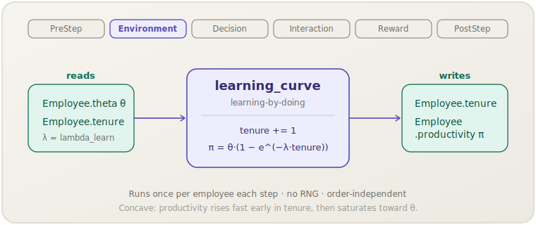

[English](learning-curve.md) | **日本語**

# 学習曲線（`learning_curve`）

> 各従業員の生産性は，学習効果によって在職期間とともに向上します．
> **フェーズ：** Environment．**出典：** Bahk & Gort (1993)．**種別：** empirical（λ）．

[← Mechanism カタログに戻る](../mechanisms.ja.md)

## 1. 概要

`learning_curve` は HR ライフサイクルモジュールにおける最も単純な生産メカニズムです．
1ステップに1回，全従業員の在職期間を1ヶ月分加算し，その在職期間の凹関数として
個人の生産性寄与を再計算します．新入社員は生産性ほぼゼロから始まり，
経験を積むにつれて能力上限 `θ` に近づいていきます —
Bahk & Gort (1993) が新規製造工場で記録した古典的な*学習効果*です．

このメカニズムは各従業員のベースライン `productivity` を確立し，
下流のメカニズムがそれを変調（`peer_effect`）・集計（`org_performance`）します．

## 2. 理論と出典

学習効果は，労働者あたりの産出量が累積経験とともに増加するが，
収穫逓減を示し，労働者の潜在能力を上限として飽和することを予測します．
socsim はこれを有界指数型（修正指数型）学習曲線でモデル化しています：

```text
tenure ← tenure + 1                       (one month per step)
π = θ · (1 − e^(−λ · tenure))
```

- `θ`（`theta`）— 従業員の真の能力，生産性の上限．
- `λ`（`lambda_learn`）— 学習率；λが大きいほど上限に早く到達する．
- `π`（`productivity`）— このステップにおける実効生産性寄与．

`tenure = 0` のとき `π = 0`；`tenure → ∞` のとき `π → θ`．
1ヶ月あたりの限界利得は幾何学的に縮小し，経験的な凹型学習曲線を再現します．
Bahk & Gort (1993) は工場レベルの学習を資本・労働・組織コンポーネントに分解しており，
`λ = 0.15` は彼らの報告範囲の中点を業界平均のデフォルトとして設定しています．

## 3. データフロー



このメカニズムは各従業員の `θ` と（インクリメント後の）`tenure` を読み取り，
新しい `tenure` と `productivity` を書き戻します．他の状態には触れません．

## 4. 6フェーズループにおける位置

エージェントの意思決定やインタラクションより前の，2番目のフェーズである **Environment** で実行されます．
この配置は意図的なものです：生産性はそのステップでの各従業員の行動の「環境」の一部であり，
最初に更新される必要があります．

- 個人ベースライン `π` を `productivity` に設定します．
- 同じステップの後段で，`peer_effect`（Interaction）がそのベースラインをチーム係数で乗算し，
  `org_performance`（Reward）が結果を集計します．

従業員ごとの `θ` と `tenure` のみに依存するため，他の Environment フェーズメカニズムとの順序制約はありません．

## 5. 状態の読み書きコントラクト

| フィールド | 読み取り | 書き込み | 備考 |
|---|:--:|:--:|---|
| `Employee.theta` | ✓ | | 生産性の上限． |
| `Employee.tenure` | ✓ | ✓ | 毎ステップ1インクリメント（飽和処理あり）． |
| `Employee.productivity` | | ✓ | 個人ベースライン `π` で上書きされる． |

## 6. 依存関係と順序制約

- **上流：** なし．各 `Employee` が所有するフィールドのみを読み取ります．
- **下流：** `peer_effect` は `productivity` が個人ベースラインを保持していることを前提にチーム乗数を適用します；
  `org_performance` は最終的な `productivity` を集計します．
  `learning_curve` を Environment（Interaction・Reward より前）に配置することで，この順序が保証されます．

## 7. パラメータ

| パラメータキー | デフォルト | 種別 | 出典 |
|---|---|---|---|
| `lambda_learn` | `0.15` | empirical（成長率） | Bahk & Gort (1993)，報告範囲の中点 |

## 8. 適用方法

### シナリオ TOML

```toml
[[mechanism]]
name  = "learning_curve"
phase = "environment"
[mechanism.params]
lambda_learn = 0.15
```

### ライブラリモード

```rust
use socsim_config::{Registry, Params, ModulePack};
use socsim_hr_lifecycle::{HrLifecyclePack, HrWorld};
use socsim_engine::{RandomActivationScheduler, SimulationBuilder};

let mut reg: Registry<HrWorld> = Registry::new();
HrLifecyclePack.register(&mut reg);

let learning = reg.build("learning_curve", &Params::empty())?;
let mut sim = SimulationBuilder::new(world)
    .scheduler(Box::new(RandomActivationScheduler))
    .seed(42)
    .add_mechanism(learning)
    .build();
sim.run()?;
```

## 9. 決定論性と RNG

乱数を**一切**使用しません．`employees.values_mut()` を反復して各従業員を独立に更新するため，
結果は順序非依存で，同じワールド状態に対して完全に決定論的です．

## 10. 期待される動作

`avg_tenure` は1ステップあたりおよそ1ヶ月増加し（`turnover` によるチャーン分を除く），
生き残った各従業員の `productivity` は `θ` に向かう凹型曲線に沿って上昇します．
ベースラインシナリオでは，`turnover` と `hiring` が定常状態に達するまでの初期において，
これが `org_performance` 増加の主要な駆動要因となります．

## 11. 参考文献

- Bahk, B.-H., & Gort, M. (1993). Decomposing learning by doing in new plants.
  *Journal of Political Economy*, 101(4), 561–583.
