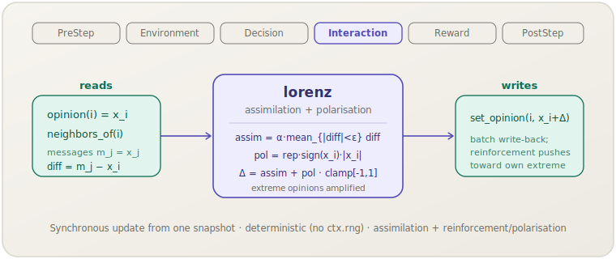

**English** | [日本語](lorenz.ja.md)

# Lorenz (`lorenz`)

> Each agent assimilates the mean of nearby opinions and then reinforces its own
> position, amplifying extreme opinions and driving polarisation.
> **Phase:** Interaction. **Source:** Lorenz et al. (2021). **Kind:** opinion dynamics (assimilation + reinforcement).

[← Back to the mechanism catalog](../mechanisms.md)

## 1. Overview

`lorenz` is the **assimilation-plus-polarisation** member of the opinion-dynamics
family in the general `socsim-social-dynamics` crate. Each agent carries a scalar
opinion in `[-1, 1]`. Once per step it performs a **synchronous** update: it
snapshots every agent's opinion, and for each agent `i` it combines two terms:

- **assimilation** — the mean gap toward neighbour opinions inside the acceptance
  region ε, scaled by α (the bounded-confidence pull);
- **reinforcement / polarisation** — a term `repulsion · sign(x_i) · |x_i|` that
  pushes the agent's opinion further out *in its own current direction*, scaled by how
  extreme it already is.

The combined delta is added to `x_i`, clamped to `[-1, 1]`, and batch-written. The
polarisation term is self-reinforcing: the more extreme an opinion, the harder it is
pushed outward — so the population tends to split toward the `±1` extremes rather than
settle at a moderate consensus.

The mechanism is **library-only**: it operates over any world implementing the
`ScalarOpinions` and `Neighbors` capability traits from `socsim-core`. There is **no
`ModulePack`** for it (no scenario-TOML registration); construct it directly and add
it to a `SimulationBuilder`.

## 2. Theory & source

Lorenz et al. (2021) frame opinion change as the interplay of three forces:
**assimilation** (attraction toward like-minded others), **reinforcement** (an
agent's own attitude strengthens in its current direction), and **polarisation** (the
population pulls apart toward extremes). Reinforcement is the key ingredient that
distinguishes this family from pure bounded-confidence models: it lets attitudes
radicalise even without contrary social pressure.

socsim renders this as a per-step opinion update. For agent `i` with opinion $x_i$
and neighbour messages $\{m_j\}$, the delta sums an assimilation term over the
in-region neighbours and a reinforcement/polarisation term:

$$
\Delta_i \;=\; \underbrace{\frac{\alpha}{|A_i|}\sum_{j \in A_i}(m_j - x_i)}_{\text{assimilation}}
\;+\; \underbrace{\rho\,\operatorname{sign}(x_i)\,|x_i|}_{\text{reinforcement / polarisation}},
\qquad A_i = \{\, j : |m_j - x_i| < \varepsilon \,\},
$$

where $\varepsilon$ is the acceptance half-width, $\alpha$ the assimilation rate, and
$\rho$ the polarisation strength (the `repulsion` field). The new opinion
$x_i' = \operatorname{clamp}_{[-1, 1]}(x_i + \Delta_i)$. When no neighbour is in
region the assimilation term is zero, but the reinforcement term still applies. The
math is ported verbatim from the `mou2024` reference's `lorenz_update`.

## 3. Data flow



The mechanism reads `opinion(i)` and the neighbour opinions (`neighbors_of(i)` →
`opinion(j)`, used as messages `m_j`) from a start-of-step snapshot, averages the
in-region assimilation gap, adds the reinforcement term scaled by `|x_i|`, and
batch-writes the clamped new opinions via `set_opinion`. No other state is touched.

## 4. Position in the 6-phase loop

Runs in **Interaction**, the phase where agents influence one another. Opinion change
*is* the interaction here.

- It reads a snapshot of all opinions taken at the start of its `apply` call, then
  writes every agent's new opinion in a single batch — making the update synchronous
  (simultaneous) and independent of the scheduler's activation order.
- Self is excluded from the message set (a neighbour `j == i` is skipped); the
  reinforcement term uses the agent's *own* snapshot opinion `x_i`.

Because it both reads and writes only the scalar opinion, two opinion-mutating
mechanisms in the same Interaction phase would compose sequentially.

## 5. State read/write contract

| Field | Read | Write | Notes |
|---|:--:|:--:|---|
| `opinion(i)` (`ScalarOpinions`) | ✓ | ✓ | Snapshotted at step start; overwritten with `clamp(x_i + Δ)`. Also drives the reinforcement term via `sign(x_i)·|x_i|`. |
| `neighbors_of(i)` (`Neighbors`) | ✓ | | Source of the messages `m_j = x_j` for the assimilation term (self excluded). |

## 6. Dependencies & ordering constraints

- **Upstream:** none. It needs only a world implementing `ScalarOpinions +
  Neighbors`; the topology (complete graph, ring, network, lattice) is the world's
  concern via `neighbors_of`.
- **Downstream:** an optional [`ConvergenceMechanism`] (PostStep) and the
  `max_abs_delta` helper apply, but the reinforcement term tends to drive opinions to
  the `±1` clamp boundaries and hold them there, so a polarised configuration — not a
  single fixed point — is the usual end state. A step budget is the clearer stop.

## 7. Parameters

| Param | Type | Default | Meaning |
|---|---|---|---|
| `epsilon` (ε) | `f64` | `0.4` | Acceptance half-width for the assimilation term: `|diff| < ε` ⇒ assimilate. |
| `alpha` (α) | `f64` | `0.5` | Assimilation rate applied to the in-region mean gap. |
| `repulsion` (ρ) | `f64` | `0.2` | Polarisation strength of the reinforcement term `ρ·sign(x_i)·|x_i|`. |

These are tunable behavioural scales, not empirical correlations. There is no
ModulePack and therefore no scenario-TOML param block; all three fields are
constructor arguments.

## 8. How to apply

This mechanism is **library-mode only** — there is no scenario-TOML registration.
Provide a world implementing `ScalarOpinions + Neighbors`, construct the mechanism,
and add it to a `SimulationBuilder`. (The world boilerplate is identical to the
[Hegselmann–Krause example](hegselmann-krause.md#8-how-to-apply).)

```rust
use socsim_social_dynamics::LorenzMechanism;
use socsim_engine::{SequentialScheduler, SimulationBuilder};

// ε = 0.4 acceptance, α = 0.5 assimilation, repulsion = 0.2 polarisation.
let lorenz = LorenzMechanism::new(0.4, 0.5, 0.2);

let mut sim = SimulationBuilder::new(world) // world: ScalarOpinions + Neighbors
    .scheduler(Box::new(SequentialScheduler))
    .seed(42)
    .add_mechanism(lorenz)
    .build();
sim.run()?;
```

Raise `repulsion` to make reinforcement dominate (faster, sharper polarisation); set
it to 0 to recover a pure assimilation (bounded-confidence-like) dynamic.

## 9. Determinism & RNG

**Deterministic**: the update reads a fixed snapshot and writes a fixed batch, so the
result is order-independent and reproducible for a given world state — it does not
touch `ctx.rng`. (Any stochasticity, e.g. random initial opinions, lives in the
world, not the mechanism.)

## 10. Expected behaviour

The regime is set by the balance between assimilation (α, ε) and reinforcement
(`repulsion`):

- **Assimilation-dominated** (large ε, small `repulsion`): the population converges
  toward consensus, like a bounded-confidence model.
- **Reinforcement-dominated** (small ε, large `repulsion`): the self-reinforcing term
  pushes opinions outward faster than assimilation can pull them together, so the
  population **polarises to the `±1` extremes**, where the clamp pins them.

Because reinforcement scales with `|x_i|`, agents that start near the centre drift
slowly at first and accelerate as they move outward — a hallmark of the
radicalisation dynamics this model captures.

## 11. References

- Lorenz, J., Neumann, M., & Schröder, T. (2021). Individual attitude change and
  societal dynamics: Computational experiments with psychological theories.
  *Psychological Review*, 128(4), 623–642.
- Mou, X., et al. (2024). Opinion-dynamics agent-based models with assimilation,
  reinforcement, and polarisation mechanisms (the `mou2024` reference port).
