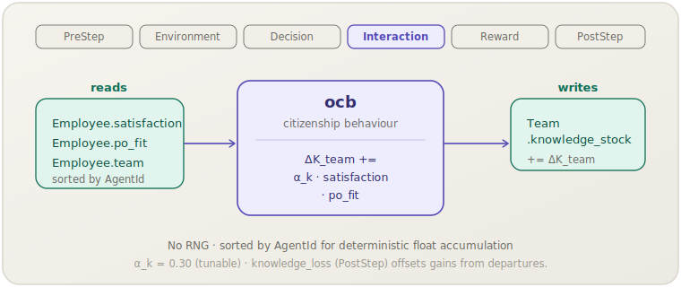

[English](ocb.md) | **日本語**

# 組織市民行動（`ocb`）

> 満足度が高く組織に適合した従業員が自発的に知識を提供し，
> ステップごとにチームの知識ストックを積み上げます．
> **フェーズ：** Interaction．**出典：** calibration（$\alpha_k$ チューナブル）．**種別：** tunable．

[← Mechanism カタログに戻る](../mechanisms.ja.md)

## 1. 概要

`ocb` は*組織市民行動（Organisational Citizenship Behaviour）*をモデル化します．
これは正式な職務要件を超えて従業員が払う，裁量的・役割外の努力を指します．
HR ライフサイクルモジュールでは，この行動を自発的な知識共有として操作化しています．
ステップごとに，全従業員が満足度と組織適合度に比例した貢献をチームの `knowledge_stock` に対して行います．
不満を抱える従業員や組織に適合していない従業員の貢献はわずか，あるいは皆無である一方，
満足度が高く組織に適合した従業員は，チーム全体の知識成長を有意に加速させます．

このメカニズムは，あえて単一の経験的研究には紐付けず，キャリブレーションに基づくものとしています．
スケールファクター `$\alpha_k$` は，`knowledge_loss` が課す知識損失と知識蓄積とのバランスを取るための
自由パラメータです．

## 2. 理論と出典

OCB は，態度的な成果（満足度，組織コミットメント，適合）が役割外行動を予測することを示す
幅広い文献と結びついています（Organ, 1988; Kristof-Brown et al., 2005）．
socsim の実装では，この貢献を線形の積として扱います．

$$\Delta K_{\text{team}} = \alpha_k \cdot \text{satisfaction} \cdot \text{po\_fit}$$

- $\text{satisfaction}$（`Employee.satisfaction`）— `fit` メカニズムによって毎ステップ更新される従業員の現在の職務満足度 $\in [0, 1]$．
- $\text{po\_fit}$（`Employee.po_fit`）— person–organisation fit $\in [0, 1]$．組織の価値観に強く同一視する従業員ほど多く貢献する．
- $\alpha_k$（`alpha_k`）— チューナブルなスケーリング係数（デフォルト 0.30）．
  目標とする離職率のもとで `knowledge_stock` の長期的な推移が `knowledge_loss` と釣り合うよう設定する．

従業員は `AgentId` の昇順で処理されるため，`ΔK_team` への浮動小数点の累積は
実行をまたいで完全に決定論的です．

## 3. データフロー



このメカニズムは ID でソートされた従業員を反復し，チームごとの知識貢献を一時バッファに蓄積して，
各チームの合計貢献を `Team.knowledge_stock` に加算します．

## 4. 6フェーズループにおける位置

4番目のフェーズである **Interaction** で，`peer_effect` と並んで実行されます．
2つのメカニズムは異なる出力（`productivity` vs `knowledge_stock`）に作用するため，
Interaction フェーズ内での相互順序は正確さに影響しません．

`fit` メカニズム（Decision，フェーズ 3）がこのフェーズより前に `satisfaction` を更新するため，
`ocb` は常に現在ステップの最新の満足度値を読み取ります．

## 5. 状態の読み書きコントラクト

| フィールド | 読み取り | 書き込み | 備考 |
|---|:--:|:--:|---|
| `Employee.satisfaction` | ✓ | | 同ステップの前段で `fit` によって更新される． |
| `Employee.po_fit` | ✓ | | Person–organisation fit；採用時/シナリオ初期化時に設定される． |
| `Employee.team` | ✓ | | `HrWorld.teams` へのインデックス． |
| `Team.knowledge_stock` | | ✓ | チームの OCB 貢献合計がインクリメントされる． |

## 6. 依存関係と順序制約

- **上流（同ステップ）：** `fit`（Decision）は `ocb` より前に実行され，
  `satisfaction` が現在期の適合評価を反映している必要があります．
  `fit` が存在しない場合，`ocb` は最後に書き込まれた満足度値をそのまま使用します．
- **下流：** `knowledge_loss`（PostStep）は `Team.knowledge_stock` を読み取り，
  離職による暗黙知の損失を適用します．`ocb` による獲得から `knowledge_loss` による損失を差し引いた純効果が，
  ストックが成長するか減少するかを決めます．
- `peer_effect` への**依存関係はありません**．両者は Interaction フェーズを共有しますが，
  書き込む先のフィールドは異なります．

## 7. パラメータ

| パラメータキー | デフォルト | 種別 | 出典 |
|---|---|---|---|
| `alpha_k` | `0.30` | tunable（知識の獲得と損失のバランス） | calibration |

## 8. 適用方法

### シナリオ TOML

```toml
[[mechanism]]
name  = "ocb"
phase = "interaction"
[mechanism.params]
alpha_k = 0.30
```

### ライブラリモード

```rust
use socsim_config::{Registry, Params, ModulePack};
use socsim_hr_lifecycle::{HrLifecyclePack, HrWorld};
use socsim_engine::{RandomActivationScheduler, SimulationBuilder};

let mut reg: Registry<HrWorld> = Registry::new();
HrLifecyclePack.register(&mut reg);

let ocb = reg.build("ocb", &Params::empty())?;
let mut sim = SimulationBuilder::new(world)
    .scheduler(Box::new(RandomActivationScheduler))
    .seed(42)
    .add_mechanism(ocb)
    .build();
sim.run()?;
```

## 9. 決定論性と RNG

乱数を**一切**使用しません．累積前に従業員を `AgentId`（昇順）でソートするため，
`knowledge_stock` への浮動小数点加算が固定された順序に従い，
同じワールド状態に対して実行をまたいでビット単位で同一の結果を生成することが保証されます．

## 10. 期待される動作

満足度が一貫して高く，person–organisation fit が良好な安定した職場環境では，
`knowledge_stock` はステップごとに着実に成長するはずです．
離職が少なければ `knowledge_loss` も小さく，ストックは上昇傾向を示します．
離職率の高いシナリオ（例えば有害行動が蔓延するエピソード）では満足度が低下し，
OCB による貢献が縮小するため，`knowledge_loss` が OCB の獲得を上回り，
ストックが減少することがあります．`alpha_k` を上げるとベースラインの成長率が上がり，
下げるとストックが離職ショックに対してより敏感になります．

## 11. 参考文献

- Organ, D. W. (1988). *Organizational Citizenship Behavior: The Good Soldier
  Syndrome*. Lexington Books.
- Kristof-Brown, A. L., Zimmerman, R. D., & Johnson, E. C. (2005). Consequences
  of individuals' fit at work: A meta-analysis of person–job, person–
  organization, person–group, and person–supervisor fit. *Personnel Psychology*,
  58(2), 281–342.
