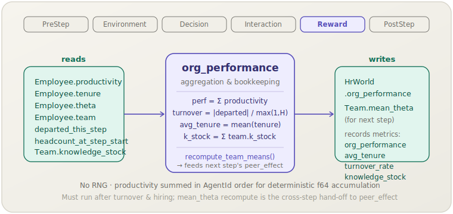

**English** | [日本語](org-performance.ja.md)

# Org performance (`org_performance`)

> Aggregates per-employee productivity and workforce metrics, and recomputes
> team mean-$\theta$ for the next step's peer effect.
> **Phase:** Reward. **Source:** aggregation. **Kind:** n/a.

[← Back to the mechanism catalog](../mechanisms.md)

## 1. Overview

`org_performance` is the measurement and bookkeeping mechanism that closes each
simulation step. It aggregates four organisation-level metrics from the current
world state, records them to the simulation's output stream, and then recomputes
each team's mean ability (`Team.mean_theta`) so that `peer_effect` has an
up-to-date team snapshot when the next step starts.

The mechanism introduces no behavioural dynamics of its own — it is a pure
observer and bookkeeper — but it is a necessary member of the pack: without it,
`org_performance` (the world-state field) is never updated and `Team.mean_theta`
becomes stale, which silently breaks `peer_effect`.

## 2. Theory & source

There is no single calibration source; the four metrics are standard HR
analytics aggregates:

$$\text{org\_performance} = \sum_{i} \pi_i, \qquad \text{turnover\_rate} = \frac{\lvert\text{departed\_this\_step}\rvert}{\max(1,\ \text{headcount\_at\_step\_start})}$$

$$\text{avg\_tenure} = \frac{1}{|E|}\sum_{i \in E} \text{tenure}_i, \qquad \text{knowledge\_stock} = \sum_{k} K_k$$

Summing productivity in sorted AgentId order makes the f64 accumulation
deterministic regardless of `BTreeMap` traversal implementation details.
`headcount_at_step_start` is captured by `turnover` before any removals,
giving the correct denominator for the monthly turnover rate.

After recording metrics, the mechanism calls `recompute_team_means()`, which
sets each `Team.mean_theta` to the mean `theta` of that team's current members.
This cross-step hand-off is the key ordering insight: `peer_effect` (Interaction,
next step) reads `mean_theta` that was written here (Reward, this step).

## 3. Data flow



Reads `Employee.productivity`, `.tenure`, `.theta`, `.team`,
`HrWorld.departed_this_step`, and `HrWorld.headcount_at_step_start`. Writes
`HrWorld.org_performance` and `Team.mean_theta`; records four metrics.

## 4. Position in the 6-phase loop

Runs in **Reward**, the fifth phase, between Interaction (where `peer_effect`
and `ocb` act) and PostStep (where `knowledge_loss` and `socialization` clean
up). This placement guarantees:

1. `productivity` has been modulated by `peer_effect` (Interaction) before
   being summed here.
2. `departed_this_step` still contains the step's departures (cleared only at
   the end of PostStep by `knowledge_loss`), so `turnover_rate` is correct.
3. `Team.mean_theta` is refreshed **after** all hiring and turnover of this step
   have settled, giving `peer_effect` an accurate team snapshot for the next
   step.

## 5. State read/write contract

| Field | Read | Write | Notes |
|---|:--:|:--:|---|
| `Employee.productivity` | ✓ | | Summed (sorted by AgentId) for `org_performance`. |
| `Employee.tenure` | ✓ | | Averaged for `avg_tenure`. |
| `Employee.theta` | ✓ | | Used in `recompute_team_means`. |
| `Employee.team` | ✓ | | Used in `recompute_team_means`. |
| `HrWorld.departed_this_step` | ✓ | | Counted for `turnover_rate`; not cleared here. |
| `HrWorld.headcount_at_step_start` | ✓ | | Denominator for `turnover_rate`. |
| `HrWorld.org_performance` | | ✓ | Set to the productivity sum. |
| `Team.knowledge_stock` | ✓ | | Summed for `knowledge_stock` metric. |
| `Team.mean_theta` | | ✓ | Recomputed for next step's `peer_effect`. |

## 6. Dependencies & ordering constraints

- **Upstream (same step):**
  - `learning_curve` (Environment) and `peer_effect` (Interaction) must have
    set final `productivity` values before this mechanism sums them.
  - `turnover` (Decision) must have populated `departed_this_step` and set
    `headcount_at_step_start` for the turnover-rate calculation.
  - `hiring` (Decision) must have run so that new hires are included in
    `recompute_team_means`.
- **Downstream (next step):** `peer_effect` reads `Team.mean_theta`; always
  include `org_performance` when `peer_effect` is present.
- **Downstream (same step):** `knowledge_loss` (PostStep) must run **after**
  this mechanism to ensure `departed_this_step` is still populated when
  `turnover_rate` is computed here.

## 7. Parameters

None. `org_performance` is a pure aggregation mechanism with no tunable
parameters.

## 8. How to apply

### Scenario TOML

```toml
[[mechanism]]
name  = "org_performance"
phase = "reward"
```

No `[mechanism.params]` block is needed.

### Library mode

```rust
use socsim_config::{Registry, Params, ModulePack};
use socsim_hr_lifecycle::{HrLifecyclePack, HrWorld};
use socsim_engine::{RandomActivationScheduler, SimulationBuilder};

let mut reg: Registry<HrWorld> = Registry::new();
HrLifecyclePack.register(&mut reg);

let op = reg.build("org_performance", &Params::empty())?;
let mut sim = SimulationBuilder::new(world)
    .scheduler(Box::new(RandomActivationScheduler))
    .seed(42)
    .add_mechanism(op)
    .build();
sim.run()?;
```

## 9. Determinism & RNG

Draws **no** randomness. Productivity is summed in sorted AgentId order to
ensure deterministic f64 accumulation. All other aggregations (`avg_tenure`,
`knowledge_stock`) are similarly order-independent or explicitly sorted.

## 10. Expected behaviour

`org_performance` (the metric) should rise during the first 12–24 steps as
average tenure accumulates and `learning_curve` lifts productivity toward $\theta$.
It then stabilises when hiring and turnover balance. Turnover spikes cause
transient dips (new hires have near-zero productivity); knowledge-shock events
are visible in the `knowledge_stock` series. The `avg_tenure` series provides a
complementary view of workforce stability.

## 11. References

No external citation. `org_performance` is a standard aggregation mechanism;
the four metrics are conventional HR analytics measures.
