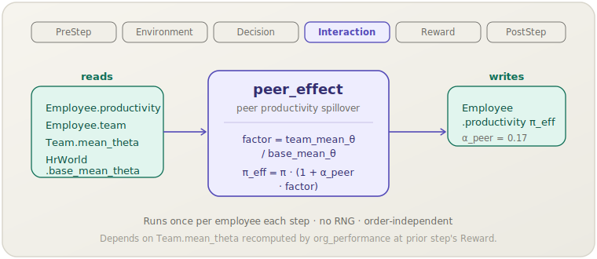

[English](peer-effect.md) | **日本語**

# ピア効果（`peer_effect`）

> 各従業員の生産性は所属チームの平均能力に応じて引き上げられ，
> 優秀な同僚からの正の波及効果を表現します．
> **フェーズ：** Interaction．**出典：** Mas & Moretti (2009)．**種別：** empirical（$\alpha_{\text{peer}}$）．

[← Mechanism カタログに戻る](../mechanisms.ja.md)

## 1. 概要

`peer_effect` は，より有能な同僚に囲まれるほど労働者の生産性が高まるという，
数多くの研究で確認されてきた現象をモデル化します．`learning_curve` が各従業員の個人ベースライン生産性 $\pi$ を確立した後，
このメカニズムが乗算的なチーム品質係数を適用します．組織全体の平均を上回るチームに所属する従業員は
生産性が上乗せされ，平均を下回るチームに所属する従業員はわずかなペナルティを受けます．

このメカニズムはチーム構成が産出量に影響する主要な経路であり，
`ocb` の知識ストックチャネルを補完します．

## 2. 理論と出典

Mas & Moretti (2009) は，生産性の高い同僚が同じシフトに加わるとレジ係のスキャン速度が有意に向上し，
その効果は同僚を直接観察できる労働者に最も強く現れることを報告しています．
socsim はこれを，チームの平均能力と組織全体のベースラインとの差に比例する
チームレベルの乗算因子として抽象化しています．

$$\pi_{\text{eff}} = \pi \cdot \left(1 + \alpha_{\text{peer}} \cdot \frac{\bar\theta_{\text{team}}}{\bar\theta_{\text{base}}}\right)$$

- $\pi$（`Employee.productivity`）— `learning_curve` が設定した個人ベースライン．
- $\bar\theta_{\text{team}}$（`Team.mean_theta`）— 従業員が所属するチームの平均能力．
  前ステップの末尾に `org_performance` によって再計算される．
- $\bar\theta_{\text{base}}$（`HrWorld.base_mean_theta`）— 初期化時に設定される組織全体の能力ベースライン．
  参照分母として定数に保たれる．
- $\alpha_{\text{peer}}$（`alpha_peer`）— 経験的なピア効果の大きさ（0.17）．

$\bar\theta_{\text{base}} \approx 0$ のとき，ゼロ除算を避けるため比率は 1.0 として扱われます．

比率 $\bar\theta_{\text{team}} / \bar\theta_{\text{base}}$ は平均的なチームで 1.0 に近く，
能力の高いチームでは 1.0 より大きく，低いチームでは 1.0 より小さくなるため，
この係数は $\pi$ を比例的に増幅または減衰させます．

## 3. データフロー



このメカニズムは各従業員の現在の `productivity` と `team` インデックスを読み取り，
そのチームの `Team.mean_theta` を参照して，`productivity` をピア調整済みの値で上書きします．
`HrWorld.base_mean_theta` はシミュレーション全体を通じて読み取り専用の定数です．

## 4. 6フェーズループにおける位置

4番目のフェーズである **Interaction** で実行されます．この配置には次の意図があります．

- `learning_curve`（Environment，フェーズ 2）が各従業員の個人 $\pi$ を設定した後でなければ，
  `peer_effect` はそれをスケールできません．
- `org_performance`（Reward，フェーズ 5）はその後，ピア調整済みの `productivity` 値を集計して
  組織レベルの産出量メトリクスを生成します．

Interaction フェーズのメカニズムの中では，同じステップ内で `Team.mean_theta` を変更するメカニズムの後に
`peer_effect` を宣言するのが原則です．ただし実際には `mean_theta` は各ステップ末の `org_performance` によって
再計算され，次のステップの開始時にここで読み取られるため，値の受け渡しはステップをまたいで行われます．

## 5. 状態の読み書きコントラクト

| フィールド | 読み取り | 書き込み | 備考 |
|---|:--:|:--:|---|
| `Employee.productivity` | ✓ | ✓ | ピア調整済みの値で上書きされる． |
| `Employee.team` | ✓ | | `HrWorld.teams` へのインデックス． |
| `Team.mean_theta` | ✓ | | 前ステップの Reward で `org_performance` が設定する． |
| `HrWorld.base_mean_theta` | ✓ | | 定数参照分母；初期化時に設定される． |

## 6. 依存関係と順序制約

- **上流（同ステップ）：** `learning_curve` が先に実行（Environment）されて
  `peer_effect` が乗算する個人ベースライン $\pi$ を確立していなければなりません．
- **上流（前ステップ）：** `org_performance` が前ステップ末にすべてのチームの `Team.mean_theta` を
  再計算していなければなりません．`org_performance` が存在しない場合，`mean_theta` の値は古くなります．
- **下流：** `org_performance`（Reward）が `org_performance` を集計する際に
  ピア調整済みの `productivity` を読み取ります．

## 7. パラメータ

| パラメータキー | デフォルト | 種別 | 出典 |
|---|---|---|---|
| `alpha_peer` | `0.17` | empirical（ピア効果の大きさ） | Mas & Moretti (2009) |

## 8. 適用方法

### シナリオ TOML

```toml
[[mechanism]]
name  = "peer_effect"
phase = "interaction"
[mechanism.params]
alpha_peer = 0.17
```

### ライブラリモード

```rust
use socsim_config::{Registry, Params, ModulePack};
use socsim_hr_lifecycle::{HrLifecyclePack, HrWorld};
use socsim_engine::{RandomActivationScheduler, SimulationBuilder};

let mut reg: Registry<HrWorld> = Registry::new();
HrLifecyclePack.register(&mut reg);

let peer = reg.build("peer_effect", &Params::empty())?;
let mut sim = SimulationBuilder::new(world)
    .scheduler(Box::new(RandomActivationScheduler))
    .seed(42)
    .add_mechanism(peer)
    .build();
sim.run()?;
```

## 9. 決定論性と RNG

乱数を**一切**使用しません．更新は，チームIDをキーとする `team_means` スナップショットを参照して
各従業員に独立して適用される純粋な算術演算です．そのため結果は反復順序に依存せず，
同じワールド状態に対して完全に決定論的になります．

## 10. 期待される動作

`learning_curve`，`peer_effect`，`org_performance` を含むシミュレーションでは，
平均能力の高いチームは，同サイズの能力の低いチームよりも一貫して高い集計生産性を示すはずです．
効果の大きさは全従業員にわたる `theta` の分散に比例します．`theta` が全従業員でほぼ均一であれば，
比率 $\bar\theta_{\text{team}} / \bar\theta_{\text{base}}$ は 1.0 付近に留まり，このメカニズムは実質的にはたらきません．
選択的な採用や離職による正の同類選択（assortative sorting）は，時間の経過とともにピア効果を増幅させます．

## 11. 参考文献

- Mas, A., & Moretti, E. (2009). Peers at work. *American Economic Review*,
  99(1), 112–145.
