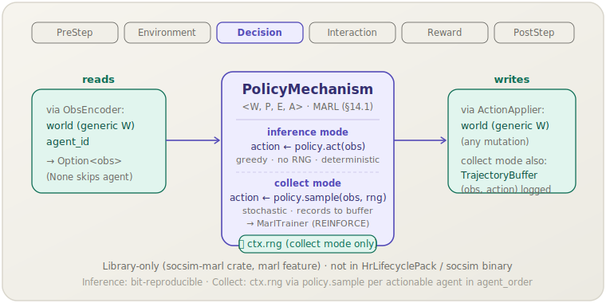

[English](policy-mechanism.md) | **日本語**

# ポリシーメカニズム (`policy`)

> 任意の固定ヒューリスティックを学習可能なポリシーで置き換える汎用の Decision フェーズラッパーで，標準のシミュレーションループの中でマルチエージェント強化学習を可能にする．
> **フェーズ:** Decision．**出典:** MARL (§14.1)．**種別:** learnable．

[← Mechanism カタログに戻る](../mechanisms.ja.md)

## 1. 概要

`PolicyMechanism<W, P, E, A>` は `socsim-marl` クレートが提供する汎用の Decision フェーズメカニズムで，共有 `Policy` を `ObsEncoder`（ワールド → 観測）と `ActionApplier`（行動 → ワールドの変異）とともにラップする．任意の固定 Decision フェーズヒューリスティックをそのまま置き換えるドロップイン部品であり，シミュレーションエンジンは他のメカニズムとまったく同じように `apply()` を呼び出すだけで，エンジン側には一切手を入れる必要がない．

2つの動作モードを備えており，同一の型を推論と学習の両方に使える．

- **推論モード** — 貪欲に行動を選択し（`policy.act`），RNG を消費しないため，凍結したポリシーのもとで決定論的に動作する．
- **収集モード** — 確率的にサンプリングし（`policy.sample`，`ctx.rng` を使用），さらに `MarlTrainer`（REINFORCE，`DiscretePolicyNet` の burn MLP，CPU）へ渡す共有 `TrajectoryBuffer` に軌跡を記録する．

`PolicyMechanism` は**ライブラリ専用**である．`HrLifecyclePack` には登録されておらず，`socsim` バイナリやシナリオ TOML ファイルからは利用できないため，Rust コードで構築して `SimulationBuilder` に直接追加する必要がある．`socsim-hr-lifecycle` 側では `marl` feature フラグの後ろに置かれている．

## 2. 理論と出典

MARL（socsim 設計ドキュメントの §14.1）は，各シミュレーションエージェントを強化学習のアクターとみなす．各 Decision フェーズでは，エンコーダーが現在のワールド状態をエージェントごとの観測ベクトルへ写像し，ポリシーが離散的な行動インデックスを出力し，アプライアーがそのインデックスをワールドの変異へと変換する．学習には，`DiscretePolicyNet`（`burn` フレームワークで構築した浅い MLP で，CPU 上で動作する）による REINFORCE を用いる．

2つのモードは次のとおりである．

```text
Inference mode:
    obs    ← encoder.encode(world, agent_id)       (skip agent if None)
    action ← policy.act(obs)                        (greedy, no RNG)
    applier.apply(world, agent_id, action, ctx.rng)

Collect mode:
    obs    ← encoder.encode(world, agent_id)       (skip agent if None)
    action ← policy.sample(obs, ctx.rng)            (stochastic, uses ctx.rng)
    applier.apply(world, agent_id, action, ctx.rng)
    buffer.begin_decision(agent_id, obs, action)    (record for trainer)
```

形式的に書けば，収集モードではポリシー分布から行動をサンプリングし，推論モードでは貪欲に行動を選択する．

$$a_t \sim \pi_\theta(\,\cdot \mid o_t) \quad(\text{collect}), \qquad a_t = \arg\max_{a} \pi_\theta(a \mid o_t) \quad(\text{inference})$$

ポリシーは，エピソードとエピソードの合間にオフラインで，REINFORCE による勾配推定を用いて学習する．

$$\nabla_\theta J = \mathbb{E}\!\left[\sum_t \nabla_\theta \log \pi_\theta(a_t \mid o_t)\, G_t\right]$$

ポリシーは `Rc<RefCell<Policy>>` として共有されるため，`MarlTrainer` がエピソードの合間に重みを更新する一方で，メカニズムは実行中ずっと同じ参照を保持し続ける．

## 3. データフロー



読み書きされる状態は，呼び出し元が与える `ObsEncoder` と `ActionApplier` の実装に完全に依存する．メカニズム自体は特定のワールドフィールドを直接操作することはなく，ワールドへのアクセスはすべて，汎用のエンコーダーとアプライアーの組を介して行われる．

## 4. 6フェーズループ内での位置

3番目のフェーズである **Decision** で実行され，HR ライフサイクルパックの `fit`，`turnover`，`hiring` と同じフェーズに並ぶ．Decision 内では宣言順序がそのまま実行順序になるため，`PolicyMechanism` は，その `ActionApplier` が持ち込む依存関係に沿うように配置する．たとえばアプライアーが `satisfaction` を変更する場合は，設計の意図に応じて，`fit` がそのフィールドを更新した後に実行するか前に実行するかを決める．

## 5. 状態読み書きコントラクト

このコントラクトは**汎用**であり，呼び出し元が指定する具体的な `ObsEncoder<W>` 型および `ActionApplier<W>` 型に依存する．

| 操作 | アクター | 備考 |
|---|---|---|
| ワールド状態の読み取り | `encoder.encode(world, aid)` | `Option<obs>` を返す．`None` の場合はそのエージェントをスキップする． |
| ワールド状態の書き込み | `applier.apply(world, aid, action, ctx.rng)` | 任意の変異を許可． |
| 軌跡の書き込み | `buffer.begin_decision(aid, obs, action)` | 収集モードのみ． |

`PolicyMechanism` のレベルでは，固定のフィールドコントラクトは存在しない．コントラクトはエンコーダーとアプライアーの実装側で文書化する．

## 6. 依存関係と順序制約

- **上流** `ObsEncoder` が読み取る値は最新でなければならない．エンコーダーが `Employee.productivity` を読み取る場合，`learning_curve` と `peer_effect` を先に実行しておく必要があるが，これらは Environment フェーズと Interaction フェーズのメカニズムで Decision より前に発火するため，フェーズの順序付けによって自動的に満たされる．
- **下流** `ActionApplier` が書き込む値は後続のメカニズムが消費する．必要であれば，Decision フェーズ内でそれらの消費側より前に `PolicyMechanism` を宣言する．
- **学習ループ** 収集モードでは，`MarlTrainer` がステップ後に `buffer.close_step(rewards)` を呼び出し，エピソードの合間に学習更新を実行しなければならない．完全な学習ループのパターンは [library.ja.md#learnable-policies-marl](../library.ja.md#learnable-policies-marl) を参照．
- **Feature フラグ** `Cargo.toml` に `socsim-marl`（`marl` feature 付き）を追加する．

## 7. パラメータ

`PolicyMechanism` にはシナリオ TOML 上のパラメータはない．ポリシーの重み，ネットワーク構成，学習のハイパーパラメータは `MarlTrainer` と `Policy` の実装が管理し，メカニズムレジストリは関与しない．

## 8. 適用方法

`PolicyMechanism` は**ライブラリ専用**であり，対応する `[[mechanism]]` TOML ブロックは存在しない．Rust で構築して `SimulationBuilder` に直接追加する．

### ライブラリモード

```rust
use std::cell::RefCell;
use std::rc::Rc;

use socsim_marl::{PolicyMechanism, TrajectoryBuffer};
use socsim_engine::{RandomActivationScheduler, SimulationBuilder};

// Your encoder and applier implementations.
let encoder = MyObsEncoder::new();
let applier = MyActionApplier::new();

// Shared policy (e.g. a trained DiscretePolicyNet loaded from disk).
let policy = Rc::new(RefCell::new(my_policy));

// --- Inference mode (frozen policy, no RNG, bit-reproducible) ---
let infer_mech = PolicyMechanism::inference(
    Rc::clone(&policy),
    encoder.clone(),
    applier.clone(),
);

// --- Collect mode (stochastic, records trajectories for MarlTrainer) ---
let buffer = Rc::new(RefCell::new(TrajectoryBuffer::new()));
let collect_mech = PolicyMechanism::collecting(
    Rc::clone(&policy),
    encoder,
    applier,
    Rc::clone(&buffer),
);

// Add to SimulationBuilder like any other mechanism.
let mut sim = SimulationBuilder::new(world)
    .scheduler(Box::new(RandomActivationScheduler))
    .seed(42)
    .add_mechanism(collect_mech)
    .build();
sim.run()?;
```

完全な学習ループ（REINFORCE 更新，報酬の割り当て，エピソードリセット）については [学習ポリシー (MARL)](../library.ja.md#learnable-policies-marl) を参照．

## 9. 決定論性と RNG

**推論モード** 乱数を**引かない**（`policy.act` は貪欲かつ決定論的である）．同じワールド状態を与えれば，凍結したポリシーによる実行はビット単位で再現可能である．

**収集モード** ステップごとに，行動可能な各エージェントについて `policy.sample(obs, ctx.rng)` を介して `ctx.rng` から1回ずつ引く．走査順は `ctx.agent_order` に従い，これはシミュレーションスケジューラーが決める（通常は，メカニズムが発火する前のステップ準備段階で引かれたランダムな順列である）．したがって収集モードの再現には，同一のシード**と**同一のエージェント順スケジュールの両方が必要となる．

`ActionApplier` が確率的なワールド変異を必要とする場合は，`ActionApplier` も `ctx.rng` を消費しうる．その点はアプライアーの実装側で文書化する．

## 10. 期待される動作

十分に学習したポリシーを使った推論モードでは，固定ヒューリスティックのベースラインと比べて，シミュレーションはより高い `org_performance`，あるいはより低い `turnover_rate`（どちらになるかは報酬シグナルによる）を生み出し，ポリシーが学習した戦略を反映するはずである．学習初期の収集モードでは挙動は本質的にランダムだが，REINFORCE が収束するにつれて，ポリシーは学習対象とする目標へと寄っていく．

## 11. 参考文献

- socsim 設計ドキュメント §14.1 — 学習ポリシー (MARL)．
- Williams, R. J. (1992). Simple statistical gradient-following algorithms for
  connectionist reinforcement learning. *Machine Learning*, 8(3–4), 229–256.
  (REINFORCE algorithm)
