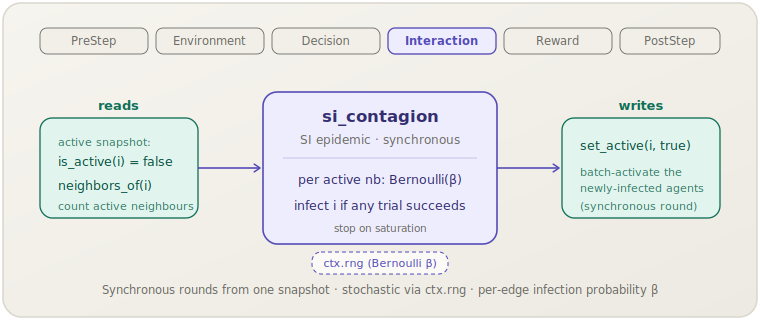

[English](si-contagion.md) | **日本語**

# SI 伝播（`si_contagion`）

> 各ステップで，アクティブ（感染）な近傍がそれぞれ独立に確率 β で非アクティブなエージェントを感染させます．新たに感染したエージェントは同期ラウンドで活性化されます．
> **フェーズ：** Interaction．**出典：** SI 感染症モデル．**種別：** network contagion（binary state, β）．

[← Mechanism カタログに戻る](../mechanisms.ja.md)

## 1. 概要

`si_contagion` は，汎用の `socsim-social-dynamics` パックにおけるネットワーク伝播ファミリーの
**エッジ単位の SI（Susceptible–Infected）** メンバーです．各エージェントは二値の
*アクティブ／感染*フラグを持ちます．1ステップに1回，**同期ラウンド**を実行します．
まずステップ開始時にアクティブ集合をスナップショットし，各非アクティブなエージェントについて，
（スナップショットから読み取った）*アクティブ*な近傍ごとに独立した Bernoulli(β) 試行を1回引きます．
それらの試行の**いずれか**が成功すればエージェントは感染します．新たに感染したエージェントは
一括で活性化されるため，ラウンド途中で感染したエージェントは次のラウンドまで感染源になりません．

ラウンドはステップ開始時のスナップショットに対して評価され，バッチで書き戻されるため，
結果はエージェントの活性化順序に依存しません．回復状態はありません（SIR ではなく SI）．
感染は単調なので，アクティブ集合は増えるだけです．メカニズムは**飽和**時に `request_stop` を呼びます
— 新たに感染するエージェントがいないラウンド，または全員がすでにアクティブなときです．

このメカニズムは**ライブラリ専用**です．`socsim-core` の `BinaryState` および `Neighbors`
能力トレイトを実装する任意のワールド上で動作します．これには**`ModulePack` がありません**
（シナリオ TOML 登録なし）．直接構築して `SimulationBuilder` に追加してください．

## 2. 理論と出典

SI モデルは最も単純な区画感染症モデルです．エージェントは*感受性*（非アクティブ）または
*感染*（アクティブ）のいずれかで，感受性エージェントは感染した近傍との接触を通じて感染し，
感受性状態には戻りません．ネットワーク上では感染はエッジ単位で媒介されます．
感染した近傍との各接触は，確率 β の独立した伝播機会です．

近傍集合 $N(i)$ がステップ開始時にアクティブなメンバー
$A(i) = \{\, j \in N(i) : j \text{ がアクティブ} \,\}$ を持つ非アクティブなエージェント `i` について，
`i` がこのラウンドで感染する確率は

$$P(i \text{ が感染}) = 1 - (1 - \beta)^{|A(i)|}$$

です．すなわち，`i` は*すべての*独立したエッジ単位の試行が失敗したときのみ感染を免れます．
同等に，`i` は少なくとも1つの Bernoulli(β) 試行 — アクティブな近傍ごとに1つ — が成功すれば感染します．
β は $[0, 1]$ にクランプされます．実装は `granovetter1973` 再現実装の SI 分岐から移植されています．

## 3. データフロー



このメカニズムは，アクティブ集合のステップ開始時スナップショットから `is_active(i)` と
`neighbors_of(i)` を読み取り，各非アクティブなエージェントのアクティブな近傍ごとに
Bernoulli(β) 試行を1回引き，新たに感染したエージェントを集めて，`set_active(i, true)` で一括書き込みます．
他の状態には触れません．

## 4. 6フェーズループにおける位置

エージェントが互いに影響を及ぼし合う **Interaction** フェーズで実行されます．
ここではエッジに沿った疾病伝播そのものが相互作用です．

- `apply` 呼び出しの開始時に取得したアクティブ集合のスナップショットを読み取り，
  新たに感染した各エージェントを単一バッチで活性化します — これによりラウンドは同期的になり，
  スケジューラの活性化順序に依存しません．
- このラウンドで活性化したエージェントはまだ感染源ではありません．スナップショットがラウンド全体の感染源集合を固定するため，
  伝播は1ステップにつき1リングずつ進みます．
- **飽和**時（新たな感染なし，または全員アクティブ）には `ctx.request_stop` を呼び，
  `granovetter1973` 再現実装の収束ルールに一致します．

## 5. 状態の読み書きコントラクト

| フィールド | 読み取り | 書き込み | 備考 |
|---|:--:|:--:|---|
| `is_active(i)`（`BinaryState`） | ✓ | ✓ | ステップ開始時にスナップショット；非アクティブなエージェントは感染時にアクティブへ反転． |
| `neighbors_of(i)`（`Neighbors`） | ✓ | | 接触集合；（スナップショットの）*アクティブ*なメンバーのみが感染源． |

## 6. 依存関係と順序制約

- **上流：** なし．`BinaryState + Neighbors` を実装するワールドのみを必要とします．
  トポロジー（完全グラフ・リング・ネットワーク・格子）は `neighbors_of` を介したワールド側の関心事であり，
  初期シード集合もワールドの責任です．
- **下流：** 不要 — メカニズムは飽和時に `request_stop` で実行を自己終了します．
  アクティブ集合は単調なので，収束ヘルパは不要です．

## 7. パラメータ

| パラメータ | 型 | デフォルト | 意味 |
|---|---|---|---|
| `beta`（β） | `f64` | `0.5` | エッジ単位の感染確率，`[0, 1]` にクランプ．β が大きいほど伝播は速く広い． |

ModulePack がないため，シナリオ TOML のパラメータブロックもありません．単一フィールドはコンストラクタ引数です．

## 8. 適用方法

このメカニズムは**ライブラリモード専用**です — シナリオ TOML 登録はありません．
`BinaryState + Neighbors` を実装するワールドを用意し，メカニズムを構築して
`SimulationBuilder` に追加します．

```rust
use socsim_core::{AgentId, BinaryState, Neighbors, WorldState, SimClock};
use socsim_social_dynamics::SiContagionMechanism;
use socsim_engine::{SequentialScheduler, SimulationBuilder};

// エージェントごとに1つのアクティブ／感染フラグを持つワールド（例：ネットワーク上）．
struct ContagionWorld { clock: SimClock, active: Vec<bool> }

impl WorldState for ContagionWorld {
    fn agent_ids(&self) -> Vec<AgentId> {
        (0..self.active.len() as u64).map(AgentId).collect()
    }
    fn clock(&self) -> &SimClock { &self.clock }
    fn clock_mut(&mut self) -> &mut SimClock { &mut self.clock }
}
impl BinaryState for ContagionWorld {
    fn is_active(&self, id: AgentId) -> bool { self.active[id.0 as usize] }
    fn set_active(&mut self, id: AgentId, v: bool) { self.active[id.0 as usize] = v; }
}
impl Neighbors for ContagionWorld {
    fn neighbors_of(&self, id: AgentId) -> Vec<AgentId> {
        self.agent_ids().into_iter().filter(|&j| j != id).collect()
    }
}

// β = 0.3 のエッジ単位感染確率．
let si = SiContagionMechanism::new(0.3);

let mut sim = SimulationBuilder::new(world) // world: BinaryState + Neighbors
    .scheduler(Box::new(SequentialScheduler))
    .seed(42)
    .add_mechanism(si)
    .build();
sim.run()?;
```

実行前にワールドで初期感染集合をシードしてください．β を下げるとカスケードは遅く確率的になり，
1 に近づけるとほぼ決定論的な氾濫になります．

## 9. 決定論性と RNG

**確率的**です．各エッジ単位の伝播は `ctx.rng` から引かれる Bernoulli(β) 試行なので，
軌道は RNG ストリームに依存します．すべての乱数が `ctx.rng` を通るため，固定シードでは実行が完全に再現可能です．
アクティブ集合は単調なので，実行は常に有限ステップで飽和に到達します．

## 10. 期待される動作

ダイナミクスはネットワークトポロジーに対する β の相対値によって決まります．

- **大きな β**（≳ パーコレーション閾値）：感染は数ラウンドで巨大連結成分に氾濫し，ほぼ全飽和に達します．
- **小さな β**：多くのエッジ単位の試行が失敗するため，伝播は遅くポケットで止まることがあります．
  大規模な流行が起こるかどうかは，β がネットワークのパーコレーション閾値を超えるかどうかに依存します．

回復がないため，アクティブ割合は非減少であり，実行は振動するのではなく固定点（飽和）で終わります．

## 11. 参考文献

- Kermack, W. O., & McKendrick, A. G. (1927). A contribution to the mathematical
  theory of epidemics. *Proceedings of the Royal Society A*, 115(772), 700–721.
- Pastor-Satorras, R., Castellano, C., Van Mieghem, P., & Vespignani, A. (2015).
  Epidemic processes in complex networks. *Reviews of Modern Physics*, 87(3), 925–979.
