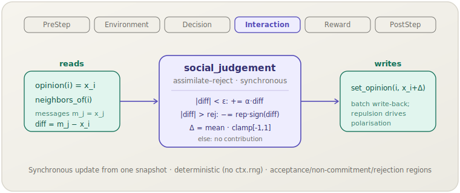

[English](social-judgement.md) | **日本語**

# 社会的判断（`social_judgement`）

> 各エージェントは，受容領域（ε）内に入る近傍の意見を同化し，拒否領域内の意見には反発します．これが分極を生み出します．
> **フェーズ：** Interaction．**出典：** Social Judgement Theory（社会的判断理論）．**種別：** opinion dynamics（assimilation–contrast）．

[← Mechanism カタログに戻る](../mechanisms.ja.md)

## 1. 概要

`social_judgement` は，汎用の `socsim-mechanisms` クレートにおける意見ダイナミクスファミリーの
**同化–対比**メンバーです．各エージェントは `[-1, 1]` のスカラー意見を持ちます．
1ステップに1回，**同期的**な更新を行います．まず全エージェントの意見をスナップショットし，
各エージェント `i` について，すべての近傍メッセージ `m_j = x_j` を符号付きギャップ
`diff = m_j − x_i` によって3つの領域に分類します．

- **受容**（`|diff| < ε`）：同化 — メッセージの*方向へ* `α · diff` だけ移動；
- **拒否**（`|diff| > rejection`）：反発 — メッセージから*遠ざかる方向へ* `repulsion · sign(diff)` だけ移動；
- **非関与**（`ε ≤ |diff| ≤ rejection`）：寄与なし．

エージェントごとの差分は，寄与する近傍にわたる**平均**です．新しい意見 `x_i + Δ` は
`[-1, 1]` にクランプされ，一括書き込みされます．反発項が**分極**を駆動します
— 離れすぎたメッセージはエージェントを反対方向へ押すため，対立するグループは両極へ発散しえます．

このメカニズムは**ライブラリ専用**です．`socsim-core` の `ScalarOpinions` および `Neighbors`
能力トレイトを実装する任意のワールド上で動作します．これには**`ModulePack` がありません**
（シナリオ TOML 登録なし）．直接構築して `SimulationBuilder` に追加してください．

## 2. 理論と出典

社会的判断理論（Sherif & Hovland）は，態度の周りの3つの幅を介して説得をモデル化します．
**受容の幅**（同化する方向へ十分近いメッセージ），**拒否の幅**（対比して*遠ざかる*ほど離れたメッセージ），
およびその間の**非関与の幅**（効果なし）です．受容内のメッセージは同化を生み，
拒否内のメッセージは態度をメッセージからさらに遠ざける対比効果を生みます．

socsim はこれをステップ単位の意見更新として表現します．意見 $x_i$ と近傍メッセージ $\{m_j\}$ を持つ
エージェント `i` について，差分はメッセージごとの寄与の平均です．

$$
\Delta_i = \frac{1}{|C_i|} \sum_{j \in C_i} \delta_{ij},
\qquad
\delta_{ij} =
\begin{cases}
\alpha\,(m_j - x_i) & |m_j - x_i| < \varepsilon \quad \text{（受容）}\\
-\,\rho_{\text{rep}}\,\operatorname{sign}(m_j - x_i) & |m_j - x_i| > r \quad \text{（拒否）}\\
0 & \text{それ以外（非関与）}
\end{cases}
$$

ここで $C_i$ は寄与する近傍の集合（受容または拒否領域にあるもの），$\varepsilon$ は受容の半幅，
$r$ は拒否閾値，$\alpha$ は同化率，$\rho_{\text{rep}}$ は反発強度です．
新しい意見は $x_i' = \operatorname{clamp}_{[-1, 1]}(x_i + \Delta_i)$ です．
この数式は `mou2024` 再現実装の `sj_update` から逐語的に移植されています．

## 3. データフロー



このメカニズムはステップ開始時のスナップショットから `opinion(i)` と近傍の意見
（`neighbors_of(i)` → `opinion(j)`，メッセージ `m_j` として使用）を読み取り，
各メッセージを受容／拒否／非関与に分類し，寄与を平均して，クランプした新しい意見を
`set_opinion` で一括書き込みします．他の状態には触れません．

## 4. 6フェーズループにおける位置

エージェントが互いに影響を及ぼし合う **Interaction** フェーズで実行されます．
ここでは意見の変化そのものが相互作用です．

- `apply` 呼び出しの開始時に取得した全意見のスナップショットを読み取り，
  各エージェントの新しい意見を単一バッチで書き込みます — これにより更新は同期的（同時）になり，
  スケジューラの活性化順序に依存しません．
- 自分自身はメッセージ集合から除外されます（近傍 `j == i` はスキップ）；近傍の意見のみがメッセージとして作用します．

スカラー意見のみを読み書きするため，同一の Interaction フェーズに意見を変更するメカニズムが2つあれば逐次的に合成されます．

## 5. 状態の読み書きコントラクト

| フィールド | 読み取り | 書き込み | 備考 |
|---|:--:|:--:|---|
| `opinion(i)`（`ScalarOpinions`） | ✓ | ✓ | ステップ開始時にスナップショット；`clamp(x_i + Δ)` で上書き． |
| `neighbors_of(i)`（`Neighbors`） | ✓ | | メッセージ `m_j = x_j` の供給源（自分自身は除外）． |

## 6. 依存関係と順序制約

- **上流：** なし．`ScalarOpinions + Neighbors` を実装するワールドのみを必要とします．
  トポロジー（完全グラフ・リング・ネットワーク・格子）は `neighbors_of` を介したワールド側の関心事です．
- **下流：** オプションの [`ConvergenceMechanism`]（PostStep）と `max_abs_delta` ヘルパは利用できますが，
  反発項は意見をクランプ境界へ駆動し，単一の固定点ではなく分極した膠着状態を生みうることに注意してください
  — 通常はステップ予算がより明確な停止ルールです．

## 7. パラメータ

| パラメータ | 型 | デフォルト | 意味 |
|---|---|---|---|
| `epsilon`（ε） | `f64` | `0.4` | 受容の半幅：`|diff| < ε` ⇒ 同化． |
| `alpha`（α） | `f64` | `0.5` | 領域内ギャップに適用する同化率． |
| `rejection`（r） | `f64` | `0.8` | 拒否閾値：`|diff| > rejection` ⇒ 反発． |
| `repulsion` | `f64` | `0.2` | 反発強度（メッセージから遠ざかる押しの大きさ）． |

これらは経験的相関ではなく，調整可能な行動スケールです．ModulePack がないため，
シナリオ TOML のパラメータブロックもありません．4つのフィールドはすべてコンストラクタ引数です．

## 8. 適用方法

このメカニズムは**ライブラリモード専用**です — シナリオ TOML 登録はありません．
`ScalarOpinions + Neighbors` を実装するワールドを用意し，メカニズムを構築して
`SimulationBuilder` に追加します．（ワールドのボイラープレートは
[Hegselmann–Krause の例](hegselmann-krause.ja.md#8-適用方法)と同一です．）

```rust
use socsim_mechanisms::SocialJudgementMechanism;
use socsim_engine::{SequentialScheduler, SimulationBuilder};

// ε = 0.4 受容，α = 0.5 同化，rejection = 0.8，repulsion = 0.2．
let sj = SocialJudgementMechanism::new(0.4, 0.5, 0.8, 0.2);

let mut sim = SimulationBuilder::new(world) // world: ScalarOpinions + Neighbors
    .scheduler(Box::new(SequentialScheduler))
    .seed(42)
    .add_mechanism(sj)
    .build();
sim.run()?;
```

`repulsion` を上げる（または `rejection` を下げて非関与帯を狭める）と分極が強まり，
0 に近づけると純粋な同化ダイナミクスに戻ります．

## 9. 決定論性と RNG

**決定論的**です．更新は固定スナップショットを読み取り，固定バッチを書き込むため，
結果は順序非依存で，同じワールド状態に対して再現可能です — `ctx.rng` には触れません．
（ランダムな初期意見などの確率性は，メカニズムではなくワールドに存在します．）

## 10. 期待される動作

レジームは，意見の広がりに対する各領域の幅によって決まります．

- **広い受容・弱い反発**（大きな ε，小さな `repulsion`）：同化が支配的になり，
  集団は有界信頼モデルとよく似て収束します．
- **狭い受容・強い反発**（小さな ε，大きな `repulsion`，低い `rejection`）：離れたペアに対して拒否項が支配的になり，
  グループを `[-1, 1]` の両極へ分極するまで押し離します — 境界の意見はクランプによって固定されます．

非関与帯はバッファとして働きます．そこにあるメッセージは引きつけも反発もせず，収束と分極の両方を遅らせます．

## 11. 参考文献

- Sherif, M., & Hovland, C. I. (1961). *Social Judgment: Assimilation and Contrast
  Effects in Communication and Attitude Change*. Yale University Press.
- Mou, X., et al. (2024). Opinion-dynamics agent-based models with assimilation,
  reinforcement, and polarisation mechanisms (the `mou2024` reference port).
