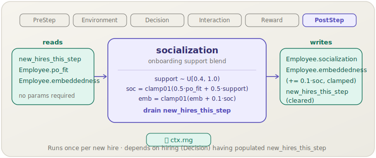

[English](socialization.md) | **日本語**

# 社会化 (`socialization`)

> 新規採用者にはランダムに抽出したサポート量が割り当てられ，これを個人–組織適合度と組み合わせて初期社会化スコアを決定し，組織への埋め込み度に早期のブーストを与えます．
> **フェーズ:** PostStep．**出典:** オンボーディングモデル（キャリブレーション）．**種別:** キャリブレーション．

[← Mechanism カタログに戻る](../mechanisms.ja.md)

## 1. 概要

`socialization` は，同一ステップで採用された従業員を対象とするオンボーディングメカニズムです．DecisionフェーズとInteractionフェーズのメカニズムがすべて終了した後の **PostStep** で実行され，同ステップで `hiring` が生成した `new_hires_this_step` リスト中のすべてのエージェントを処理します．

各新規採用者について，組織からのサポート量をランダムに抽出し，本人の個人–組織適合度と混ぜ合わせて `[0, 1]` の `socialization` スコアを求め，そのスコアを使って `embeddedness` をわずかに上方へ押し上げます．すべての新規採用者を処理し終えると，`new_hires_this_step` をクリアして次のステップに備えます．

このメカニズムは意図的にパラメータを持たせていません．固定係数（0.5/0.5のブレンド，0.1の埋め込み度増分，`U[0.4, 1.0)` のサポート範囲）には，キャリア初期に受け取るサポートは組織や役割によって変わるものの常に最低限はポジティブであること，そして1ヶ月のオンボーディングだけでは埋め込み度が控えめで有界な範囲しか動かないこと，という仮定が織り込まれています．

## 2. 理論と出典

社会化スコアの計算式は，内的な適合度と受け取ったサポートという2つの成分を，1つの統合指標へとブレンドするものです．

$$\text{support} \sim \mathcal{U}[0.4, 1.0)$$

$$\text{socialization} = \operatorname{clip}_{[0,1]}\!\left(0.5\,\text{po\_fit} + 0.5\,\text{support}\right)$$

$$\text{embeddedness} \leftarrow \operatorname{clip}_{[0,1]}\!\left(\text{embeddedness} + 0.1\,\text{socialization}\right)$$

- `po_fit` — 新規採用者の個人–組織適合度．構築時に割り当てられ，以後は固定です．$\text{po\_fit}$ が高い従業員ほど早く組織に溶け込みます．
- $\text{support}$ — $\mathcal{U}[0.4, 1.0)$ からの一様抽出値．下限の0.4は，組織が常に最低限の基本的なオンボーディングは提供するという仮定を反映し，上限が1.0に満たないのは，サポートが完璧になることはないことを表します．
- 等重み（0.5/0.5）のブレンドによって，2つの成分が社会化に対称的な影響を及ぼします．
- 0.1の埋め込み度増分は1ステップあたりの小さな押し上げで，一度に大きく初期化するのではなく，シミュレーションの自然なダイナミクス（ネットワークの成長，在職期間など）に乗って後続のステップで積み上がっていきます．
- すべての値は有効範囲に収めるため $[0, 1]$ にクランプされます．

この関数形式そのものに対応する公表文献はありません．`turnover` のロジスティック離職モデルやWatts–Strogatzネットワークと組み合わせたときに現実的なオンボーディングのダイナミクスが生まれるよう設計した，キャリブレーション上の選択です．

## 3. データフロー



`socialization` は `new_hires_this_step`（`hiring` が生成）と各新規採用者の `po_fit` および `embeddedness` を読み取ります．`socialization` と増分された `embeddedness` を書き戻し，その後 `new_hires_this_step` をクリアします．

## 4. 6フェーズループにおける位置

第6フェーズであり最終フェーズでもある **PostStep** で実行されます．これにより，次の点が保証されます．

1. `socialization` が読み取る前に，`hiring`（Decision）が新規従業員を挿入し `new_hires_this_step` を生成し終えていること．
2. Interactionフェーズのメカニズム（`peer_effect`，`ocb`，`toxic_spread`）が既存の従業員名簿に対して実行済みであること．新規採用者は最初のステップのInteractionには加わりません——まず社会化を受けてから，次のステップ以降に完全なInteractionへ参加します．
3. `knowledge_loss` も PostStep で実行されますが，両者がともに有効な場合でも互いに素な状態（`new_hires_this_step` と `departed_this_step`）を扱うため，どちらを先に実行しても結果は変わりません．

## 5. 状態読み書きコントラクト

| フィールド | 読み取り | 書き込み | 備考 |
|---|:--:|:--:|---|
| `HrWorld.new_hires_this_step` | ✓ | ✓ | 新規採用者のイテレーションに使用；終了時にクリアされます． |
| `Employee.po_fit` | ✓ | | 個人–組織適合度，採用時に固定． |
| `Employee.embeddedness` | ✓ | ✓ | `0.1 · socialization` だけインクリメントされ，`[0, 1]` にクランプ． |
| `Employee.socialization` | | ✓ | `clamp01(0.5·po_fit + 0.5·support)` に設定． |

## 6. 依存関係と順序制約

**必ずこのメカニズムより前に実行すべきもの**

- `hiring`（Decision）——`hiring` が `new_hires_this_step` を生成します．これがないとリストは空のままで，`socialization` は何もしません．実際，`hiring` を登録していなければ `new_hires_this_step` 自体が生成されないため，`socialization` は安全に省略できます．

**同ステップ内に下流の依存先はありません．** 更新された `socialization` と `embeddedness` の値が読み取られるのは，*次の*ステップで `turnover` と `fit` が実行されるときが最初です．

**共有状態の引き継ぎ**

| 生産者 | フィールド | 消費者 |
|---|---|---|
| `hiring` | `new_hires_this_step` | `socialization` |
| `socialization` | `new_hires_this_step` のクリア | （次ステップ用のクリーンな状態） |
| `socialization` | `Employee.embeddedness` | `turnover`（次ステップ） |
| `socialization` | `Employee.socialization` | `fit`（次ステップ，間接的） |

## 7. パラメータ

`socialization` に**設定可能なパラメータはありません**．すべての係数はコンパイル時定数です．

| 定数 | 値 | 役割 |
|---|---|---|
| サポート下限 | `0.4` | 最小組織サポート |
| サポート上限 | `1.0`（排他） | 最大組織サポート |
| 適合度重み | `0.5` | サポートとの等重みブレンド |
| サポート重み | `0.5` | 適合度との等重みブレンド |
| 埋め込み度増分 | `0.1` | 社会化でスケールされたステップあたりのナッジ |

## 8. 使い方

### シナリオTOML

```toml
[[mechanism]]
name  = "hiring"
phase = "decision"
[mechanism.params]
rho_si  = 0.51
p_toxic = 0.04

[[mechanism]]
name  = "socialization"
phase = "post_step"
```

`socialization` は `[mechanism.params]` ブロックを必要としません．TOML内で `hiring` の後に記述する必要がありますが，両者は異なるフェーズで実行されるため，順序制約はエンジンによって自動的に守られます．

### ライブラリモード

```rust
use socsim_config::{Registry, Params, ModulePack};
use socsim_packs::hr_lifecycle::{HrLifecyclePack, HrWorld};
use socsim_engine::{RandomActivationScheduler, SimulationBuilder};

let mut reg: Registry<HrWorld> = Registry::new();
HrLifecyclePack.register(&mut reg);

let socialization = reg.build("socialization", &Params::empty())?;
let mut sim = SimulationBuilder::new(world)
    .scheduler(Box::new(RandomActivationScheduler))
    .seed(42)
    .add_mechanism(socialization)
    .build();
sim.run()?;
```

## 9. 決定論性とRNG

`socialization` は `ctx.rng` から乱数を引きます——新規採用者1人につき `gen_range(0.4..1.0_f64)` を1回呼び出します．ステップあたりの新規採用者数は `hiring` が決め（これも与えられたシードに対して決定論的です），`new_hires_this_step` は順序付きリストであるため，同じシードで実行すればサポート抽出のシーケンスがそのまま再現されます．

## 10. 期待される動作

ベースラインシナリオ（`hiring` と `turnover` が有効）では，次のような挙動になります．

- 各新規採用者は，`po_fit` に応じた下限値とランダムなサポートによる上乗せから `socialization` を始めます．$\text{po\_fit} = 0.8$，$\text{support} = 0.7$ の採用者であれば $\text{socialization} = \operatorname{clip}_{[0,1]}(0.5 \times 0.8 + 0.5 \times 0.7) = 0.75$ となります．
- これに対応する `embeddedness` の上乗せ $0.1 \times 0.75 = 0.075$ は，小さいながらも意味のある量です．*次の*ステップで `turnover` の離職確率を約 $0.075 \times \text{quit\_embed\_sens}$ ロジット単位だけ下げ，入社直後の再離職の可能性を減らします．
- `socialization` がないと，新規採用者は `embeddedness = 0` から始まるため1ヶ月目の離職確率が著しく高くなり，離職率に「入社初日後悔」とでも呼ぶべき非現実的なスパイクが現れます．
- サポート範囲を変えたい場合（例：サポートの薄い組織向けの `[0.1, 0.5)`）はコードレベルで定数を書き換える必要があり，これはパラメータを持たない設計の既知の制限です．

## 11. 参考文献

外部引用なし．関数形式は socsim-packs hr-lifecycle モデル内部のキャリブレーション上の選択です．
