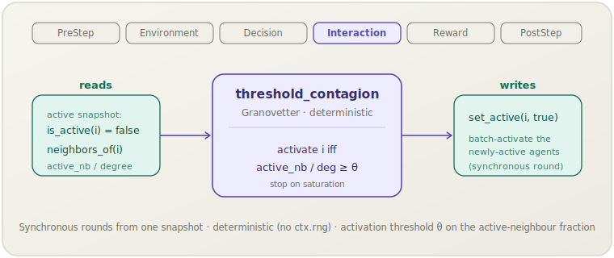

**English** | [日本語](threshold-contagion.ja.md)

# Threshold contagion (`threshold_contagion`)

> Each step, an inactive agent activates iff its fraction of active neighbours
> reaches the threshold θ; newly-active agents are activated in a synchronous,
> deterministic round.
> **Phase:** Interaction. **Source:** Granovetter (1978). **Kind:** network contagion (binary state, θ).

[← Back to the mechanism catalog](../mechanisms.md)

## 1. Overview

`threshold_contagion` is the **deterministic threshold** member of the
network-contagion family in the general `socsim-mechanisms` crate. Each agent
carries a binary *active* flag. Once per step the mechanism performs a **synchronous
round**: it snapshots the active set at the start of the step, and an inactive agent
activates iff the fraction of its neighbours that are active reaches the threshold θ.
Newly-active agents are batch-written, so an agent activated mid-round does not count
toward its neighbours' thresholds until the next round.

Unlike SI contagion, activation is **deterministic** and depends on the *fraction* of
active neighbours rather than independent per-edge trials — capturing Granovetter's
idea that individuals join collective behaviour only once enough of their contacts
already have. The active set is monotone (no de-activation), so the mechanism calls
`request_stop` on **saturation**: a round in which no new agent activates, or everyone
is already active.

The mechanism is **library-only**: it operates over any world implementing the
`BinaryState` and `Neighbors` capability traits from `socsim-core`. There is **no
`ModulePack`** for it (no scenario-TOML registration); construct it directly and add
it to a `SimulationBuilder`.

## 2. Theory & source

Granovetter (1978) proposed the **threshold model of collective behaviour**: each
individual has a threshold — the fraction (or number) of others who must already be
acting before that individual joins. Small shifts in the threshold distribution can
produce large differences in the eventual size of the cascade, explaining why
seemingly similar crowds reach very different outcomes.

socsim uses a single, homogeneous fractional threshold θ. For an inactive agent `i`
with degree $d_i$ and active-neighbour count $a_i$ at the start of the step (both read
from the snapshot), `i` activates iff

$$\frac{a_i}{\max(d_i, 1)} \;\ge\; \theta,$$

where the $\max(d_i, 1)$ guards against division by zero for isolated agents. The
update is fully deterministic — no randomness is involved. The implementation is
ported from the `granovetter1973` reference's threshold branch.

## 3. Data flow



The mechanism reads `is_active(i)` and `neighbors_of(i)` from a start-of-step
snapshot of the active set, computes the active-neighbour fraction for each inactive
agent, collects those reaching θ, and batch-writes them via `set_active(i, true)`.
No other state is touched.

## 4. Position in the 6-phase loop

Runs in **Interaction**, the phase where agents influence one another. Social
threshold-crossing along edges *is* the interaction here.

- It reads a snapshot of the active set taken at the start of its `apply` call, then
  activates every newly-crossed agent in a single batch — making the round
  synchronous and independent of the scheduler's activation order.
- An agent activated this round does not contribute to its neighbours' fractions
  until the next round: the snapshot fixes the active set for the whole round, so the
  cascade advances one wave per step.
- On **saturation** (no new activation, or everyone active) it calls
  `ctx.request_stop`, matching the `granovetter1973` reference's convergence rule.

## 5. State read/write contract

| Field | Read | Write | Notes |
|---|:--:|:--:|---|
| `is_active(i)` (`BinaryState`) | ✓ | ✓ | Snapshotted at step start; inactive agents flipped to active once the fraction reaches θ. |
| `neighbors_of(i)` (`Neighbors`) | ✓ | | Both the degree `d_i` and the active count `a_i` are derived from this set (against the snapshot). |

## 6. Dependencies & ordering constraints

- **Upstream:** none. It needs only a world implementing `BinaryState + Neighbors`;
  the topology (complete graph, ring, network, lattice) is the world's concern via
  `neighbors_of`, and the initial seed set is the world's responsibility.
- **Downstream:** none required — the mechanism self-terminates the run via
  `request_stop` on saturation. The active set is monotone, so no convergence helper
  is needed.

## 7. Parameters

| Param | Type | Default | Meaning |
|---|---|---|---|
| `theta` (θ) | `f64` | `0.5` | Activation threshold: the fraction of active neighbours required. Smaller θ → easier, wider cascades. |

There is no ModulePack and therefore no scenario-TOML param block; the single field
is a constructor argument.

## 8. How to apply

This mechanism is **library-mode only** — there is no scenario-TOML registration.
Provide a world implementing `BinaryState + Neighbors`, construct the mechanism, and
add it to a `SimulationBuilder`. (The world boilerplate is identical to the
[SI contagion example](si-contagion.md#8-how-to-apply).)

```rust
use socsim_mechanisms::ThresholdContagionMechanism;
use socsim_engine::{SequentialScheduler, SimulationBuilder};

// θ = 0.3: activate once 30% of neighbours are active.
let threshold = ThresholdContagionMechanism::new(0.3);

let mut sim = SimulationBuilder::new(world) // world: BinaryState + Neighbors
    .scheduler(Box::new(SequentialScheduler))
    .seed(42)
    .add_mechanism(threshold)
    .build();
sim.run()?;
```

Seed the initial active set in the world before running. Lower θ for easier, more
explosive cascades; raise it to require broader local support before activation.

## 9. Determinism & RNG

**Deterministic**: activation depends only on the snapshot fraction `a_i / d_i` and
the fixed threshold θ; the mechanism never touches `ctx.rng`, so the run is fully
reproducible from the initial active set. The active set is monotone, so the run
always reaches saturation in finite steps.

## 10. Expected behaviour

The outcome is governed by θ relative to the seed set and the network's degree
structure:

- **Small θ** (low local support needed): an initial seed can trigger a global
  cascade that floods the network within a few waves.
- **Large θ**: most agents never reach the required fraction, so the cascade stalls
  near the seed — small changes in θ or in the seed placement can flip the system
  between local containment and a system-wide cascade (Granovetter's tipping point).

Because there is no de-activation, the active fraction is non-decreasing and the run
ends at a fixed point (saturation).

## 11. References

- Granovetter, M. (1978). Threshold models of collective behavior. *American Journal
  of Sociology*, 83(6), 1420–1443.
- Watts, D. J. (2002). A simple model of global cascades on random networks.
  *Proceedings of the National Academy of Sciences*, 99(9), 5766–5771.
