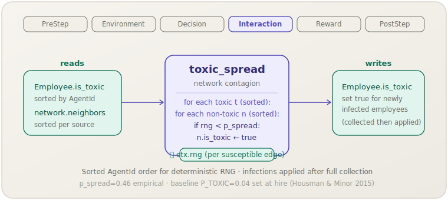

[English](toxic-spread.md) | **日本語**

# 有害伝播 (`toxic_spread`)

> 有害な従業員が，経験的に較正された感染確率でネットワークエッジを通じて非有害な隣接者を感染させる．
> **フェーズ:** Interaction．**出典:** Housman & Minor (2015)．**種別:** empirical (p_spread)．

[← Mechanism カタログに戻る](../mechanisms.ja.md)

## 1. 概要

`toxic_spread` は職場の毒性を社会的伝染プロセスとしてモデル化する：有害な従業員は，繰り返しの否定的な交流を通じて，隣接する非有害な同僚を有害な従業員へと転化させることができる．このメカニズムは，従業員間を結ぶ Watts–Strogatz ソーシャルネットワーク上で毒性を伝播させ，Housman & Minor (2015) が報告した経験的比率に較正されたエッジごとの感染確率を適用する．

毒性は組織に間接的な影響を与える：有害な従業員は近隣の満足度を低下させ（fit および満足度ダイナミクスを通じて），離職確率を高めるため，`toxic_spread` は労働力不安定性の重要な増幅器となる．採用時に設定されるベースライン有病率 `P_TOXIC = 0.04` は，抑制されなければ `toxic_spread` によって時間とともに増加しうる．

## 2. 理論と出典

Housman & Minor (2015) は大規模サービス企業における有害労働者のコストを定量化し，直接的な生産性損失と強いピア感染効果の両方を示した．socsim はこの感染をシンプルなネットワーク拡散モデルに対応付ける：

```text
for each toxic employee t (sorted by AgentId):
    for each non-toxic neighbour n of t (sorted by AgentId):
        if U(0,1) < p_spread:
            n.is_toxic ← true
```

感染の決定はまとめて収集されてから一括適用されるため，同じステップ内で新たに感染した従業員が感染源になることはない．

- `p_spread`（`P_SPREAD = 0.46`）— 経験的なエッジごとの月次感染確率（Housman & Minor 2015）．
- ネットワークのデフォルトは Watts–Strogatz（`k = 4`, `β = 0.1`）で，各従業員におよそ4人の隣接者を持たせる．

## 3. データフロー



このメカニズムは `Employee.is_toxic` とネットワーク隣接リストを読み取り，感受性のあるエッジごとに `ctx.rng` を1回サンプリングして，新たに感染した従業員の `Employee.is_toxic = true` を書き込む．他の状態は変更しない．

## 4. 6フェーズループ内での位置

4番目のフェーズである **Interaction** で，`peer_effect` および `ocb` と並列に実行される．Interaction 内の順序が問題になるのは，同じ Interaction フェーズ内で `is_toxic` を読み取るメカニズムよりも `toxic_spread` を**先に**宣言する必要がある場合のみである．デフォルトパックでは，Interaction フェーズのメカニズムは `is_toxic` を読み取らないため，宣言順序は柔軟に選べる．

Interaction に配置することは適切である：毒性は直接的な社会的接触を通じて伝播し，ピア生産性スピルオーバーと同じ概念的枠組みを共有するからである．

## 5. 状態読み書きコントラクト

| フィールド | 読み取り | 書き込み | 備考 |
|---|:--:|:--:|---|
| `Employee.is_toxic` | ✓ | ✓ | 感染源；新たに感染した場合は `true` に書き込まれる． |
| `HrWorld.network`（隣接） | ✓ | | Watts–Strogatz；有害な従業員ごとに隣接者を参照する． |

## 6. 依存関係と順序制約

- **上流:** `hiring`（Decision）が採用時に `P_TOXIC = 0.04` というポピュレーションベースラインで `is_toxic` を設定する．ネットワークが初期化されていれば，同一ステップ内の依存はない．
- **下流:** 同じステップの残りのフェーズ内で `is_toxic` を読み取るメカニズムはない．毒性の影響は，`fit`（`satisfaction` を更新）と `turnover`（`satisfaction` と `embeddedness` を消費）を通じて，**次の**ステップの **Decision** フェーズに現れる．したがって，このステップで伝播した毒性は次のステップ以降に有効になる．

## 7. パラメータ

| パラメータキー | デフォルト | 種別 | 出典 |
|---|---|---|---|
| `p_spread` | `0.46` | empirical（エッジごとの月次感染率） | Housman & Minor (2015) |

`P_TOXIC = 0.04`（採用時のベースライン有病率）はこのメカニズムではなく `hiring` が設定する．調整する場合は `hiring` メカニズムの `p_toxic` パラメータを使うこと．

## 8. 適用方法

### シナリオ TOML

```toml
[[mechanism]]
name  = "toxic_spread"
phase = "interaction"
[mechanism.params]
p_spread = 0.46
```

### ライブラリモード

```rust
use socsim_config::{Registry, Params, ModulePack};
use socsim_hr_lifecycle::{HrLifecyclePack, HrWorld};
use socsim_engine::{RandomActivationScheduler, SimulationBuilder};

let mut reg: Registry<HrWorld> = Registry::new();
HrLifecyclePack.register(&mut reg);

let ts = reg.build("toxic_spread", &Params::empty())?;
let mut sim = SimulationBuilder::new(world)
    .scheduler(Box::new(RandomActivationScheduler))
    .seed(42)
    .add_mechanism(ts)
    .build();
sim.run()?;
```

## 9. 決定論性と RNG

`ctx.rng` からランダム性を引き出す — 感受性のある（有害な感染源，非有害な隣接者）エッジごとに `gen::<f64>()` を1回呼び出す．ビット単位の再現性を保証するため：

1. 有害な感染源の従業員はイテレーション前に **AgentId でソート**して収集される．
2. 各感染源について，隣接者は RNG を参照する前に **AgentId でソート**される．

この辞書順の整列により，RNG の消費シーケンスは基底マップのイテレーション順序に関わらず一定となり，同一シードで再現可能な実行が保証される．

## 10. 期待される動作

`P_TOXIC = 0.04` および `p_spread = 0.46` の条件では，有害有病率は初期の 4% からネットワーク構造と有害従業員の離職率に依存するより高い均衡に向かって上昇する．`k = 4` の Watts–Strogatz ネットワークでは，このメカニズムは通常 24〜48 ステップにわたって毒性の緩やかな上昇傾向を引き起こし，その後安定するか（または有害ノードを排出する離職カスケードを引き起こすか）する．`hiring` の補充を無効にしたまま `toxic_spread` を実行するとネットワークの大部分が感染する；`p_toxic = 0.04` で採用を再有効化すると有害比率が徐々に希釈される．

## 11. 参考文献

- Housman, M., & Minor, D. (2015). Toxic workers. *Harvard Business School
  Working Paper* 16-057.
