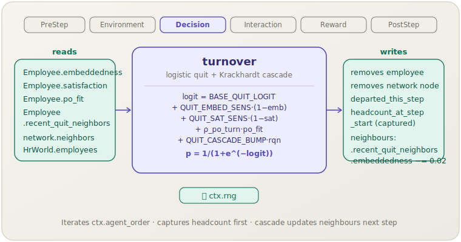

[English](turnover.md) | **日本語**

# 離職（`turnover`）

> 各従業員は，組織埋め込み度，満足度，個人–組織適合度，ネットワークを介した伝染をもとに，退職するか否かを決定します．
> **フェーズ：** Decision．**出典：** Kristof-Brown et al. (2005) + Krackhardt & Porter (1986)．**種別：** 混合（経験的 $\rho$ + チューナブルなロジット重み）．

[← Mechanism カタログに戻る](../mechanisms.ja.md)

## 1. 概要

`turnover` は自発的な従業員の離職をモデル化します．ステップごとに，固定されたランダム順（`ctx.agent_order`）ですべての在職中の従業員を走査し，組織行動の4つの予測変数（組織埋め込み度，満足度，個人–組織適合度，そして先月退職したネットワーク隣接者数というKrackhardtカスケード）をロジスティック回帰に通して得た確率で，Bernoulli試行を引きます．

従業員が退職すると，従業員ロスターとソーシャルネットワークの双方から削除され，そのレコードが `departed_this_step` に追加されます．その後，カスケードが残りのすべての隣接者を更新します．各隣接者の `recent_quit_neighbors` カウンターが1増加し，`embeddedness` が0.02減少します（`[0, 1]` にクランプ）．更新された `recent_quit_neighbors` の値は*次の*ステップで `turnover` が読み取り，退職がクラスター状の波となって広がりうるフィードバックループを形成します．

また `turnover` は，処理の冒頭で（削除が行われる前に）`headcount_at_step_start` を取得します．これにより，`org_performance`（Reward）が離職率の分母を正確に計算できます．

## 2. 理論と出典

退職の決定は，標準的なロジスティックモデルに従います．

$$\begin{aligned}
\ell = {}& \text{BASE\_QUIT\_LOGIT}
       + \text{QUIT\_EMBED\_SENS}\,(1-\text{embeddedness}) \\
     & + \text{QUIT\_SAT\_SENS}\,(1-\text{satisfaction})
       + \rho_{\text{po\_turn}}\cdot\text{po\_fit}
       + \text{QUIT\_CASCADE\_BUMP}\cdot n_{\text{quit}}
\end{aligned}$$

$$p_{\text{quit}} = \sigma(\ell) = \frac{1}{1 + e^{-\ell}}$$

（$n_{\text{quit}} = \text{recent\_quit\_neighbors}$．）

`ctx.rng.gen::<f64>()` $< p_{\text{quit}}$ であれば，その従業員は退職します．

- `BASE_QUIT_LOGIT`（−4.82）は，他の要因が働かないときの基準月次離職率を約0.8%に設定する値で，業界平均にキャリブレーションされています．
- `QUIT_EMBED_SENS`（1.0）と `QUIT_SAT_SENS`（0.8）は，2つの離職を促す要因に対するチューナブルな感度重みです．埋め込み度と満足度が高いほど $p_{\text{quit}}$ は下がります．
- $\rho_{\text{po\_turn}}$（−0.35）は Kristof-Brown et al. (2005) のメタ分析から得られた，PO適合度と離職意図の経験的相関です．負の符号は，適合度が高いほど離職が減ることを表します．
- `QUIT_CASCADE_BUMP`（0.30）はチューナブルな伝染重みです．先月退職した隣接者1人につき $\ell$ に0.30が加算され，Krackhardt & Porter (1986) が記録した「雪だるま式」のパターンを再現します．

**カスケードのしくみ（退職後）：**  
そのステップの退職者集合を確定した後，メカニズムはまずすべての `recent_quit_neighbors` を0にリセットし，続いて各退職者の旧隣接者リストを走査して `recent_quit_neighbors` カウンターをインクリメントし，`embeddedness` を0.02デクリメントします．この2パス方式（いったん全リセットしてから加算する）により，複数の退職者が隣接者を共有する場合でも正確な集計が保証されます．

## 3. データフロー



まず `headcount_at_step_start` が取得され，次に `ctx.agent_order` の順序ですべての従業員が評価されます．退職者を削除した後，Krackhardtカスケードが旧隣接者を更新します．`departed_this_step` リストは下流の `knowledge_loss`（PostStep）と `org_performance`（Reward）へ引き継がれます．

## 4. 6フェーズループにおける位置

3番目のフェーズである **Decision** で実行されます．位置づけとしては，`Environment`（`learning_curve` が個人生産性を設定）の後，`Interaction`（`peer_effect`，`ocb`，`toxic_spread` が在職者のロスターに作用）の前です．

Decision 内では `turnover` と `hiring` の両方が実行されます．両方が有効な場合，シナリオTOMLでは `turnover` を `hiring` より前に宣言する必要があります．こうすることで，(a) `headcount_at_step_start` が離職前の人数を反映し，(b) `hiring` が同じステップの離職で生まれた空席を埋められるようになります．順序を逆にすると，`hiring` が同ステップで後から退職する人数の分だけターゲットを超えて採用してしまいます．

`fit`（同じく Decision）は離職判定の前に満足度を更新するため，宣言順では `fit` を `turnover` より前に置く必要があります．

## 5. 状態の読み書きコントラクト

| フィールド | 読み取り | 書き込み | 備考 |
|---|:--:|:--:|---|
| `HrWorld.employees` | ✓ | ✓ | 退職者が削除されます． |
| `HrWorld.network` | ✓ | ✓ | 退職者のノードとエッジが削除されます． |
| `HrWorld.departed_this_step` | | ✓ | 退職者ごとに `(id, $\theta$, tenure, team)` を追加．`knowledge_loss` と `org_performance` が消費します． |
| `HrWorld.headcount_at_step_start` | | ✓ | `apply` の冒頭，削除前に1回設定されます． |
| `Employee.embeddedness` | ✓ | ✓ | 離職ロジットに使用．カスケード隣接者に対して0.02デクリメントされます． |
| `Employee.satisfaction` | ✓ | | 離職ロジットに使用． |
| `Employee.po_fit` | ✓ | | 離職ロジットに使用． |
| `Employee.recent_quit_neighbors` | ✓ | ✓ | カスケードのロジット項に使用．0にリセットした後，隣接者の分だけインクリメントされます． |
| `network.neighbors(id)` | ✓ | | カスケードに使用する隣接者リスト． |

## 6. 依存関係と順序制約

**必ず後に実行すべきもの：**
- `fit`（Decision）．退職判定を評価する前に `satisfaction` がそのステップの個人適合度の更新を反映しているようにするため．

**必ず前に実行すべきもの：**
- `hiring`（Decision）．`headcount_at_step_start` を離職前の人数とし，採用がそのステップの空席を埋められるようにするため．
- `knowledge_loss`（PostStep）．`turnover` が生成する `departed_this_step` を `knowledge_loss` が読み取り，暗黙知の流出を計算します．`turnover` を先に実行しないまま，同ステップで `knowledge_loss` を実行してはいけません．
- `org_performance`（Reward）．`departed_this_step` と `headcount_at_step_start` を使って離職率を計算します．

**共有状態の引き継ぎ：**

| 生産者 | フィールド | 消費者 |
|---|---|---|
| `turnover` | `departed_this_step` | `knowledge_loss`，`org_performance` |
| `turnover` | `headcount_at_step_start` | `org_performance` |
| `turnover` | 更新された `recent_quit_neighbors` | `turnover`（次ステップ） |

## 7. パラメータ

| パラメータキー | デフォルト | 種別 | 出典 |
|---|---|---|---|
| `rho_po_turn` | `−0.35` | 経験的 | Kristof-Brown et al. (2005)，メタ分析相関 |
| `base_quit_logit` | `−4.82` | チューナブル | 月次基準離職率~0.8%にキャリブレーション |
| `quit_embed_sens` | `1.0` | チューナブル | 埋め込み度不足に対する離職ロジットの感度 |
| `quit_sat_sens` | `0.8` | チューナブル | 満足度不足に対する離職ロジットの感度 |
| `quit_cascade_bump` | `0.30` | チューナブル | 直近に退職した隣接者1人あたりの伝染重み |

## 8. 使い方

### シナリオTOML

```toml
[[mechanism]]
name  = "fit"
phase = "decision"
[mechanism.params]
rho_pj = 0.20
rho_po = 0.07

[[mechanism]]
name  = "turnover"
phase = "decision"
[mechanism.params]
rho_po_turn       = -0.35
base_quit_logit   = -4.82
quit_embed_sens   =  1.0
quit_sat_sens     =  0.8
quit_cascade_bump =  0.30
```

`turnover` は，Decision フェーズ内で正しい順序を保つため，TOML 内で `fit` の後かつ `hiring` の前に記述する必要があります．

### ライブラリモード

```rust
use socsim_config::{Registry, Params, ModulePack};
use socsim_hr_lifecycle::{HrLifecyclePack, HrWorld};
use socsim_engine::{RandomActivationScheduler, SimulationBuilder};

let mut reg: Registry<HrWorld> = Registry::new();
HrLifecyclePack.register(&mut reg);

let mut params = Params::empty();
params.set("rho_po_turn",       -0.35_f64);
params.set("base_quit_logit",   -4.82_f64);
params.set("quit_embed_sens",    1.0_f64);
params.set("quit_sat_sens",      0.8_f64);
params.set("quit_cascade_bump",  0.30_f64);

let turnover = reg.build("turnover", &params)?;
let mut sim = SimulationBuilder::new(world)
    .scheduler(Box::new(RandomActivationScheduler))
    .seed(42)
    .add_mechanism(turnover)
    .build();
sim.run()?;
```

## 9. 決定論性とRNG

`turnover` は `ctx.rng` から乱数を引きます．具体的には，`ctx.agent_order` で定義された固定の反復順序に従い，ステップごとに従業員1人につき1回 `gen::<f64>()` を呼び出します．`agent_order` は各ステップの開始時にシミュレーションシードから決定論的に導出される順列なので，ロジットに `f64` の累積が含まれていても，同じシードによる2回の実行は同一の退職シーケンスを生成します．

Krackhardtカスケードはソート済みの隣接者順に適用されるため，`embeddedness` のデクリメントも反復順序に依存しません．

## 10. 期待される動作

ベースラインシナリオ（デフォルトパラメータ，60ヶ月実行）では，次のような挙動が見られます．

- 満足度と埋め込み度が均衡値の付近にある場合，月次離職率は0.8〜2%前後で変動します．
- 1つのクラスターで退職が発生すると，隣接者の `recent_quit_neighbors` が上昇し，翌月の離職確率が高まります．その結果，`org_performance` が記録する `turnover_rate` の時系列に，短期間で収束する複数期間のカスケードバーストがスパイクとして現れることがあります．
- `quit_cascade_bump` を無効化（0に設定）するとスパイクが抑えられ，分散の小さい滑らかな離職曲線が得られます．
- `knowledge_loss` は `departed_this_step` リストをチーム単位の暗黙知の流出に変換するため，在職期間の長い退職者は `knowledge_stock` に対して不釣り合いに大きな負の影響を及ぼします．

## 11. 参考文献

- Kristof-Brown, A. L., Zimmerman, R. D., & Johnson, E. C. (2005). Consequences
  of individuals' fit at work: A meta-analysis of person–job, person–organization,
  person–group, and person–supervisor fit. *Personnel Psychology*, 58(2), 281–342.
- Krackhardt, D., & Porter, L. W. (1986). The snowball effect: Turnover embedded
  in communication networks. *Journal of Applied Psychology*, 71(1), 50–55.
