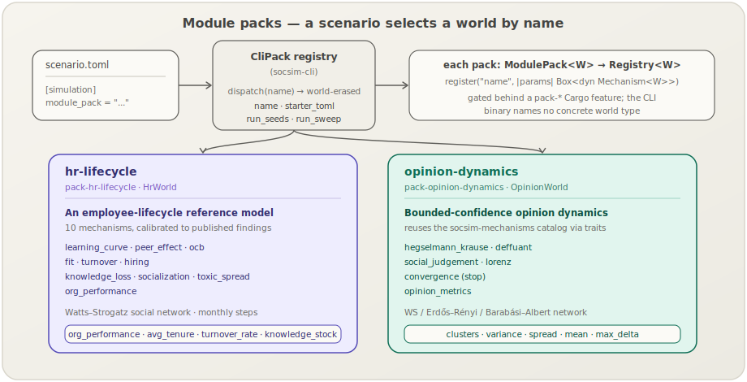

[English](packs.md) | **日本語**

# モジュールパックカタログ

**モジュールパック**は，socsim における*完結したモデル*の単位です．
[メカニズム](mechanisms.ja.md)が研究ロジックの1つの部品であるのに対し，パックはワールド全体を実行するために必要なものをすべて束ねます．具体的には，すべてのエージェントが共有する状態を表す具体的な**ワールド型**，それを前進させる**メカニズム**群，それらのメカニズムを名前で [`Registry`](library.ja.md) に組み込む**登録**関数，そしてすぐに実行できる**スターターシナリオ** TOML です．

`socsim` CLI は**ワールド多相**です．シナリオが名前でパックを選択し（`[simulation] module_pack = "..."`），バイナリは具体的なワールドを一切名指しすることなく，そのパックのワールド型へディスパッチします．現在2つのパックが同梱されています．



## 同梱される2つのパック

| パック | ワールド | モデル化対象 | メカニズム | ページ |
|---|---|---|---|---|
| [`hr-lifecycle`](packs/hr-lifecycle.ja.md) | `HrWorld` | 従業員ライフサイクル組織：採用，学習，ピア効果，満足度，離職カスケード，知識喪失 | 10個，公表された経験的知見に対してキャリブレーション済み | [→ hr-lifecycle](packs/hr-lifecycle.ja.md) |
| [`opinion-dynamics`](packs/opinion-dynamics.ja.md) | `OpinionWorld` | ソーシャルネットワーク上の有界信頼の意見形成（合意，クラスタリング，分極化） | `socsim-mechanisms` の意見ファミリーを，ケイパビリティトレイト経由で再利用 | [→ opinion-dynamics](packs/opinion-dynamics.ja.md) |

CLI からはいつでも一覧表示できます．

```sh
socsim list packs        # pack names
socsim list mechanisms   # mechanisms grouped by pack
```

## パックの構造

すべてのパックは2つのトレイトとスターター TOML によって定義されます．

1. **`ModulePack<W>`**（[`socsim-config`](library.ja.md)）— 研究者向けのインターフェースです．`pack_name()` と `register(&mut Registry<W>)` メソッドを持ち，すべてのメカニズムコンストラクタを名前で追加します．ライブラリ利用者はこれを直接呼び出すことで，1行でひとまとまりの研究内容を有効化できます．

2. **`CliPack`**（[`socsim-cli`](cli.ja.md)）— オブジェクトセーフで*ワールド消去された*ラッパーです．`name()`，`starter_toml()`，`mechanism_names()`，`run_seeds()`，`run_sweep()` を公開し，いずれもワールド非依存の結果型を返します．各 `CliPack` は内部に具体的なワールドを保持し，ジェネリックな [`socsim-runner`](architecture.ja.md) 関数をそれに対して単態化するため，CLI バイナリは特定のドメインモデルから独立し続けます．

両パックとも同名の Cargo フィーチャ（`pack-hr-lifecycle`，`pack-opinion-dynamics`）でゲートされており，いずれもデフォルトで有効です．そのため，下流のバイナリは必要なパックだけをコンパイルに含められます．パック層がシナリオとエンジンの間にどう位置するかは[アーキテクチャ概要](architecture.ja.md#2つの利用経路シナリオcli-vs-ライブラリモード)を，パックをゼロから組み立てる実践的な手順は [T5 — シナリオパック](tutorials/05-scenario-pack.ja.md)チュートリアルを参照してください．

## パックを駆動する2つの方法

| 経路 | エントリポイント | 適した用途 |
|---|---|---|
| **シナリオ / CLI** | `.toml` 内の `module_pack = "..."`，続けて `socsim run` | 再現可能なシナリオファイル，パラメータスイープ，再コンパイル不要 |
| **ライブラリ** | Rust での `Pack.register(&mut reg)` + `SimulationBuilder` | カスタムドライバ，socsim をより大きなプログラムへ組み込む |

以下の各パックページでは，両方の経路，ワールドのデータモデル，[6フェーズティックループ](architecture.ja.md#6フェーズティックループ)にまたがるメカニズムの構成，スターターシナリオ，記録されるメトリクスを解説します．

## ページ

- [**hr-lifecycle**](packs/hr-lifecycle.ja.md) — キャリブレーション済みの従業員ライフサイクル参照モジュール（`HrWorld`，10個のメカニズム）．
- [**opinion-dynamics**](packs/opinion-dynamics.ja.md) — 有界信頼の意見ダイナミクス（`OpinionWorld`）．

## 新しいパックを追加する

CLI レジストリは，run/sweep/validate/list パイプラインに手を加えることなく，新しいパックが既存の2つと並んで収まるよう設計されています．

1. 具体的な `World` とそのメカニズムを実装する（あるいは，意見パックのように，ケイパビリティトレイト経由で [`socsim-mechanisms`](mechanisms.ja.md) カタログを再利用する）．
2. それに対して `ModulePack<W>` を実装する（`pack_name` + `register`）．
3. `pack-foo` Cargo フィーチャの背後で，`CliPack` を実装した `struct FooCliPack;` を実装する．
4. `crates/socsim-cli/src/packs.rs` の `packs()` にそれを追加する．

[T5 チュートリアル](tutorials/05-scenario-pack.ja.md)が，ステップ1–2をエンドツーエンドで解説します．

## 関連項目

- [Mechanism カタログ](mechanisms.ja.md) — パックが構成する個々のメカニズム．
- [CLI リファレンス](cli.ja.md) — `init`，`run`，`validate`，`list`，`sweep`，`summarize`．
- [アーキテクチャ](architecture.ja.md) — クレートグラフ，6フェーズティックループ，キャリブレーション哲学．
- [ユースケース＆レシピ](usecases.ja.md) — 両パックの実行可能なワークフロー．
