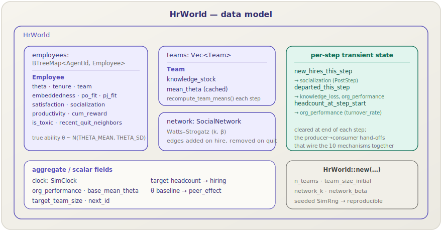
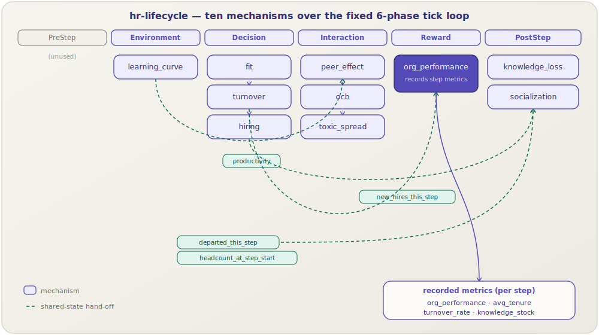

**English** | [日本語](hr-lifecycle.ja.md)

# `hr-lifecycle` pack

> A reference **employee-lifecycle** model: agents are employees on teams who learn, interact, decide whether to quit, and are replaced — with every parameter calibrated against published organisational-behaviour findings.
> **World:** `HrWorld`. **Mechanisms:** ten. **Cargo feature:** `pack-hr-lifecycle` (on by default). **Time unit:** one step = one month.

[← Back to the pack catalog](../packs.md)

## 1. Overview

The `hr-lifecycle` pack models how an organisation's workforce evolves over
time. Each step (one month) every employee learns on the job, contributes to
their team, may grow or lose satisfaction, and decides whether to stay or quit;
departures drain team knowledge and trigger network cascades, while hiring
refills vacancies. It is the pack's reference module — its ten mechanisms are
[calibrated](../architecture.md#calibration-philosophy) against published
empirical correlations (Schmidt & Hunter, Mas & Moretti, Kristof-Brown,
Krackhardt, Nonaka, …), so a baseline run reproduces realistic monthly turnover,
tenure, and knowledge dynamics.

It is the worked example behind the [use-cases runbook](../usecases.md) and the
[T5 scenario-pack tutorial](../tutorials/05-scenario-pack.md), and a compiled
library driver lives at
[`crates/socsim-packs/examples/hr_baseline.rs`](../../crates/socsim-packs/examples/hr_baseline.rs).

## 2. The world: `HrWorld`



`HrWorld` owns the shared state every mechanism reads and writes:

| Field | Type | Models |
|---|---|---|
| `employees` | `BTreeMap<AgentId, Employee>` | the live roster (sorted by id for determinism) |
| `teams` | `Vec<Team>` | per-team `knowledge_stock` and cached `mean_theta` |
| `network` | `SocialNetwork` | a [Watts–Strogatz](../architecture.md) small-world tie graph |
| `org_performance` | `f64` | aggregate productivity, refreshed each Reward phase |
| `base_mean_theta` | `f64` | mean ability θ at *t = 0*, the normaliser for `peer_effect` |
| `target_team_size` | `usize` | headcount target that `hiring` refills toward |
| `new_hires_this_step` | `Vec<AgentId>` | transient: this step's hires → consumed by `socialization` |
| `departed_this_step` | `Vec<(id, θ, tenure, team)>` | transient: this step's quitters → consumed by `knowledge_loss`, `org_performance` |
| `headcount_at_step_start` | `usize` | transient: snapshot taken by `turnover` → the `turnover_rate` denominator |

Each **`Employee`** carries the behavioural state the mechanisms act on:
`theta` (true ability, drawn ~N(`THETA_MEAN`, `THETA_SD`)), `tenure`,
`team`, `embeddedness`, `po_fit`, `pj_fit`, `satisfaction`, `socialization`,
`productivity`, `cum_reward`, `is_toxic`, and `recent_quit_neighbors` (the
counter that drives the turnover cascade). Each **`Team`** holds a
`knowledge_stock` and a cached `mean_theta` recomputed every step.

The world is built by `HrWorld::new(n_teams, team_size, ws_k, ws_beta, &mut rng)`
from a seeded [`SimRng`](../architecture.md), so a given seed always produces
the same starting organisation.

> The three transient buffers are the heart of the pack: they are the
> **shared-state hand-offs** that wire the ten otherwise-independent mechanisms
> into one coherent monthly cycle (see §4).

## 3. The ten mechanisms

The pack registers ten mechanisms. Each links to its full page in the
[mechanism catalog](../mechanisms.md), where you'll find the equations, sources,
state contracts, and parameters.

| Mechanism | Phase | Kind | Role in the lifecycle |
|---|---|---|---|
| [`learning_curve`](../mechanisms/learning-curve.md) | Environment | empirical | Tenure-driven learning-by-doing raises each employee's productivity. |
| [`fit`](../mechanisms/fit.md) | Decision | empirical | Person–job / person–organisation fit drives job satisfaction. |
| [`turnover`](../mechanisms/turnover.md) | Decision | mixed | Logistic monthly quit hazard plus a Krackhardt network cascade. |
| [`hiring`](../mechanisms/hiring.md) | Decision | empirical | Refills teams to target; selection observes ability through a validity signal. |
| [`peer_effect`](../mechanisms/peer-effect.md) | Interaction | empirical | Team ability lifts each member's effective productivity. |
| [`ocb`](../mechanisms/ocb.md) | Interaction | tunable | Citizenship behaviour adds to the team knowledge stock. |
| [`toxic_spread`](../mechanisms/toxic-spread.md) | Interaction | empirical | Toxic behaviour spreads along network edges. |
| [`org_performance`](../mechanisms/org-performance.md) | Reward | aggregation | Aggregates productivity and records the step's metrics. |
| [`knowledge_loss`](../mechanisms/knowledge-loss.md) | PostStep | mixed | Departing veterans drain tacit team knowledge. |
| [`socialization`](../mechanisms/socialization.md) | PostStep | calibration | Onboards new hires, raising embeddedness. |

An optional learnable [`policy`](../mechanisms/policy-mechanism.md) mechanism
(MARL) can replace the hand-coded turnover decision behind the `marl` Cargo
feature — see the [architecture notes](../architecture.md).

## 4. Composition across the 6-phase tick loop

Mechanisms compose over socsim's fixed
[6-phase order](../architecture.md#the-6-phase-tick-loop):
`PreStep → Environment → Decision → Interaction → Reward → PostStep`. Within a
phase they fire in scenario declaration order. The diagram shows the full
monthly cycle and the shared-state hand-offs (dashed) that connect the phases.



The hand-offs are what make ordering matter:

- **`turnover` → `knowledge_loss`, `org_performance`** via `departed_this_step`.
  `turnover` must run before both. It also captures `headcount_at_step_start`
  *before* removing anyone, so `org_performance` has a well-defined
  `turnover_rate` denominator.
- **`hiring` → `socialization`** via `new_hires_this_step`. Within the Decision
  phase, declare `turnover` *before* `hiring` so hiring refills the same step's
  vacancies and `headcount_at_step_start` reflects the pre-attrition count.
- **`fit` → `turnover`**: `fit` updates `satisfaction`, which `turnover` reads
  in its quit logit, so `fit` precedes `turnover`.
- **`learning_curve` → `peer_effect`**: productivity is set in Environment
  before `peer_effect` scales it in Interaction.

The starter scenario already declares the mechanisms in a correct order; the
per-mechanism pages document each ordering constraint in detail (e.g.
[turnover §6](../mechanisms/turnover.md)).

## 5. Metrics & output

`org_performance` (Reward) records four metrics every step, written to the JSONL
log and surfaced by `socsim summarize` (see the [CLI reference](../cli.md)):

| Metric | Meaning |
|---|---|
| `org_performance` | Sum of employee `productivity` — aggregate effective output. |
| `avg_tenure` | Mean tenure (months) across the roster. |
| `turnover_rate` | `departed_this_step / headcount_at_step_start` for the step. |
| `knowledge_stock` | Sum of `team.knowledge_stock` across all teams. |

It also emits `turnover` and `hiring` **events** (with the affected `agent_id`)
into the same log, so you can reconstruct individual moves. See
[org_performance](../mechanisms/org-performance.md) for the exact record shapes.

## 6. How to apply

### Scenario / CLI

Generate the starter scenario and run it:

```sh
socsim init --module-pack hr-lifecycle --out scenarios/hr.toml
socsim run scenarios/hr.toml
```

The starter TOML configures a 5-team organisation on a Watts–Strogatz network
for 60 monthly steps and declares all ten mechanisms in a valid order:

```toml
[simulation]
name        = "hr_lifecycle_baseline"
module_pack = "hr-lifecycle"
t_max       = 60
seed        = 42
scheduler   = "random_activation"

[world]
n_teams           = 5
team_size_initial = 8
network_model     = "watts_strogatz"
network_k         = 4
network_beta      = 0.1

[[mechanism]]
name  = "learning_curve"
phase = "environment"
[mechanism.params]
lambda_learn = 0.15

[[mechanism]]
name  = "fit"
phase = "decision"
[mechanism.params]
rho_pj = 0.20
rho_po = 0.07

[[mechanism]]
name  = "turnover"     # before hiring, after fit
phase = "decision"
[mechanism.params]
rho_po_turn       = -0.35
base_quit_logit   = -4.82
quit_embed_sens   = 1.0
quit_sat_sens     = 0.8
quit_cascade_bump = 0.30

[[mechanism]]
name  = "hiring"
phase = "decision"
[mechanism.params]
rho_si  = 0.51
p_toxic = 0.04

[[mechanism]]
name  = "peer_effect"
phase = "interaction"
[mechanism.params]
alpha_peer = 0.17

[[mechanism]]
name  = "ocb"
phase = "interaction"
[mechanism.params]
alpha_k = 0.30

[[mechanism]]
name  = "toxic_spread"
phase = "interaction"
[mechanism.params]
p_toxic  = 0.04
p_spread = 0.46

[[mechanism]]
name  = "org_performance"
phase = "reward"

[[mechanism]]
name  = "knowledge_loss"
phase = "post_step"
[mechanism.params]
phi_tacit  = 0.85
beta_loss  = 1.0
kappa_loss = 0.40

[[mechanism]]
name  = "socialization"
phase = "post_step"

[output]
log_path = "runs/{name}_{seed}.jsonl"
metrics  = ["org_performance", "avg_tenure", "turnover_rate", "knowledge_stock"]
```

Validate, sweep, and summarise with the usual CLI verbs:

```sh
socsim validate scenarios/hr.toml
socsim run scenarios/hr.toml --seeds 0..30 --parallel
socsim summarize runs/hr_lifecycle_baseline_42.jsonl
```

### Library

Register the pack into a `Registry`, build the mechanisms, and drive them with a
[`SimulationBuilder`](../library.md). The full runnable version is
[`examples/hr_baseline.rs`](../../crates/socsim-packs/examples/hr_baseline.rs):

```rust
use socsim_config::{ModulePack, Params, Registry};
use socsim_core::{SimClock, SimRng};
use socsim_engine::{RandomActivationScheduler, SimulationBuilder};
use socsim_packs::hr_lifecycle::{HrLifecyclePack, HrWorld};

let mut rng = SimRng::from_seed(42);
let mut world = HrWorld::new(5, 8, 4, 0.1, &mut rng);
world.clock = SimClock::new(60);

let mut reg: Registry<HrWorld> = Registry::new();
HrLifecyclePack.register(&mut reg);

let mut builder = SimulationBuilder::new(world)
    .scheduler(Box::new(RandomActivationScheduler))
    .seed(42);
for name in [
    "learning_curve", "fit", "turnover", "hiring",
    "peer_effect", "ocb", "toxic_spread",
    "org_performance", "knowledge_loss", "socialization",
] {
    builder = builder.add_mechanism(reg.build(name, &Params::empty())?);
}
let mut sim = builder.build();
sim.run()?;
```

## 7. Calibration constants

Every empirical parameter lives in
[`crates/socsim-packs/src/hr_lifecycle/calibration.rs`](../../crates/socsim-packs/src/hr_lifecycle/calibration.rs)
with a doc-comment citing its source. The headline values:

| Constant | Value | Source |
|---|---|---|
| `RHO_SI` | `0.51` | Structured-interview validity — Schmidt & Hunter (1998) |
| `RHO_GMA` | `0.51` | GMA → performance — Schmidt & Hunter (1998) |
| `ALPHA_PEER` | `0.17` | Peer-effect multiplier — Mas & Moretti (2009) |
| `P_TOXIC` / `P_SPREAD` | `0.04` / `0.46` | Toxic prevalence & spread — Housman & Minor (2015) |
| `PHI_TACIT` | `0.85` | Tacit-knowledge loss on exit — Nonaka (1994) |
| `RHO_PJ` / `RHO_PO` | `0.20` / `0.07` | Fit → satisfaction — Kristof-Brown et al. (2005) |
| `RHO_PO_TURN` | `−0.35` | PO fit → turnover intent — Kristof-Brown et al. (2005) |
| `LAMBDA_LEARN` | `0.15` | Learning-curve rate — Bahk & Gort (1993) |
| `BASE_MONTHLY_QUIT_HAZARD` | `0.008` | ~0.8 %/month baseline quit rate |
| `C_TURN` | `1.25` | Turnover cost (× annual salary) — Allen (2008) |

Constants tagged *calibration scale* (`ALPHA_K`, `KAPPA_LOSS`,
`BASE_QUIT_LOGIT`, the `QUIT_*` sensitivities, the `THETA_*` ability
parameters) are tunable knobs chosen so steady-state inflow ≈ attrition outflow;
the [architecture page](../architecture.md#calibration-philosophy) explains the
empirical-vs-tunable split.

## 8. See also

- [Mechanism catalog](../mechanisms.md) — every mechanism this pack composes.
- [opinion-dynamics pack](opinion-dynamics.md) — the other bundled pack.
- [Use cases & recipes](../usecases.md) — runnable HR workflows (baseline, sweeps, summaries).
- [T5 — A scenario pack](../tutorials/05-scenario-pack.md) — build a pack from scratch.
- [CLI reference](../cli.md) · [Architecture](../architecture.md) · [Library API](../library.md)
