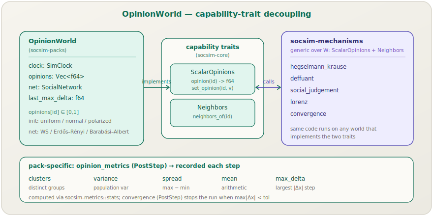
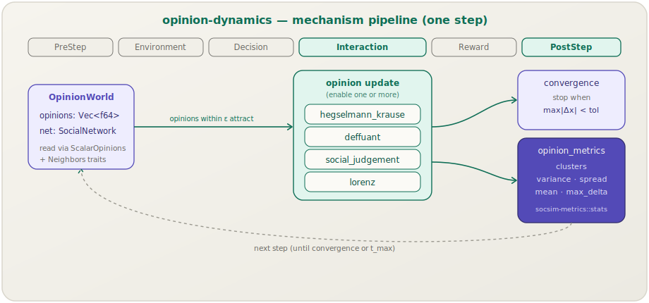

[English](opinion-dynamics.md) | **日本語**

# `opinion-dynamics` パック

> ソーシャルネットワーク上の**有界信頼の意見形成**です．エージェントは `[0, 1]` のスカラー意見を保持し，自分の意見に十分近い隣接者の意見へと引き寄せられます．メカニズムと ε に応じて，集団は合意に到達するか，クラスタに落ち着くか，あるいは分極化します．
> **ワールド：** `OpinionWorld`．**メカニズム：** 意見更新4個 + ユーティリティ2個．**Cargo フィーチャ：** `pack-opinion-dynamics`（デフォルトで有効）．

[← パックカタログに戻る](../packs.ja.md)

## 1. 概要

`opinion-dynamics` パックは，古典的な**有界信頼**ファミリーの意見モデルを実行します．すべてのエージェントは1つのスカラー意見を保持します．各ステップで，その意見は，見解が信頼区間 ε 内にあるネットワーク隣接者の意見へと移動し，遠すぎるものは無視します．この単一のルールを繰り返し適用すると，文献における3つの典型的な帰結 — 全体合意，いくつかの安定したクラスタへの分裂，そして持続的な分極化 — を再現します．

[`hr-lifecycle`](hr-lifecycle.ja.md) とは異なり，このパックは独自のロジックをほとんど持ちません．そのワールドは2つの小さな**ケイパビリティトレイト**を実装し，実際の更新ルールは [`socsim-mechanisms`](../mechanisms.ja.md) カタログのドメイン非依存なメカニズムです — そのため，同じメカニズムコードは，同じケイパビリティを公開する他のどんなワールド上でも動作しうるのです．

## 2. ワールド：`OpinionWorld`



`OpinionWorld` は意図的に極めて小さく作られています．

| フィールド | 型 | モデル化対象 |
|---|---|---|
| `opinions` | `Vec<f64>` | エージェントごとのスカラー意見．`AgentId` でインデックス |
| `net` | `SocialNetwork` | 意見が拡散する結合グラフ |
| `clock` | `SimClock` | シミュレーションクロック |
| `last_max_delta` | `f64` | 単一ステップでの最大の意見変化量（収束診断指標） |

ワールドは，シナリオの `[world]` ブロックから `OpinionWorld::new(params, seed)` によって構築されます．ブロックは次を選択します．

- **`n_agents`** — 集団サイズ（デフォルト100，スターターでは200を使用）．
- **`network_model`** — `watts_strogatz`（デフォルト），`erdos_renyi`，または `barabasi_albert`．モデルごとの通常のパラメータ（`network_k`，`network_beta`，`network_p`，`network_m`）を伴います．
- **`init_distribution`** — `uniform`（デフォルト），`normal`（三角分布，0.5を中心とする），または `polarized`（0と1付近の二峰分布）．すべての初期意見は `[0, 1]` 内にあります．

### ケイパビリティトレイトによる疎結合

`OpinionWorld` は [`socsim-core`](../library.ja.md) から3つのトレイトを実装します．

- **`WorldState`** — 基本コントラクト（`agent_ids`，`clock`）．
- **`ScalarOpinions`** — `opinion(id) -> f64` と `set_opinion(id, value)`．
- **`Neighbors`** — `neighbors_of(id) -> Vec<AgentId>`．

意見メカニズムは `impl<W: ScalarOpinions + Neighbors> Mechanism<W>` としてジェネリックに記述されているため，ワールドにはこれらのメソッドを通じて*のみ*触れ，意見がたまたま `Vec<f64>` に格納されていることを一切知りません．これは[アーキテクチャ概要](../architecture.ja.md)で説明されているのと同じトレイトベースの疎結合です．[`socsim-mechanisms`](../mechanisms.ja.md) カタログは，それぞれのドメインのワールド向けに `BinaryState`（伝染），`CultureVectors`（Axelrod），`GroupMembership`（グループダイナミクス）も定義しています — このパックは単にそれらを実装しないだけです．

## 3. パックのメカニズム

パックの [`register`](../tutorials/05-scenario-pack.ja.md) は，**4個**の交換可能な意見更新メカニズム（研究したいものを有効化）に加え，**2個**の PostStep ユーティリティを組み込みます．

| メカニズム | フェーズ | 挙動 | カタログページ |
|---|---|---|---|
| `hegselmann_krause` | Interaction | ε 内のすべての意見の平均に向かう同期更新 | [→](../mechanisms/hegselmann-krause.ja.md) |
| `deffuant` | Interaction | ペアワイズ：ε 内の2エージェントが率 μ で収束 | [→](../mechanisms/deffuant.ja.md) |
| `social_judgement` | Interaction | ε 内では同化し，棄却領域では*反発*する → 分極化 | [→](../mechanisms/social-judgement.ja.md) |
| `lorenz` | Interaction | 同化に加え，極端を増幅する自己強化項 | [→](../mechanisms/lorenz.ja.md) |
| `convergence` | PostStep | ユーティリティ：`max|Δx| < tol` で実行を停止 | — |
| `opinion_metrics` | PostStep | パック固有：ステップごとのメトリクスを記録（§4） | — |

4個の意見メカニズムは `socsim-mechanisms` の意見ダイナミクスフィーチャファミリーのメンバーです（このファミリーは Hegselmann–Krause 向けに A/G/H/P/R の [`MeanOperator`](../mechanisms/hegselmann-krause.ja.md) ファミリーも提供します）．パックは伝染，文化，グループダイナミクスのメカニズムを登録**しません** — それらは `OpinionWorld` が提供しないワールドケイパビリティを必要とするためです．

## 4. パイプラインとメトリクス



1ステップは単純です．選択された意見メカニズムが **Interaction** で実行され，続いて2つのユーティリティが **PostStep** で実行されます．`opinion_metrics` は毎ステップ5つのスカラーを記録し（[`socsim-metrics`](../architecture.ja.md) の統計ヘルパ経由で計算），`convergence` は意見の移動が止まると実行を早期に停止します．

| メトリクス | 意味 |
|---|---|
| `clusters` | 許容値 `tol` 内における別個の意見グループの数． |
| `variance` | 意見の母集団分散． |
| `spread` | 意見の `max − min`． |
| `mean` | 意見の算術平均． |
| `max_delta` | 単一ステップでの最大の意見変化量（`world.last_max_delta` にもキャッシュされる）． |

`clusters` が1へと収束していくのは合意の兆候です．1より大きい安定した数は分裂です．`social_judgement` や `lorenz` の下で `variance`/`spread` が上昇するのは分極化です．

## 5. 適用方法

### シナリオ / CLI

```sh
socsim init --module-pack opinion-dynamics --out scenarios/op.toml
socsim run scenarios/op.toml
```

スターターシナリオは，200エージェントのスモールワールドネットワーク上で Hegselmann–Krause の合意を実行します．

```toml
[simulation]
name        = "opinion_dynamics_baseline"
module_pack = "opinion-dynamics"
t_max       = 60
seed        = 42
scheduler   = "random_activation"

[world]
n_agents          = 200
network_model     = "watts_strogatz"
network_k         = 6
network_beta      = 0.1
init_distribution = "uniform"

[[mechanism]]
name  = "hegselmann_krause"
phase = "interaction"
[mechanism.params]
epsilon = 0.25
mean    = "A"

[[mechanism]]
name  = "opinion_metrics"
phase = "post_step"
[mechanism.params]
tol = 0.01

[[mechanism]]
name  = "convergence"
phase = "post_step"
[mechanism.params]
tol = 0.0001

[output]
log_path = "runs/{name}_{seed}.jsonl"
metrics  = ["clusters", "variance", "spread", "mean"]
```

別のモデルを研究するには，Interaction メカニズムを差し替えます — たとえば `hegselmann_krause` ブロックを `deffuant`（`mu`，`pairs_per_step` を追加），`social_judgement`（`alpha`，`rejection`，`repulsion`），または `lorenz` ブロックに置き換えます．合意→分裂の遷移を探るには，ε をスイープします．

```sh
socsim sweep scenarios/op.toml --axis hegselmann_krause.epsilon=0.05..0.4:8 --seeds 0..20
```

### ライブラリ

```rust
use socsim_config::{Params, Registry};
use socsim_packs::opinion::{self, OpinionWorld};
use socsim_engine::{RandomActivationScheduler, SimulationBuilder};

let mut reg: Registry<OpinionWorld> = Registry::new();
opinion::register(&mut reg);

let world = OpinionWorld::new(&world_params, 42);
let mut hk_params = Params::empty();
hk_params.set("epsilon", 0.25_f64);

let mut sim = SimulationBuilder::new(world)
    .scheduler(Box::new(RandomActivationScheduler))
    .seed(42)
    .add_mechanism(reg.build("hegselmann_krause", &hk_params)?)
    .add_mechanism(reg.build("opinion_metrics", &Params::empty())?)
    .build();
sim.run()?;
```

[T2 — 意見ネットワーク](../tutorials/02-opinion-network.ja.md)チュートリアルは意見モデルをステップごとに構築し，[ユースケースページ](../usecases.ja.md)はベースライン実行で期待されるメトリクス系列を示します．

## 6. 関連項目

- [Mechanism カタログ](../mechanisms.ja.md) — 意見ダイナミクスメカニズムファミリーの全容（理論，方程式，図）．
- [hr-lifecycle パック](hr-lifecycle.ja.md) — もう1つの同梱パック．
- [T2 — 意見ネットワーク](../tutorials/02-opinion-network.ja.md) — ガイド付きの意見ダイナミクス構築．
- [ユースケース＆レシピ](../usecases.ja.md) · [CLI リファレンス](../cli.ja.md) · [アーキテクチャ](../architecture.ja.md)
